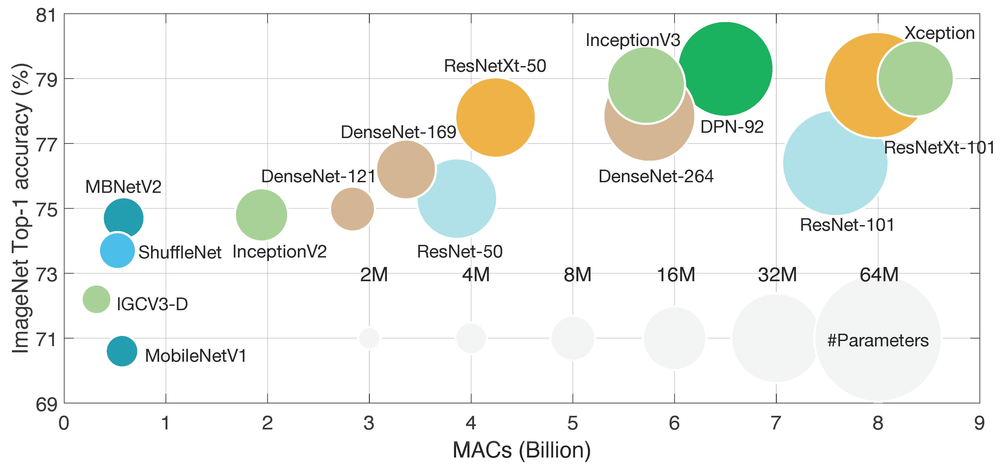

# Lecture 01: Introduction to TinyML and Efficient Deep Learning Computing

## Note Information

| Title       | Introduction to TinyML and Efficient Deep Learning Computing                                                    |
|-------------|-----------------------------------------------------------------------------------------------------------------|
| Lecturer    | Song Han                                                                                                        |
| Date        | 09/08/2022                                                                                                      |
| Note Author | John Doe (johndoe)                                                                                                 |
| Description | Introducing why efficient deep learning is important and challenging, and an overview of the course information. |

## Deep Learning is Everywhere but Increasing Computation Demands make it challenging

This is a template of the lecture note.

## Overview of the Course Information

This is a template of the lecture note.
