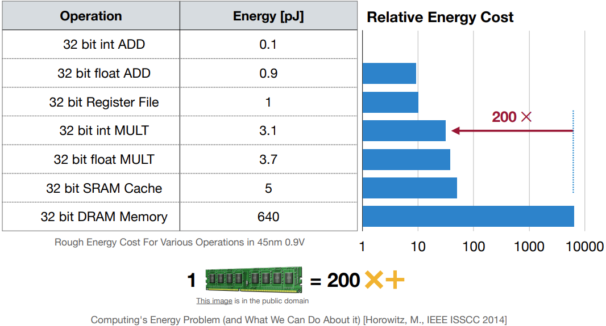
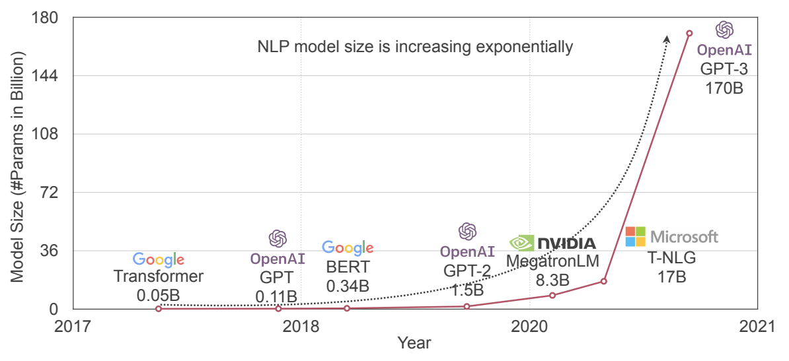
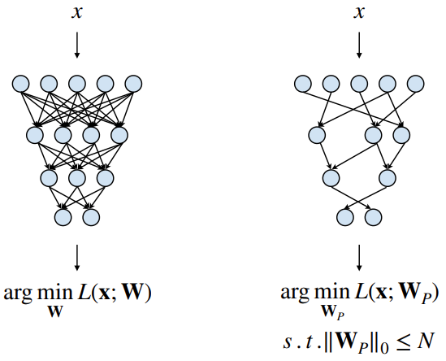
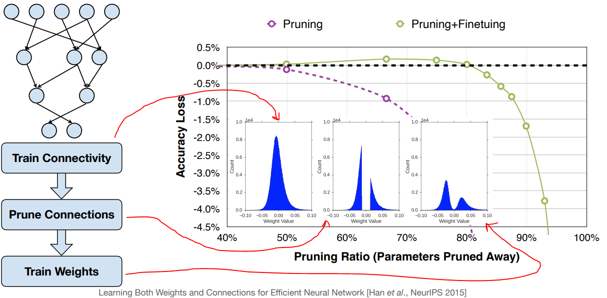

# Lecture 03: Pruning and Sparsity (Part I)

## Note Information

| Title       | Introduction to TinyML and Efficient Deep Learning Computing                                                    |
|-------------|-----------------------------------------------------------------------------------------------------------------|
| Lecturer    | Song Han                                                                                                        |
| Date        | 09/15/2022                                                                                                      |
| Note Author | Andrew Feldman (abf149)                                                                                         |
| Description | Introduce and motivate pruning; outline the pruning process and granularities; overview pruning criteria        |

## Outline of this lecture

- Introduce neural net pruning
- Process of pruning
- Granularity of pruning
- Pruning criteria

## Introduce neural net pruning
### Background on the cost of executing DNNs

- Increasing cost of memory to store large models

    - Multiply/accumulate is the primary compute operation in DNN; main-memory access energy exceeds multiply cost by roughly 200x

    

- Models are getting larger

    

- The cost of moving models from main memory into on-chip memory hierarchy & arithmetic units is increasing

#### Key DNN execution cost metrics

- Model size - number of weight parameters, which directly impacts storage size and indirectly impacts the bandwidth and latency involved in transferring the model between locations.
    - The increasing cost of memory combined with increasing model size means that storage cost is a key reason for minimizing model size
    - It is also more costly to build memories which support higher bandwidth, and as models expand to have more weights, the bandwidth required to move move chunks of weight within the processor memory hierarchy (main memory, cache, register file) increases. This too motivates minimizing model size
    - Downloading a DNN onto a mobile device is another point where model size is impactful; large model size can mean the difference between being able to download a DNN model quickly over mobile data vs taking a long time to transfer the model and/or requiring WiFi
    - Example - 10 million weights may be two large to store on a phone or conveniently transfer to a phone, especially over Cellular Data
- Model execution time
    - The scaling behavior of execution time with respect to model size is a function of the arithmetic operations comprising the neural network
- Model inference energy
- Example - large RL policy DNNs for protein folding, gameplay, etc. may consume thousands of dollars of GPU or TPU time

### Background on sparsity

- Sparsity generally referes to underlying statistical redundancy in a data structure which contains multiple values. Generally sparsity implies that there is an opportunity to *compress* the data structure by omitting redundancy. 
- In this lecture we primarily focus on exploiting the most trivial form of sparsity (think: redundancy), namely the subset of zero-values in the data structure.
- In this class the data structures we care about are tensors

### What is pruning?

Pruning - metaphorically, "brain damage”; or put another way, eliminating unnecessary knowledge. A DNN's knowledge is understood to reside in its *weights*.

It turns out that many if not most industrially-interesting DNN models can be decomposed into their component weight tensors, and the component weight tensors frequently contain statistical redundancy (sparsity) - so you should be able to compress the component tensors of the DNN and thereby shrink the storage, data transfer and execution time/energy costs of the DNN. Think of this like putting each DNN tensor into a "zip file" which requires fewer bits than the original.

However, compressed tensors still need to be used for computation at inference-time, so we need a compression scheme that lends itself to efficient computation; we do not want the compression savings to be overshadowed by the cost of decompressing the tensor for computation.

Many compression techniques exist which work by removing redundant zero-values from a tensor, such that  most or all of the remaining values after compression are exclusively non-zero. Frequently it is possible to compute directly on compressed data using such a zero-removal scheme, because the computations we are interested in performing in DNNs are multiply/accumulate, for which zero operands are ineffectual.

However, in many industrially-interesting DNNs, the sparsity does not directly take the form of redundant zero-values, but rather manifests as other hidden patterns in the weight tensors. This leads to the idea of *pruning* - assuming that the tensor has some underlying statistical sparsity, we use some technique to convert this sparsity to zero-sparsity. We flip some of the DNN weights to zero and potentially adjust the values of the other weights to compensate. Since zero-valued weights are ineffectual for multiply/accumulate, we treat the zero-valued weights as if they do not exist (they were "pruned") and therefore we do not store, transfer or compute on these weights. So in summary, we achieve savings on key metrics by converting underlying statistical sparsity to a specific form of sparsity (zero-sparsity) and then rely on hardware and/or software to *exploit* this sparsity to do less work.

### Introducing pruning through a neurobiological analogy

In neurobiology axonal connections are understood to play a role in representing and computing on information in the brain. The number of axonal connections ramps up after birth, stays high for a period of time, until eventually a very large number of connections are destroyed toward the end of adolescence and into adulthood. Scientists assume that the brain does this in order to facilitate aggressive learning early in life, followed by honing in on only the most critical knowledge later in life. This latter stage of destroying axonal connections is referred to in neurobiology as "pruning" of the neuronal axons. 

The process of surfacing tensor sparsity as redundant zero weights and then avoiding doing work on these zero weights was named "pruning" by analogy to the latter stage of axonal destruction in human development, since the zero weights have effectively been removed from consideration, and any remaining DNN knowledge must be encapsulated in the smaller number of remaining nonzero weights. 

Sometimes, DNNs are trained to completion (pre-trained) before pruning, in which case the neurobiological analogy applies even more closely - the initial pre-training of the model is like the infant and childhood stage of aggressive learning, after which pruning is needed to preserve only the most important knowledge for "adulthood".

### Recovered accuracy with pruning

- DNN accuracy can often be maintained even at significant pruning factors - again, this is because there was underlying weight redundancy before pruning
    - Example: NeuralTalk LSTM maintains image caption quality up to 90% pruning factor
    - But the accuracy does eventually break, dropping off sharply around some critical accuracy-level

### Industry support

- Industrial pruning tools
    - AMD/Xilinx
    - Xilinx Vitis
    - Reduce model complexity by 5x-50x with minimal accuracy impact
- Key architectures for exploiting sparsity
    - Academic
        - EIE [Han et. al., ISCA 2016]
        - ESE [Han et. al., FPGA 2017]
        - SpArch [Zhang et. al., HPCA 2020]
        - SpAtten [Wang et. al., HPCA 2021]
    - Commercial
        - NVIDIA Ampere architecture.
            - 2:4 sparsity in A100 GPU, 2x peak performance, 1.5x measured BERT speedup

## Pruning process

### Defining the pruning problem (without weight updates/retraining/fine-tuning, which will be discussed later)

### Pruning steps
- At a high-level
    1. Train connectivity - gradient descent/SGD
    1. Prune connections - as described above
    1. Weight-update/train/re-train/fine-tune - use the gradient-descent/SGD process along with a mask that holds pruned weights at zero, to adapt the *remaining* weights and recover accuracy
        - See section on "Weight updates and iterative pruning"

- Additional notes
    - Select specific weights or groups of weights to prune
    - Weights become zero
    - Zero weights may be skipped entirely from computation ⇒ time ($), energy savings
    - Zero weights do not need to be stored ⇒ storage & data transfer savings
    - Neurons for which which all ingress weights are zero can itself be pruned ⇒ prune all egress weights from that neuron ⇒ additional execution & storage savings

### Weight updates and iterative pruning
- “Brain damage” of pruning → lower accuracy after pruning (”recovered accuracy”)
- Recovered accuracy can be increased to updating the weights to adapt to the brain damage
- We also improve accuracy by pruning the model incrementally, in small increments of sparsity factor

#### Impact of pruning, weight updates, and iteration
- Here we assume that a variant of magnitude-based pruning is used, but the ideas will be similar regardless
- Each step of the pruning process has a distinctive effect on the weight distribution
- Without other prior knowledge, imagine that the initial weight distribution is Gaussian-like
- Pruning cuts away those weights with absolute magnitude near zero, leaving a bimodal distribution of weight values above and below zero
- Retraining/fine-tuning/weight-update increases the spread of these distributions, owing to weight adjustments to recover accuracy (i.e. correct the brain damage)

- Pruning sacrifices accuracy, with increasing severity with respect to sparsity factor
- The accuracy/sparsity trend is a relatively gradual slope
- Retraining/fine-tuning/weight-update recovers accuracy; there is a more sudden drop-off of accuracy at a certain sparsity
- Adding in iterative training recovers the most accuracy and maintains the most uniform accuracy, with nearly a brick-wall accuracy drop-off at very high sparsity factors
- See below.

- Note there is actually a slight improvement in accuracy with aggressive pruning, which we might hypothesis is due to avoiding overfitting

## Granularity
- Fine-grained (a.k.a. unstructured) pruning
    - Flexible pruning indices
        - Essentially "random access" to prune any weight in any tensor
    - Pros
        - High recovered accuracy/higher compression ratio for the same accuracy; this is a result of flexibility to match the underlying patterns of redundancy in the weight tensor
    - Cons
        - Potential to exploit in custom hardware; challenging or impossible to exploit effectively on CPU/GPU
- Pattern-based pruning
    - Constrain pruning indices to fixed patterns so that it is easier for hardware to exploit sparsity
    - A classic example is N:M block pruning - in every size-M block of consecutive weights, N must be nonzero
    - Pros
        - Easier to exploit in hardware
        - 2:4 block sparsity exploited by NVIDIA Ampere GPU architecture; roughly 2x speed-up
    - Cons
        - Lower recovered accuracy/compression ratio vs fine-grained owing to less flexibility 
        - Likely challenging to exploit effectively on CPU
- There a number of intermediate pruning granularities between fine-grained and channel-pruning which are mentioned quickly
    - Vector-level pruning
    - Kernel-level pruning
- Channel pruning
    - Coarse-grained pruning constraint - only remove entire channels, effectively changing layer geometry
    - Pros
        - Feasible to exploit on CPU and GPU (effectively a change in layer geometry)
        - Also possible to exploit in custom hardware
    - Cons
        - Lowest recovered accuracy/compression ratio due to barely any flexibility

## Weight-pruning criteria

### Magnitude pruning - prune the smallest weight values

$$Importance = |W|$$

Otherwise known as *salience*. Prune the lowest-importance weights first. This is a heuristic score.

- For fine-grained pruning, the ranking of individual weights based on the above importance score will be the same as the ranking based on any norm (L1, L2, etc.)

- For other pruning granularities, it is necessary to distinguish formulae for aggregating importance of groups of weights
    - L1-norm magnitude:

    $$\sum_{i\in S} |w_{i}|$$

    - L2-norm magnitude:

    $$\sqrt{\sum_{i\in S} |w_{i}|^{2}}$$

    - Lp-norm magnitude:

    $$(\sum_{i\in S} |w_{i}|^{p})^{\frac{1}{p}}$$

### Scaling-based pruning

Output channels (filters) are assigned trainable *channel scaling factor*; magnitude-ranking of channel scaling factors is employed to prune channels
- For Conv layers preceding batch-norm, the batch-norm's integrated scaling factor can be utilized for magnitude pruning

### Taylor-series based pruning criteria
- Use the Taylor series of network loss wrt. weight value as a proxy for the importance/saliency of a weight
- The removal of a weight is modeled as a decrease in its value to zero, which causes an incremental change $\delta L$ in the loss according to the Taylor series
- Different Taylor series terms provide different information, discussed in the next sections

#### Second-order methods

##### Optimal Brain Damage (OBD) (Yan LeCun) - early second-order information pruning
- Assumes pre-trained network ⇒ first-order term is ~0, second-order term is a function of Hessian of loss wrt weights, and assume iid to remove derivative cross-terms:

    $$importance_{w_{i}} = \frac{1}{2}h_{ii}w^{2}_{i}$$

- Pros: effectively a “one-shot” computation of which weights to prune & how to adapt the remaining weights to correct for pruning
- Cons:
    - Generally, second-order information based on the Hessian size scales as (# weights)^2 ⇒ unweildy to compute & store
    - OBD assumes diagonal Hessian i.e. iid weights so only self-second-derivatives are nonzero, however the subsequent Optimal Brain Surgeon paper (OBS) showed empirically that this approximation is frequently inaccurate, which has a negative impact on recovered accuracy
    - Also, “one-shot” computation of pruning outcome with Hessian seeks the nearest solution to the original trained local minimum; unlikely to escape local minima

#### First-order methods
- Assume second-order term is negligible and assume iid, so

    $$importance_{w_{i}} = (g_{i}w_{i})^{2}$$

    for fine-grained pruning, and

    $$importance_{\textbf{W}^{S}} = \sum_{i\in S} |\delta L_{i}|^{2} = \sum_{i\in S} (g_{i}w_{i})^{2}$$

    for coarse-grained pruning

## Pruning neurons

As a general rule - "when removing neurons from the network, the less useful the neurons being removed are, the better the performance of pruned neural network is."

### Percentage-of-zero-based pruning

Remove neurons from the model which have the highest Average Percentage of Zero activations (APoZ)

### First-order-based pruning

Another Taylor-Series based technique.

### Regression-based pruning

Define an MSE loss function at each layer and then do coarse- or fine-grained pruning to minimally impact the layer MSE.
- Two steps
    - Fix weight values, solve for channels to prune (*NP-hard*)
    - Fix channel pruning choices, solve for weight updates to maximize recovered accuracy/minimize reconstruction error

