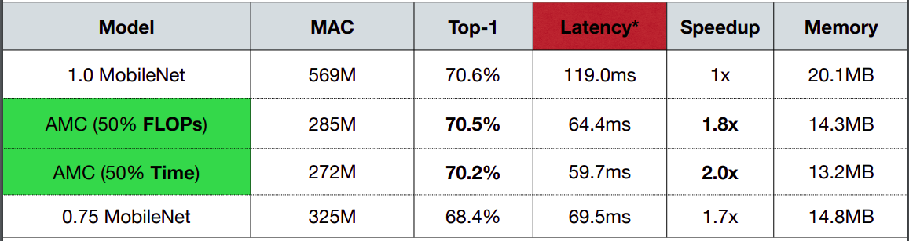

# Lecture 04: Pruning and Sparsity (Part II)

## Note Information

| Title       | Pruning and Sparsity (Part II)                                                                           |
| ----------- | -------------------------------------------------------------------------------------------------------- |
| Lecturer    | Song Han                                                                                                 |
| Date        | 09/20/2022                                                                                               |
| Note Author | Alex Gu (gua)                                                                                            |
| Description | Introduce and motivate pruning; outline the pruning process and granularities; overview pruning criteria |

## Outline of this lecture

- Explain pruning and introduce how to select pruning ratio and how to fine-tune
- Introduce the Lottery Ticket Hypothesis
- Introduce how systems support sparsity in pruned neural networks

## Section 1: Pruning Ratios

The goal of this section is to understand how to find per-layer pruning ratios. Recall from last time that empirically, non-uniform pruning performs better than uniform shrinking.

However, how should we find the pruning ratios for each layer?

### Analyze the sensitivity of each layer

The idea behind this first approach is that different layers are expected to have different sensitivities to pruning. At a high level, we analyze each individual layer's sensitivity (holding other layers constant), and then prune each layer in proportion to how sensitive it is. More specifically:

- First, for each layer $L_i$, prune the layer with different pruning ratios and observe the accuracy degrade $\Delta Acc_r^i$ for each pruning ratio.
- The figure below shows this process for VGG-11 on CIFAR-10 using ratios $r \in \{0, 0.1, \cdots, 0.9\}$.

- Then, pick a degradation threshold $T$. For each layer, prune it as much as possible without the accuracy dropping below $T$.
- In the figure below, we pick a threshold $80\%$. Then, for $L_0$, we can prune about $72\%$ of the weights, while for $L_2$ we can prune almost $90\%$.

This method isn't optimal because it treats layers independently and doesn't consider their interactions, but the method is very robust and easy to implement in practice.

### AMC: AutoML for Model Compression [[He et al., 2018]](https://arxiv.org/pdf/1802.03494.pdf)

We saw that the previous approach has a major caveat of not being able to consider the interactions between different layers. The next approach, AMC (AutoML for Model Compression), treats pruning as a reinforcement learning problem.

**State**: The state is represented using 11 features including layer indices, channel numbers, kernel sizes, FLOPs.

**Actions**: We use a continuous action space $a \in [0, 1)$ indicating the pruning ratio of that layer.

**Agent**: We use a DDPG (off-policy, actor-critic) agent as follows: at each timestep, the agent receives a state $s_t$ representing layer $t$ of the environment. The agent outputs ab action $a_t \in [0, 1)$, and the layer is compressed using some algorithm (like channel pruning) to sparsity ratio $a_t$. The agent then moves to layer $t+1$ with a new state $s_{t+1}$. After the final layer, the model is evaluated on the validation set, and the agent receives a reward.

**Reward**: One possible reward is $R_{err} = -Error$, encouraging the model to prune to a low validation loss. However, this doesn't incentivize model size reduction. Therefore, one way to achieve such reduction is by limiting the action space: allow arbitrary actions for the first few layers, and then constrain $a_t$ for later layers. Other possible rewards include $R_{\text{FLOPs}} = -Error \cdot \log(\text{FLOPs})$ or $R_{\text{Param}} = -Error \cdot \log(\\text{Number of Params})$.

A figure summary of the algorithm is below:

The authors showed that AMC can prune the resulting models to a lower density than human experts with negligible accuracy loss (0.02\% ResNet50 top-1 accuracy):

Interestingly, the agent also learned that $3 \times 3$ convolution layers can be pruned more than $1 \times 1$ convolution layers.

Finally, compared to MobileNet, AMC is able to achieve 2x speedup without much accuracy degradation:

### NetAdapt: A rule-based iterative/progressive method [[Yang et al., 2018]](https://arxiv.org/pdf/1804.03230.pdf)

Another approach, NetAdapt, finds per-layer pruning ratios to meet a global resource constraint like latency or energy consumption. At a high level, at each iteration, NetAdapt generates many network proposals (A, B, ..., Z in the figure) and evaluates them with respect to the budget. These metrics are then used to come up with proposals at the next iteration, and so on.

As an illustrative example, consider the constraint as reducing the latency by a certain amount $\Delta R$. As network proposals, we look at each layer and use a lookup table to prune that layer so that the latency reduction is at least $\Delta R$ (proposal models A, ..., Z). Then, we fine-tune the model for a short period (10k iterations) and measure the accuracy after fine-tuning. We then prune the layer with the highest accuracy (C). We then repeat until the latency reduction satisfies the constraint. Finally, we fine-tune the model for a long period to recover the original accuracy. The loop is shown here:

Because of the iterative nature, we get a series of models with varying resource constraints, one for each iteration of the algorithm, as shown below:

## Section 2: Fine-tuning/Training

### Iterative pruning

After pruning, the model's performance may decrease. One way to mitigate this is to fine-tune the pruned neural network, allowing for higher pruning ratios. As a heuristic, when fine-tuning, a learning rate of 1/10 to 1/100 of the original learning rate is used. We can iteratively prune and fine-tune for even better performance [[Han et al., 2015]](https://arxiv.org/pdf/1506.02626.pdf):

### Regularization

When training neural networks or fine-tuning quantized neural networks, regularization is added to penalize non-zero parameters and encourage smaller parameters. The most common regularizers are L1, $L' = L(\mathbf{x}; \mathbf{W}) + \lambda |\mathbf{W}|_1$) and L2, $L' = L(\mathbf{x}; \mathbf{W}) + \lambda \|\mathbf{W}\|^2$.

Some examples are that magnitude-based fine-grained pruning uses L2 regularization on weights, while network slimming [[Liu et al., 2017]](https://arxiv.org/abs/1708.06519) applies smooth L1 regularization on channel scaling factors.

### ADMM

A final method for network pruning, which was not covered in the lecture, is due to [[Zhang et al., 2018]](arxiv.org/pdf/1804.03294.pdf) and applies classical optimization techniques to the model pruning problem. We can write pruning as $$\arg \min_{\mathbf{W}_P} L(\mathbf{x}; \mathbf{W}_P) + g(\mathbf{W}_P), \quad g(\mathbf{W}_p) = \begin{cases} 0 & \|\mathbf{W}_P\|_0 \le N \\ \infty & otherwise \end{cases}.$$ This can be written as $$ \arg \min\_{\mathbf{W}\_P } L(\mathbf{x}; \mathbf{W}\_P) + g(\mathbf{Z}) \quad \text{s.t.} \quad \mathbf{W_P} = \mathbf{Z}.$$

The idea is then to write out the augmented Lagrangian and apply ADMM. We refer interested readers to the paper.

## Section 3: The Lottery Ticket Hypothesis [[Frankle et al., 2019]](https://arxiv.org/pdf/1803.03635.pdf)

The lottery ticket hypothesis is as follows: _A randomly-initialized, dense neural network contains a subnetwork that is initialized such that—when trained in isolation—it can match the test accuracy of the original network after training for at most the same number of iterations._

What does this mean? Earlier, we saw that we could train a neural network, prune it, and then fine-tune the pruned network. What if instead of fine-tuning the pruned network, we trained it from scratch? Contemporary experience shows that architectures uncovered by pruning are harder to train and reach lower accuracy than original networks.

In fact, most randomly sampled sparse networks (shown in dashed lines below) cannot recover the original accuracy. However, carefully chosen subnetworks (called winning lottery tickets, shown in solid lines) can.

How? Via an iterative magnitude pruning approach. Assume that you want $p\%$ of the parameters pruned and you'll prune for $n$ iterations. First, randomly initialize the neural network $f(\textbf{x}; \textbf{W}_0)$. Then, train the network for some number of iterations $t$ to get parameters $\textbf{W}_0$. We prune $p^{1/n}\%$ of the parameters, creating a mask $m$. Then, set $\mathbf{W}_0 \leftarrow m \odot \textbf{W}_0$, and repeat. Note that at each step, **weights are being reset to their original values**, what changes is the set of connections present.

Later, the authors found that resetting weights to $\textbf{W}_0$ only works for small tasks like MNIST and CIFAR, failing on deeper networks [[Frankle, et al. 2019]](https://arxiv.org/pdf/1903.01611.pdf). Instead, they reset the weights to the values after a small number of training iterations (in this case $t=6$).

## Section 4: System Support for Sparsity

### EIE: Efficient Inference Engine [[Han et al., 2016]](https://arxiv.org/pdf/1602.01528.pdf)

EIE is the first DNN accelerator for sparse, compressed models.

EIE takes advantage of sparse weights (10x less computation, 5x less memory), sparse activations (3x less computation), and weight sharing with 4-bit weights (8x less memory).

**Parallelization**: EIE employs a variant of the compressed sparse column (CSC) representation. Consider a FC layer forward pass shown below:

Say we have 4 processing engines, PE0 through PE3. Physically, we keep virtual weights, relative indices, and column pointers. Below, we see an example for PE0. In the first row (green), we see the nonzero weights $w_{0, 0}, w_{0, 1}, w_{4, 2}, ...$. In the second row (orange), we see the relative indices of each weight with respect to the previous weight (starting at the top left, columns first, then rows). Finally, in the last row, we see a cumulative sum of the number of nonzero weights in each column. This representation makes it easy to exploit activation sparsity to do the forward pass: we simply multiply each nonzero activation by all of the nonzero elements in the corresponding column.

**Architecture**:
The EIE architecture is shown below.

The architecture of each PE is shown here. We refer readers to the paper for a more detailed description of each component.

Compared to CPU and GPU, EIE achieves better speedup, FLOP reduction, throughput, and energy efficiency.

### Accelerating Recurrent Neural Networks [[Han et al., 2017]](https://arxiv.org/pdf/1612.00694.pdf)

First, one observation is that PE's are unbalanced: some have more nonzero weights than others. Therefore, one trick is to apply load balancing, so that nonzero weights are distributed across PE's.

This achieves better speedup without any accuracy sacrifice.

  
   

The hardware architecture consists of memory units, sparse matrix multiplication units, and element-wise units. Compared to CPU and GPU, we see significant speedup in latency, power, speedup, and energy efficiency. In addition, the engine is easily adaptable to different hardwares.

### M:N Sparsity [[Mishra et al., 2021]](https://arxiv.org/pdf/2104.08378.pdf)

M:N sparsity means that out of every $N$ consecutive weights, at most $M$ are nonzero. A common case is 2:4 sparsity, shown below. Instead of storing each value, we just need to store the nonzero data values, as well as 2-bit indices representing which 2 elements in each consecutive block of 4 are nonzero.

System support for this type of sparsity is also relatively straightforward, shown below. Note that only half the multiplications need to be done.

Benchmarks show that large GEMM operations achieve 2x speedup without any drop in accuracy:

