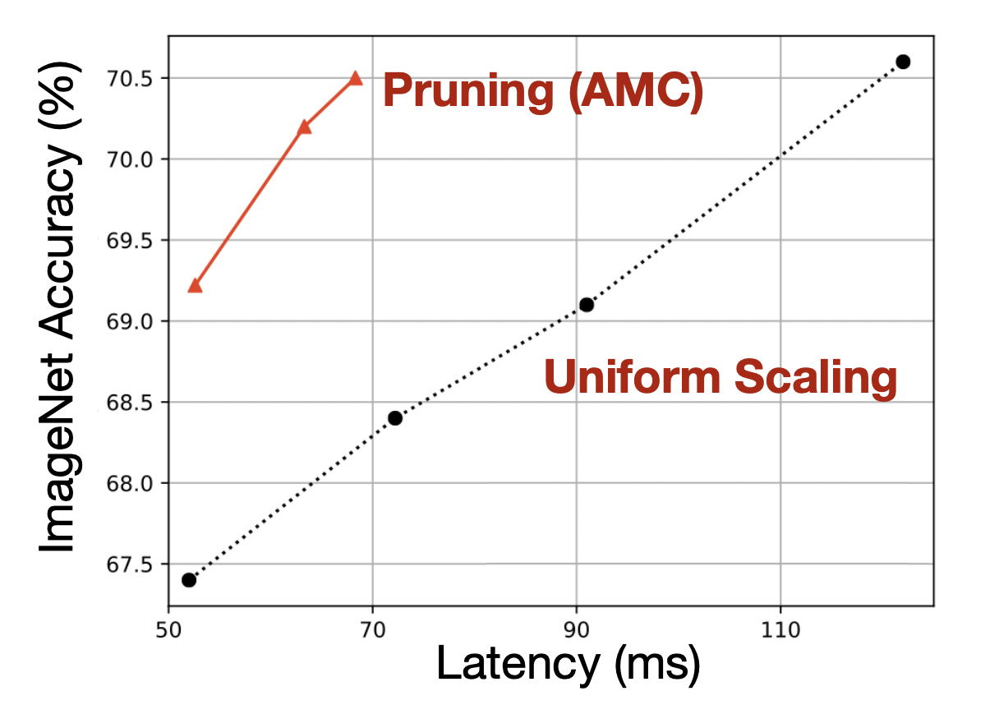
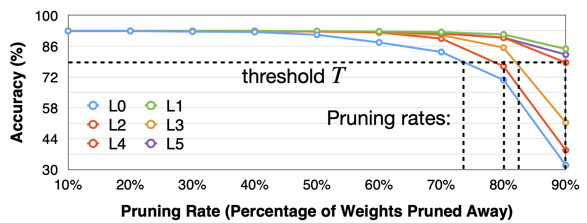
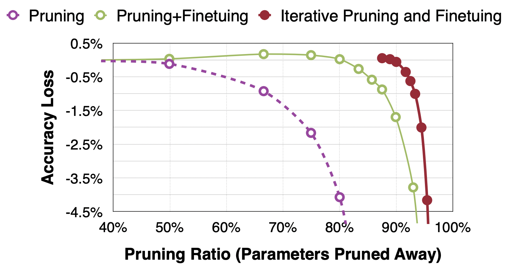
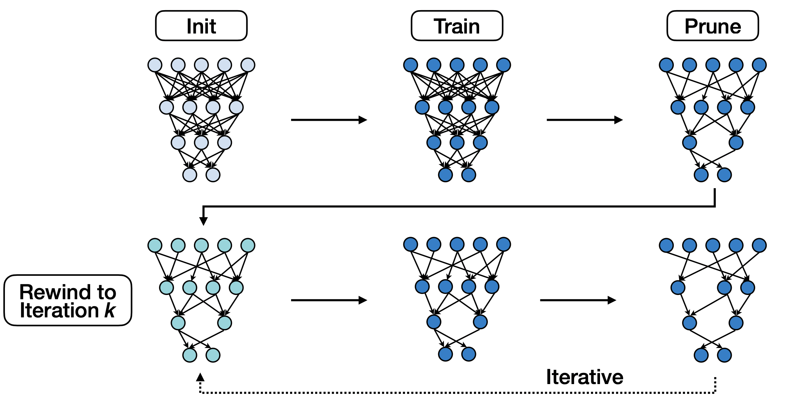
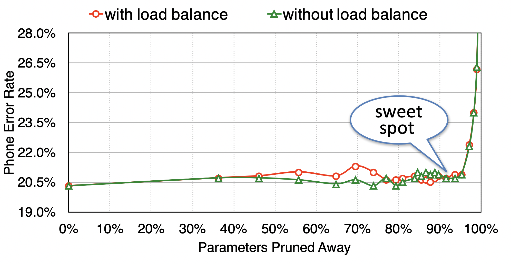
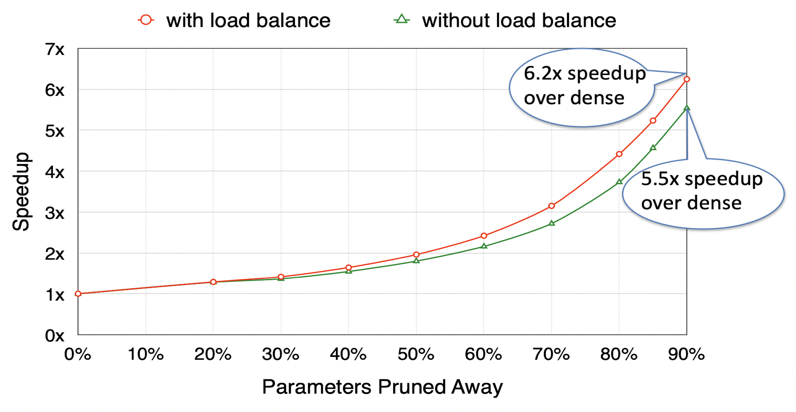
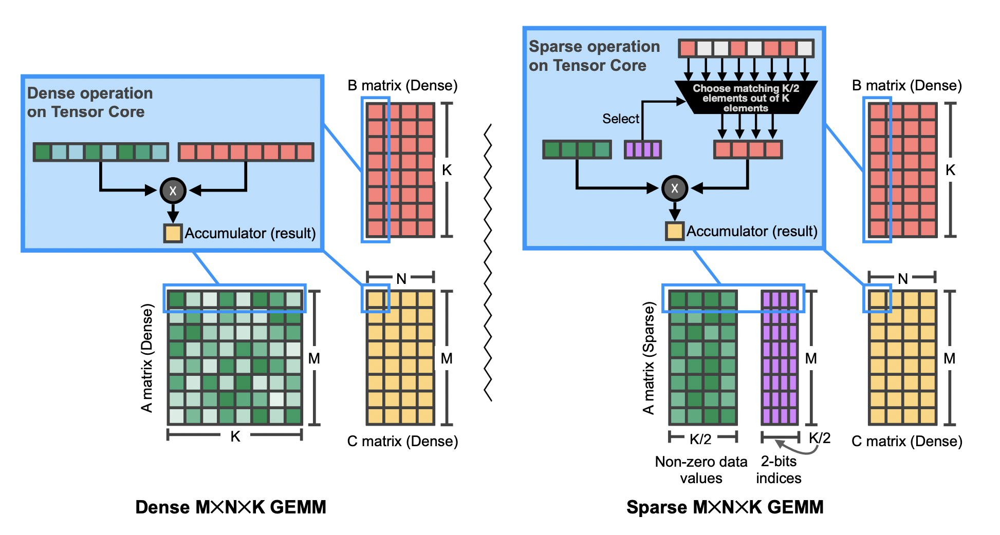

# Lecture 04: Pruning and Sparsity (Part II) 

## Note Information

| Title       | Pruning and Sparsity (Part II)                                                    |
|-------------|-----------------------------------------------------------------------------------------------------------------|
| Lecturer    | Song Han                                                                                                        |
| Date        | 09/20/2022                                                                                                      |
| Note Author | Saaketh Vedantam (saakethv)                                                                                                 |
| Description | Discussing how to select the pruning ratio and how to fine-tune, introducing the Lottery Ticket Hypothesis, and describing system support for sparsity. |

## Pruning Ratio

Question: How should we find per-layer pruning ratios?

- Shallower layers find low level features 
- Deeper layers find abstract features

Which layers have the most redundancy?

- Non-uniform pruning performs better than uniform scaling
- Deeper layers have more redundancy (more channels, more reused features) so they can be more aggressively pruned

### Analyzing the sensitivity of each layer

- **Sensitivity**: how much accuracy drops when the layer is pruned
- More sensitive layers should be pruned less, less sensitive indicates redundancy

Sensitivity Analysis

- Pick a layer $L_i$ in the model

    - Prune $L_i$ with some set of ratios; i.e. $r\in \{0.1,0.2,\dots,0.9\}$
    - Observe accuracy decrease $\Delta{\text{Acc}_i^r}$ for each ratio $r$
- Repeat for all layers
- Pick a degradation threshold $T$ such that the pruning ratio achieves the desired accuracy

Pros: 

- Easy to see which layers are least sensitive to pruning by seeing which has the highest accuracy at the end.
- Simple algorithm for finding ratio

Cons: 
- Ignores interaction between layers - how does accuracy drop if two layers are pruned simultaneously?
- Ignores size of layers - pruning large layers a little is better than pruning small layers a lot

### Automatic Pruning

Given an **overall** compression ratio, how do we choose per-layer pruning ratios?

- Traditionally done with a lot of human oversight - how can we automate?

**AMC** (**A**utoML for **M**odel **C**ompression) [ [He et al., ECCV 2018]](https://arxiv.org/abs/1802.03494)

- Treat pruning as reinforcement learning problem

    - Reward: -error rate - penalty for large size

        - Constrain on #FLOPS or latency
    - Action: compress layer by some sparsity ratio (continuous number in $[0,1)$)
    - Embedding: neural network architecture (channel numbers, kernel sizes, etc.)
    - Learning done with a DDPG agent
- AutoML can prune much more efficiently than humans
- Automatically learns good policy for removing redundant convolutions

**NetAdapt** [[Yang et al., ECCV 2018]](https://arxiv.org/abs/1804.03230): Rule-based iterative pruning method

- Find a per-layer pruning ratio to meet global resource constraint 
- E.g. Latency constraint

    - In each iteration, reduce the latency by amount $\Delta R$
    - Use pre-built lookup table for layer pruning/latency measures
    - For each layer

        - Prune the layer by $\Delta R$ according to lookup table
        - Fine-tune a little, measure accuracy
    - Prune layer with highest accuracy
- Repeat until total latency reduction satisfies the constraint
- Returns series of models with increasing latency reduction

## Finetuning and Training Sparse NNs

Goal: Recover accuracy of network after pruning model.

- Learning rate should be 1%-10% of original learning rate, since model was already trained

**Iterative Pruning** [[Han et al., NeurIPS 2015]](https://arxiv.org/abs/1506.02626)

- Prune then fine-tune for one iteration
- Repeat as many times as needed
- Could work better than pruning all at once because model gradually learns with more sparsity

Regularization techniques:

- L1: $L'=L(x;W)+\lambda|W|$
- L2: $L'=L(x;W)+\lambda||W||^2$
- Good for pruning because it penalizes non-zero weights and encourages smaller parameters

## Lottery Ticket Hypothesis 

Question: Can we train a sparse neural network from scratch?

- LTH: Yes!
- Currently, we train a full model and prune after
- Pruned networks trained from the start achieve lower accuracy

**Lottery Ticket Hypothesis** [[Frankle et al., ICLR 2019]](https://arxiv.org/abs/1803.03635): A randomly initialized, dense NN contains a subnetwork that can be trained to match the test accuracy of the original network after training for at most the same number of iterations as the original.

- Idea: Iterative magnitude pruning
    - Train full model, then prune by magnitude
    - *Reset* weights of pruned network to original initialization - gives "winning ticket"
    - Issue: Still requires training full model
- Instead, reset the weights to those after a *small number of iterations* [[Frankle et al., arXiv 2019]](https://arxiv.org/abs/1903.01611)
    - #iterations (k) can be found with experimentation

## System Support for Sparsity

Because NNs are nonconvex, we overparameterize them so they can be trained to convergence
- Bad for inference, especially if memory is constrained
- Therefore we need model compression for both faster and more power efficient inference

**EIE** (**E**fficient **I**nference **E**ngine) [[Han et al., ISCA 2016]](https://arxiv.org/pdf/1602.01528.pdf): First accelerator for sparse DNN models
- Skip multiplying by zero step by setting output to 0 whenever a multiplier is 0
    - Weights: *static* sparsity
    - Activations *dynamic* sparsity
- Quantization: Approximate weights as 4-bit instead of 32-bit
- Parallelize with specialized processing elements (PEs) and extra metadata (indices of nonzero elements)

EIE achieves *significant* speedup and energy efficiency over traditional compression techniques 
- Now, it's commercialized in NVIDIA GPUs

### Load Imbalance

Question: Can we codesign the pruning algorithm and efficient inference?
- **Load imbalance**: some PEs might have more work than others due to imbalanced nonzero entries in each part of the matrix
- *Balancing* pruning means distributing the sparsity more evenly across PEs [[Han et al., FPGA 2017]](https://arxiv.org/abs/1612.00694)
    - Doesn't decrease accuracy
    - Faster than load imbalanced networks

### M:N Sparsity

- In every group of N elements, at least M have to be 0
- Common use case: 2:4 sparsity [[Mishra et al., arXiv 2021]](https://arxiv.org/abs/2104.08378)
    - Compress matrix in half by pushing all nonzero elements to left
    - Store 2-bit index for each element
- M:N sparse matrix multiplication implemented on NVIDIA tensor cores

