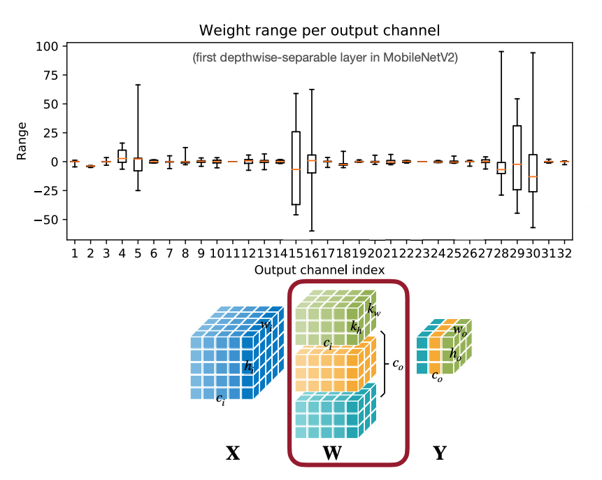
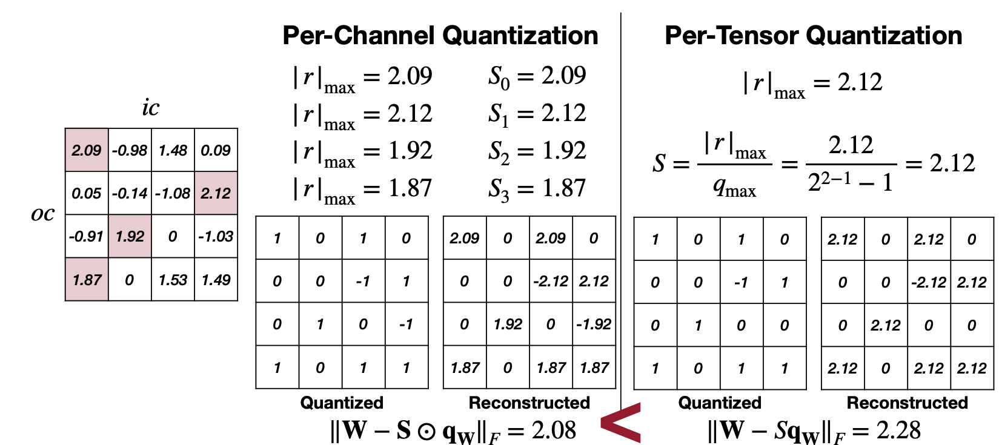
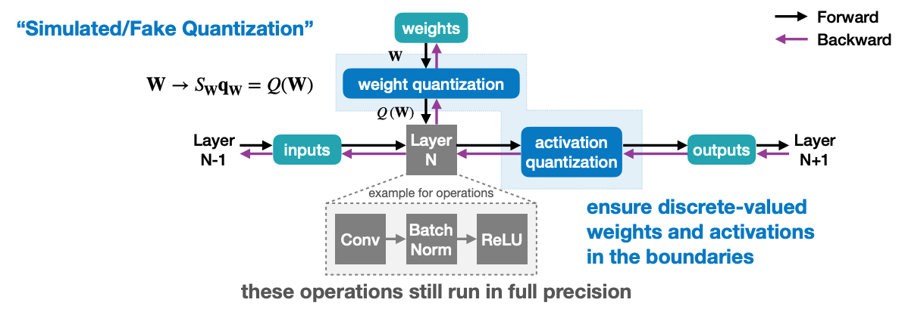
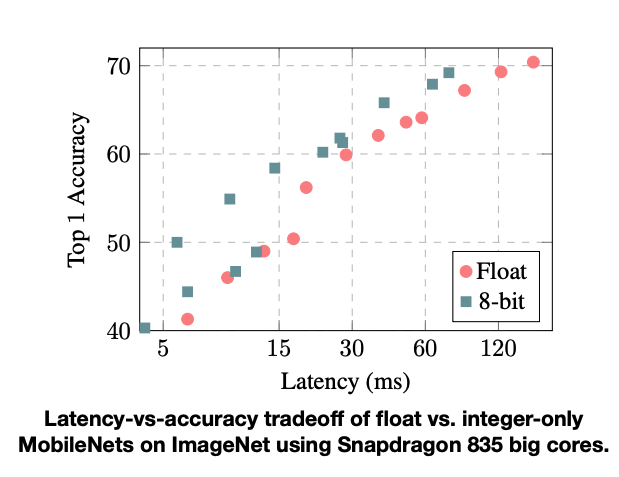
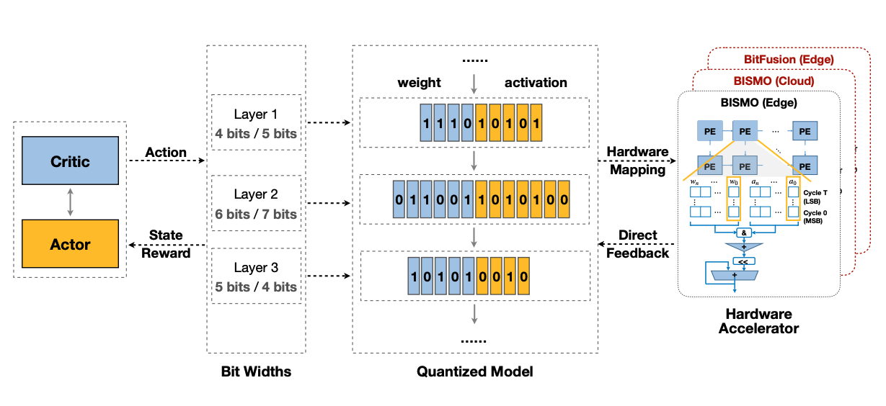
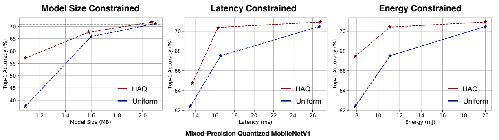

# Lecture 06: Quantization (Part II)

## Note Information

| Title       | Quantization (Part II)       |
|-------------|-----------------------------------------------------------------------------------------------------------------|
| Lecturer    | Song Han                                                                                                        |
| Date        | 09/27/2022                                                                                                      |
| Note Author | Enrique Montas (emontas)|
| Description | This lecture introduces post-training quantization, quantization-aware training, binary and ternary quantization, and automatic mixed-precision quantization. |

## Post Training Quantization
Question: How should we get the optimal linear quantization parameters (__S__ caling, __Z__ ero point)?

### Weight Quantization
#### Symmetric Linear Quantization on Weights

- $$|r|_{max} = |{W}|_{max}$$

- Using a *single* scale *S* for whole weight tensor (**Pre-Tensor Quantization**)
-- sufficient for large models
-- significant accuracy drops for small models
- Common failure causes
-- large differences (>100x) in ranges of weights for different output channels
-- outlier weight values that cause precision loss of other weights after quantization
- Solution: **Per-Channel Quantization**
-- different scaling and bias factors for different channels
[[Markus et al., ICCV 2019]](https://arxiv.org/abs/1906.04721) [[Jacob et al., CVPR 2018]](https://arxiv.org/abs/1712.05877)

**Per-Tensor vs Per-Channel Quantization:**
- Large differences in weight ranges for different output channels
-- Per-Channel Weight Quantization will outperform Per-Tensor Weight Quantization
- Per-Channel Quantization is not supported on all hardware causing unnecessary overhead in computation when finding each channel's individual scale value
-- the support for Per-Channel Quantization is increasing as its popularity in microcontrollers and use is vision models is growing

Can we make weight ranges similar to each other such that per-tensor weight quantization will work? [[Markus et al., ICCV 2019]](https://arxiv.org/abs/1906.04721)

#### Weight Equalization
##### Rescaling to equalize the weight ranges of different channels
**Key Idea: positive scaling equivarience** [[Markus et al., ICCV 2019]](https://arxiv.org/abs/1906.04721)
- scaling down layer *i* weights $W_{oc=a}^{(i)}$ of output channel *oc=a* by *s*
- scaling up layer *i+1* weights $W_{ic=a}^{(i+1)}$ of input channel *ic=a* by *s*

To make weight ranges of different output channels match as closely as possible,
$$s_j =\frac{1}{r_{ic=j}^{(i+1)}}\sqrt{r_{oc=j}^{(i)} \cdot r_{ic=j}^{(i+1)}}$$
where $r_{oc=j}^{(i)}$ is the weight range of *output* channel *j* in layer *i*, and $r_{ic=j}^{(i + 1)}$ is the weight range of *input* channel *j* in layer $i+1$
*note: f must be linear ie ReLU() is piece-wise linear, requires going throught the entire network 2 layers at a time*

##### Adaptive Rounding for Weight Quantization
**Rounding-to-nearest is suboptimal**
*Philosophy:* Weights are correlated with each other. Thus rounding each weight (to the nearest) is suboptimal for rounding the entire tensor. [[Nagel et al., PMLR 2020]](https://arxiv.org/abs/2004.10568)

What is optimal? Rounding that reconstructs the original *activation* the best, which may be very different.
- only for weight quantization
- short term tuning required, (almost) post-training quantization

*Method:*
- instead of $\lfloor w\rceil$, we want to choose from $\{\lfloor w\rfloor, \lceil w\rceil\}$ to get the best reconstruction.
- we can take a learning-based method to find quantized value $\widetilde{w} = \lfloor \lfloor w\rfloor+\delta\rceil, \delta\in [0,1]$:

$$\arg\min_v||Wx-\widetilde Wx||^2_F + \lambda f_{reg}(V) \rightarrow \arg\min_v||Wx-\lfloor\lfloor{W}\rfloor + {h}({V})\rceil{x}||^2_F + \lambda f_{reg}({V})$$

Here, **x** is the input to the layer, **V** is a random variable of the same shape, **h**() is a function to map the range to $(0,1)$, ie rectified sigmoid, and $f_{reg}(\mathbf{V})$ is regularization that encourages **h(V)** to be binary

### Activation Quantization
#### Linear Quantization on Activations
- for different inputs the floating-point range varies
- to determine the floating-point range, the activations statistics are gathered **before** thhe model is deployed.

**How to collect activations statistics before deploying the model**
#### Dynamic Range for Activation Quantization
- Type 1: Durring training [[Jacob et al., CVPR 2018]](https://arxiv.org/abs/1712.05877)
-- exponental moving averages (EMA) smooths observed ranges across thousands of training steps
$$\hat{r}_{\min, \max}^{(t)} = \alpha\cdot r_{\min, \max}^{(t)}+(1-\alpha)\cdot\hat{r}_{\min, \max}^{(t-1)}$$

- Type 2: By running a few "calibration" batches of samples on the trained FP32 model [Neural Network Distiller](https://intellabs.github.io/distiller/algo_quantization.html) [[Banner et al., NeurIPS 2019]](https://arxiv.org/abs/1810.05723) [Szymon Migacz, 2017](https://on-demand.gputechconf.com/gtc/2017/presentation/s7310-8-bit-inference-with-tensorrt.pdf)
-- spend dynamic range on outliers hurts representation ability
-- use *mean* of the min/max of each sample in the batches
-- *minimize the mean-square-error* between inputs **X** and reconstructed quantized inputs $Q({X})$
$$\min_{|r|_{max}}\mathbb{E}[({X}-Q({X}))^2]$$

-- assume inputs are in Gaussian or Laplace distribution.
 in a Laplace distribution (0, *b*) optimal clipping values can be numerically computed as $$|r|_{\max} = 2.83b, 3.98b, 5.03b$$ for 2, 3, 4 bits.
-- the Laplace parameter *b* can be estimated from calibration input distribution.
-- *minimize loss of information* since integer models encode the same information as the original floating-point model,
we can measure information loss with Kullback-Leibler divergence (relative information divergence):
-- for two discrete probability distributions *P, Q*

$$D_{KL}(P||Q)=\sum_i^N P(x_i)\log\frac{P(x_i)}{Q(x_i)}$$

*intuition: KL divergence measures the information lost when approximating a given encoding*

### Bias Quantization
#### Quantized Bias Correction
**Fix biased error introduced by quantization**
A common assumption is that quantized error is unbiased. The quantization error weights can cause biased error on corresponding outputs shifting the distribution of the next layer. [[Markus et al., ICCV 2019]](https://arxiv.org/abs/1906.04721)
$$\mathbb{E}[\mathbf{\hat{y}-y}]\approx \frac{1}{N}\sum_n(Q\mathbf{(W)x_n})_j-(\mathbf{Wx_n})_j$$
- denote quantization error as $$\epsilon = Q(\mathbf{W})-\mathbf{W}$$
$$\mathbb{E}[\mathbf{y}] = \mathbb{E}[\mathbf{Wx}] + \mathbb{E}[\epsilon x] - \mathbb{E}[\epsilon x]$$
$$\mathbb{E}[\mathbf{y}] = \mathbb{E}[Q(\mathbf{Wx})] - \epsilon\mathbb{E}[x]$$
where the $- \epsilon\mathbb{E}[x]$ term is absorbed into the bias parameter
$\mathbb{E}[x]$ can be inferred from batch normalization

Smaller models seem to not respond as well to post-training quantization, presumabley due to their smaller representational capacity.

## Quantized-Aware Training
Question: How should we improve performance of quantized models?
**Train the model taking quantization into consideration**
- minimize loss of accuracy, especially aggressive quantization with 4 or less width bit, neural networks will be trained/fine-tuned with quantized weights and activations.
- typically fine-tuning a pre-trained floating point model provides better accuracy than training from scratch [[Han et al., ICLR 2016]](https://arxiv.org/abs/1510.00149)

- maintain a full precision copy of weights while training
- small gradients are accumulated
- once the model is trained only use quantized weights for infrence

We can construct an affine mapping of intergers to real numbers $$r=S(q-Z)$$
$$\mathbf{W}\rightarrow \mathbf{q_W}-\text{zero point}\times\text{scale}=Q(\mathbf{W})$$
How should gradients back-propagate through the (simulated) quantization?
- quantization is discrete valued
-- almost anywhere $$\frac{\partial Q(W)}{\partial W} = 0$$
-- this zero gradient carries and the network is unable to learn
- Straight-Through Estimator (STE) passes gradients through quantization [[Hinton et al., Coursera Video Lecture, 2012]](https://www.coursera.org/learn/neural-networks-deep-learning) [[Bengio, arXiv 2013]](https://arxiv.org/abs/1308.3432)
$$g_{\mathbf{W}} = \frac{\partial L}{\partial W}=\frac{\partial L}{\partial Q(W)}$$

[[Jacob et al., CVPR 2018]](https://arxiv.org/abs/1712.05877)

## Binary and Ternary Quantization
Using Binary/Ternary Quantization the storage is for Binary/Ternary Weights and the computation is bit operations.
Question: Can we push the precision to 1 bit?

| input | weight | operations | memory | computation |
|---|---|---|---|---|
|$\mathbb{R}$| $\mathbb{R}$ |+ x| 1x | 1x |
|$\mathbb{R}$| $\mathbb{B}$ |+ -| ~32x less | ~2x less |
|$\mathbb{B}$| $\mathbb{B}$ |xnor, popcount | ~32x less | ~58x less |

**There are two types of Binarization:** [[Courbariaux et al., NeurIPS 2015]](https://arxiv.org/abs/1511.00363)  [[Courbariaux et al., Arxiv 2016]](https://arxiv.org/abs/1602.02830) [[Rastegari et al., ECCV 2016]](https://arxiv.org/abs/1603.05279)
- Deterministic: direct computation usually results in sign function
- Stochastic: use global statistics  or the value of the input data
-- harder to implement because it requires the hardware to generate random bits while quantizing

**Ternary Weight Networks:** [[Li et al., Arxiv 2016]](https://arxiv.org/abs/1605.04711) Weights $\in [-1, 0, 1]$

$$q = \begin{cases} r_t & \text{if } r > \Delta\\
        0 & \text{if } x |r| \leq \Delta, \text{where } \Delta = .7 \times\mathbb{E}(|r|), r_t=\mathbb{E}_{|r|>\Delta}(|r|)\\
        -r_t & \text{if } r < -\Delta
        \end{cases}$$

**Trained Ternary Quantization:** [[Zhu et al., ICLR 2017]](https://arxiv.org/abs/1612.01064) Instead of using a fixed $r_t$, introduce two trainable parameters $w_p, w_n$ to represent the negative and positive scales.

$$q = \begin{cases} w_p & \text{if } r > \Delta\\
        0 & \text{if } x |r| \leq \Delta, \\
        -w_n & \text{if } r < -\Delta
        \end{cases}$$

|ImageNet Top-1 Accuracy | Full Precision | 1 bit (BWN) | 2 bit (TWN) | TTQ |
|-|-|-|-|-|
|ResNet-18 | 69.6 | 60.8 | 65.3 | 66.6|

## Mixed-Precision Quantization
Uniform Quantization: Layers have uniform widths of weights and activations in the quantized model.

Mixed-Precision Quantization: Layers can have uneven widths of weights and activations in the quantized model.

- MPQ challenges us with a huge design space [[Wang et al., CVPR 2019]](https://arxiv.org/abs/1811.08886)
-- design automation allows MPQ to outperform Uniform Quantization

