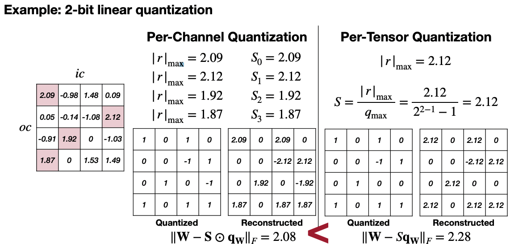
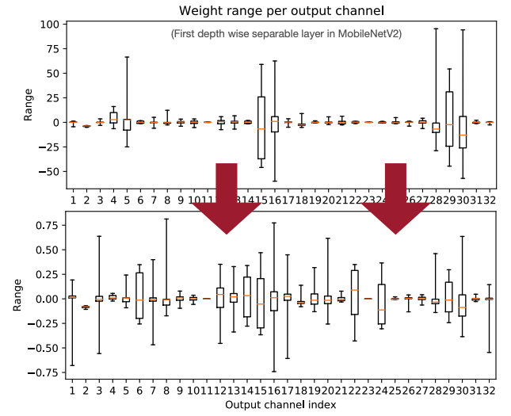
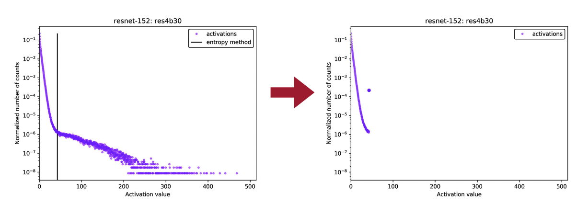
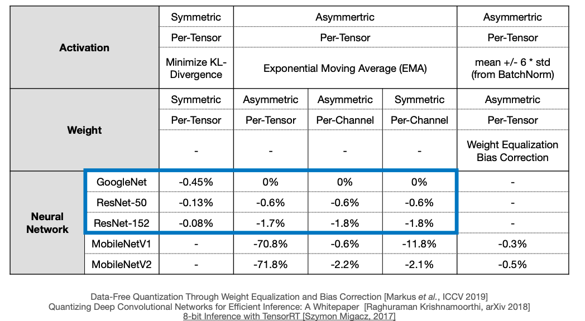
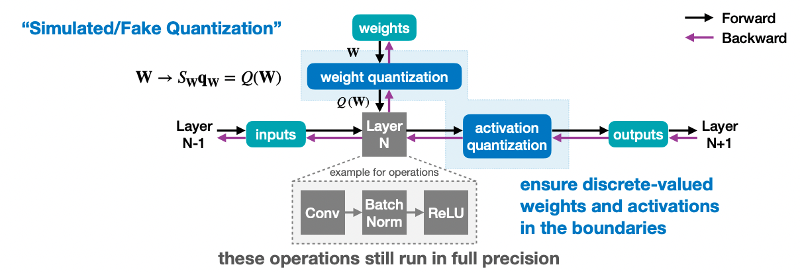
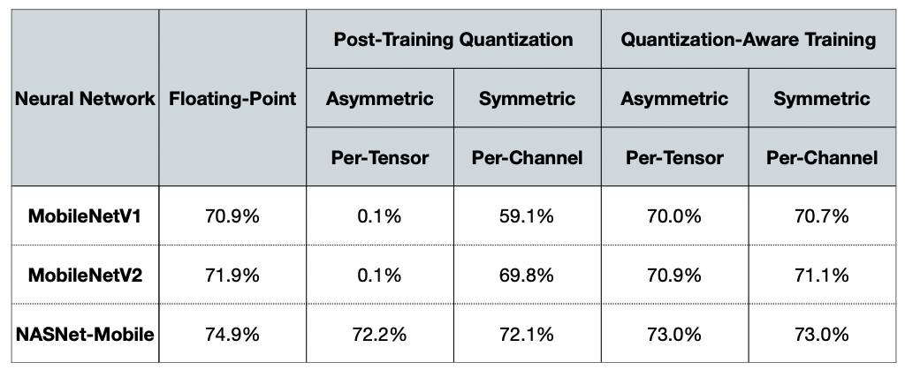
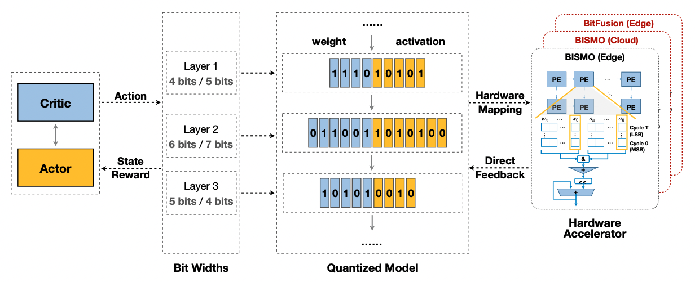

# Lecture 06: Quantization (Part II)

## Note Information

| Title       | Quantization (Part II)                                                    |
|-------------|-----------------------------------------------------------------------------------------------------------------|
| Lecturer    | Song Han                                                                                                        |
| Date        | 09/27/2022                                                                                                      |
| Note Author | Janice Yang (janicey)                                                                                                 |
| Description | Second part of two parts on the topic of quantization for space minimization. |

## Post-Training Quantization
How should we get the optimal linear quantization parameters (S, Z)? 

### Weight Quantization

#### Per-Tensor vs Per-Channel Quantization
- There often exist large differences in weights for different channels (which can lead to significant accuracy drops in smaller models). There could be large differences in ranges of weights for different output channels, or outlier weights that make all remaining weights less precise after quantization. 
- Solution: we can use per-channel quantization

The figure above comes from [[Han, 2022]](https://hanlab.mit.edu/files/course/slides/MIT-TinyML-Lec06-Quantization-II.pdf), demonstrating how reconstructed error can be much smaller if we use per-channel quantization, which can lead to better model accuracy.

However, not all hardware supports this, and there might be unnecessary overhead. These days, per-channel quantization is quite popular in real-life applications. 

#### Weight Equalization
- Key idea: rescaling weights to equalize the weight ranges of different output channels, so that we can potentially still use per-tensor weight quantization. 

The figure above comes from [[Markus et al., ICCV 2019]](https://hanlab.mit.edu/files/course/slides/MIT-TinyML-Lec06-Quantization-II.pdf), demonstrating how different output channel weights can be and how they could be equalized.

- Pick a scaling factor $s$, where for each $s_i$ per layer, we divide layer $i$ by s, and scale up layer $i+1$ by s. This should maintain equivariance. 

Actual equations:

$$y^{(i+1)} = f(W^{(i+1)}x^{(i+1)} + b^{(i+1)}) = f(W^{(i+1)} * f(W^{(i)}x^{(i)} + b^{(i)}) + b^{(i+1)}) = f(W^{(i+1)}S * f(S^{-1}W^{(i)}x^{(i)} + S^{-1}b^{(i)}) + b^{(i+1)})$$

where $S = \text{diag}(s)$ and $s_j$ is the weight equalization scale factor of output channel $j$. Here, $f$ has to be linear. 

To make the weight ranges of different output channels match as closely as possible, we choose $s_j$ where

$$s_j = \frac{1}{r_{ic=j}^{(i+1)}} \sqrt{r_{oc=j}^{(i)} \cdot r_{ic=j}^{(i+1)}},$$

where $r_{oc=j}^{(i)}$ is the weight range of output channel $j$ in layer $i$, and $r_{ic=j}^{(i+1)}$ is the weight range of input channel $j$ in layer $i+1$. 

- Intuition, $1 * 100 = 10 * 10$, so taking the product of the two numbers, then the square root should give you the same product, and you just get two equalized input numbers now. 

- Shortfalls: assumes simple activation functions. Works well with ReLU which is piece-weise linear, but perhaps will not work with more complex functions. 
- Pros: does not require much computation or extra training, can get the weights and equalize them directly.

#### Adaptive Rounding
- Key idea: rounding to nearest number is not always optimal. The best rounding for each individual weight may not be the best rounding for the whole tensor, because weights interact with each other. 
- Learn the rounding that reconstructs the original activation the best. 
- We try to learn a parameter $\Delta$ between [0, 1] that optimizes rounding for each weight. 
- Optimize the difference between the original $Wx$ and the reconstructed $\lfloor\lfloor W \rfloor + h(V)\rceil x$:

$$\arg\min_v || Wx - \lfloor\lfloor W \rfloor + h(V)\rceil x ||^2_F + \lambda f_{reg}(V)$$

where $x$ is the input to the layer, $V$ is a random variable of the same shape, $h()$ is a function to map the range to (0, 1), and $f_{reg}(V)$ is a regularization that encourages $h(V)$ to be binary. 

### Activation Quantization
- Before deploying the model, gather input activation values using some calibration batches on the trained model to understand sample distributions
- Type 1: During training, use Exponential moving averages (EMA). During training time, find $r_{min}$ and $r_{max}$, and smooth across thousands of training steps. 
- Type 2: Running a few "calibration" batches of samples on the trained FP32 model. Minimize the mean-squared-error between inputs X and (reconstructed) quantized inputs Q(X), and find optimal clipping values for both ends. For Laplace (0, b) distributions, optimal clipping values can be solved numerically. Otherwise, another way to find the boundaries is to minimize Kullback-Leibler (KL) divergence, which represents the loss of information. 

For two discrete probability distributions $P$ and $Q$: 

$$D_{KL}(P||Q) = \sum_{i}^{N}P(x_i)\log\frac{P(x_i)}{Q(x_i)}$$

The figure above comes from [[Szymon Migacz, 2017]](https://on-demand.gputechconf.com/gtc/2017/presentation/s7310-8-bit-inference-with-tensorrt.pdf), showing an example of clipping weights on a certain layer of ResNet-152, after finding the optimal clipping point using KL Divergence optimization.

### Bias Quantization
- Key idea: fix the biased error introduced by quantization, because it can often be unevenly distributed. 
- Method: just absorb the quantization error into the model bias parameter. 

Quantization error can be denoted as $\epsilon = Q(W) - W$

$$E[y] = E[Wx] + E[\epsilon x] - E[\epsilon x] = E[Q(W)x] - \epsilon E[x],$$

where $E[x]$ can be inferred from batch normalization, and the last term $\epsilon E[x]$ can be absorbed in the bias parameter. 

### Post-Training Linear Quantization Summary
- Smaller models seem to lose more accuracy than large models after quantization, even after methods such as per channel quantization. However, this can be corrected by Weight Equalization and Bias Correction. 

## Quantization-Aware Training
- To minimize loss of accuracy, especially aggressive quantization with 4 bits and lower bit width, we should train or fine-tune a neural network with quantized weights and activations.
- To do this, we maintain a full precision copy of the weights during training, to capture smaller gradient changes. 
- We propagate the gradients through the (simulated) quantization by using a Straight-Through Estimator. 
    - Quantization is discrete-valued, therefore the slope is 0 everywhere. The Straight-Through Estimator simply passes the gradients through quantization as if it had been the identity function. 

The figure above comes from [[Han, 2022]](https://hanlab.mit.edu/files/course/slides/MIT-TinyML-Lec06-Quantization-II.pdf), depicting quantization-aware training.

- Results show that quantization-aware training achieves similar or better accuracy than post-training quantization. 

The figure above comes from [[Raghuraman Krishnamoorthi, arXiv 2018]](https://hanlab.mit.edu/files/course/slides/MIT-TinyML-Lec06-Quantization-II.pdf), comparing performance of quantization aware and non-aware training.

## Neural Network Quantization
- Memory movement is very expensive. Reducting memory by half results in reducing precision by 4x though, need to think about tradeoffs. 

### Binary / Ternary Quantization
- Can we push the quantization precision to just 1 bit? 
- Changing to binary weights means we don't have to do multiplication anymore, just addition and subtraction.

Types of Binarization:
- Deterministic Binarization: directly computes the bit value based on a threshold, usually 0, resulting in a sign function. 
- Stochastic Binarization: probability of -1 or +1 is determined by some function using global statistics or the value of input data. 
    - e.g. in Binary Connect(BC), probability is determined by a hard sigmoid function. 
    - this becomes harder to implement as it requires the hardware to generate random bits when quantizing

Minimizing Quantization Error in Binarization 
- Can scale by a constant value. Binary Weight Network (BWN) does this and performs significantly better than BinaryConnect. 

If both activations and weights are binarized: 
- Can be represented by a $xnor$ operation, multiplied by 2, then added to the number of terms. This involves a popcount equation and other simple operations, which is easy to implement on hardware. 

Ternary Weight Networks (TWN)
- Weights are quantized to +1, -1, and 0, using $\Delta = 0.7 * E(r)$ as a threshold to map out 3 distinct regions: $r > \Delta$, $|r| \leq \Delta$, and $r < -\Delta$. 

Trained Ternary Quantization (TTQ)
- Instead of using a fixed scale $r_t$ for both ends we can use two trainable parameters $w_p$ and $w_n$ to represent the positive and negative scales, which achieve better performance than both BWN and TWN.

### Mixed-Precision Quantization
- Challenge: Huge space of choices for bits for each layer.
-  Solution: use reinforcement learning to learn the optimal bits per layer for weights and activation, to create better optimization curves for latency and energy versus accuracy. 

The figure above comes from [[Wang et al. CVPR 2019]](https://hanlab.mit.edu/files/course/slides/MIT-TinyML-Lec06-Quantization-II.pdf), depicting a design that supports hardware-aware automated quantization with mixed precision.