# Lecture 06: Quantization Part II

## Note Information

| Title       | Quantization Part II                                                                                            |
|-------------|-----------------------------------------------------------------------------------------------------------------|
| Lecturer    | Song Han                                                                                                        |
| Date        | 09/27/2022                                                                                                      |
| Note Author | Pranav Murugan (pmurugan)                                                                                       |
| Description | This lecture explores techniques for post-training quantization as well as training a quantized model, and introduces binary and ternary quantization. |

## Review of K-Means and Linear Quantization [[Link to Lecture 05 Notes]](https://github.com/mit-han-lab/6s965-fall2022/blob/main/notes/lecture-05-alangham.md)

### K-Means

- Define quantized weights with K-means clustering of the values in the weight matrix [[Han et al., ICLR 2016]](https://arxiv.org/pdf/1510.00149.pdf)
- Map from quantized weights to centroids with a lookup table
- An example of a gradient operation on a quantized tensor is below:

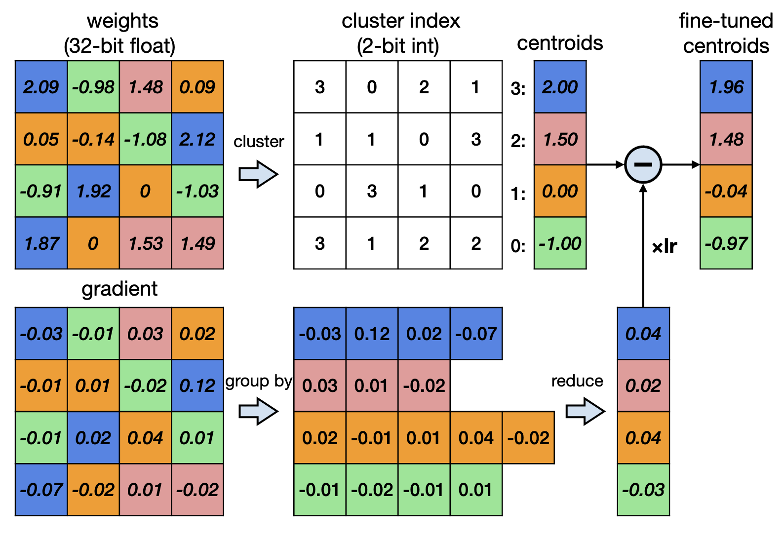

### Linear

- Have integer quantized weights with affine map from real to integer weights [[Jacob et al., CVPR 2018]](https://arxiv.org/pdf/1712.05877.pdf)

- Map $q_{min}$ and $q_{max}$ to $r_{min}$ and $r_{max}$, with zero point $Z$ and scale $S$
- The transformation from the quantized to non-quantized parameters is thus $$r = S(q - Z)$$
- To minimize the number of nonzero operations, we typically make the following assumptions for a fully-connected layer $Y = WX +b$:

$$Z_W = Z_b = 0,$$
$$S_b = S_WS_X.$$

where $Z_W$ is the zero point of the weights, $Z_b$ is the zero point of the bias, and $S_b, S_W, S_X$ are the scale factors of the bias, weights and input respectively.

- The quantized version of a fully-connected layer is below:

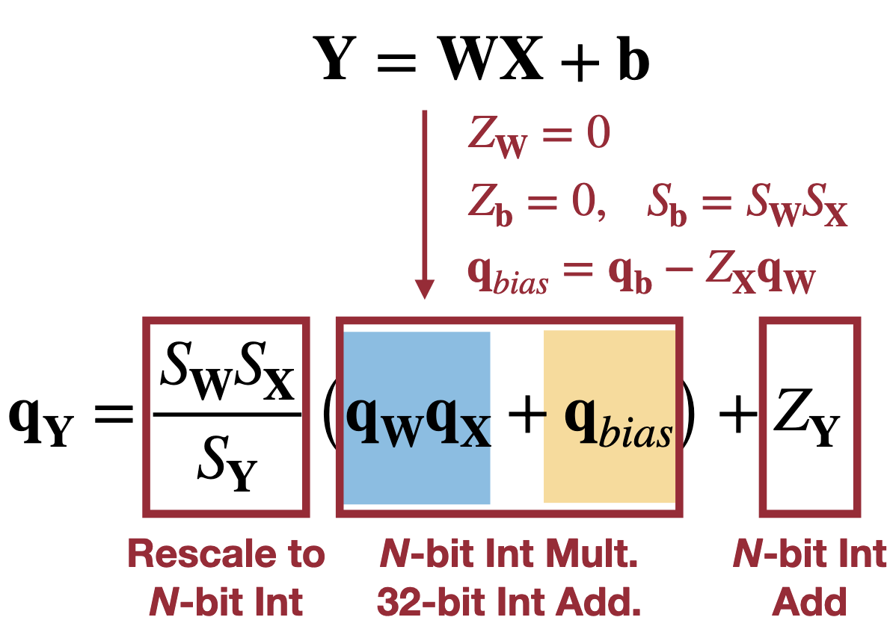

*How are the parameters S and Z determined?*
- One way is asymmetric quantization, shown below
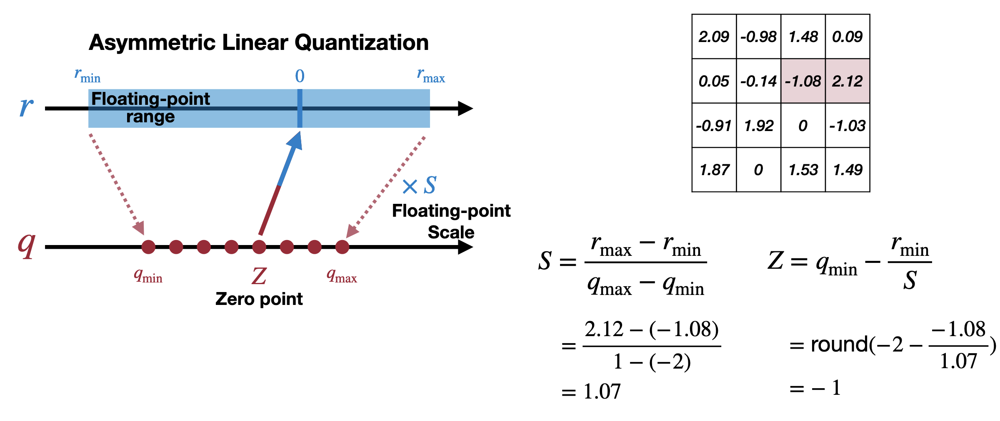
- Another way is symmetric quantization, shown below.
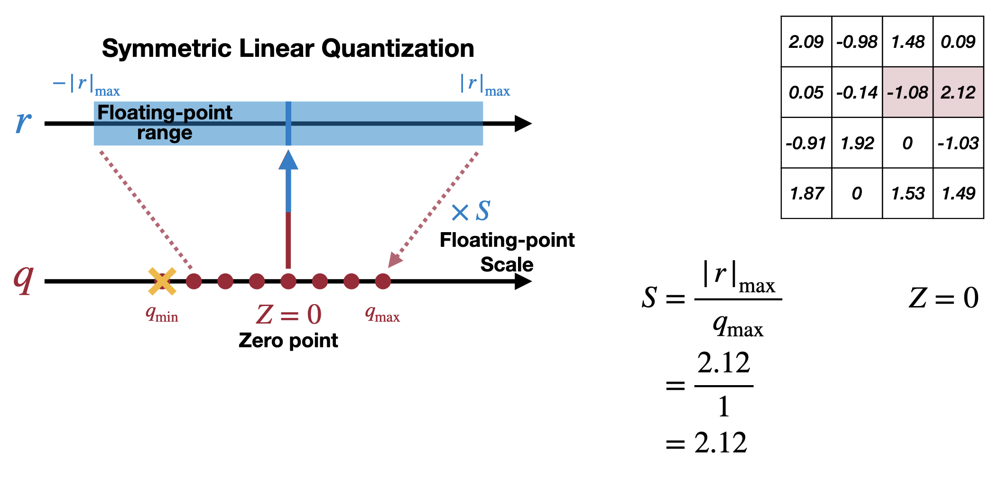
Symmetric quantization is easier to accelerate since the $Z = 0$ restriction reduces the number of required operations; however, this comes at the expense of slightly reduced expressive power since one bit is unused.

## Post-Training Quantization (PTQ)

### 1. Weight Quantization

We can use single scale $S$ for whole tensor (Per-Tensor Quantization), by setting $|r_{max}| = |W_{max}|$. It works well enough for large models, but has poor accuracy for small models.

_Why?_ Because large differences in weights between channels and outlier weights can make quantization mapping not effective. In the figure below, the outliers in channel 28 will set the scaling factor of the quantized model, which means at low bit counts, the majority of channels have a low resolution for their near-zero weights [[Markus et al., ICCV 2019]](https://arxiv.org/pdf/1906.04721.pdf).

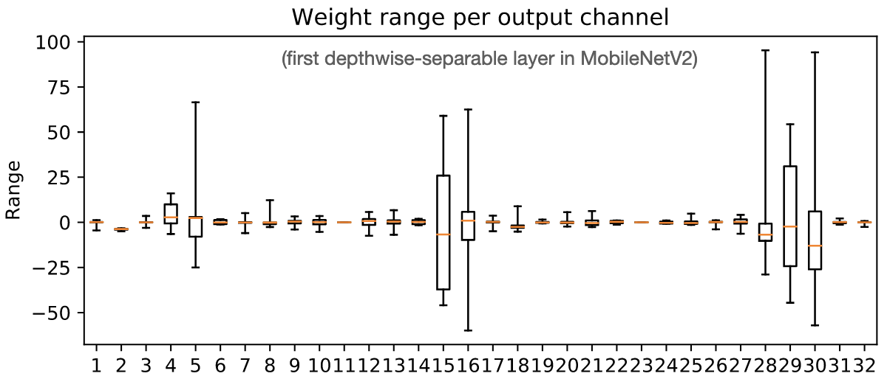

The solution is to use **per-channel quantization**, so that variations in weights between channels is better accounted for. In per-channel quantization, the scaling max $|r_{max}|$ is set per-channel. Thus, the resulting scale factors are better at reconstructing the original data. There may also be differences in the quantized matrix between the per-tensor and per-channel methods, but the former results in lower reconstruction errors.

The drawback of per-channel quantization is that it requires more specialized hardware support, and requires more computation and memory overhead because more scaling factors must be stored. However, modern GPUs are starting to support per-channel quantization.

*Can we make weight ranges similar to each other so that per-tensor weight quantization will work?*

#### Weight Equalization
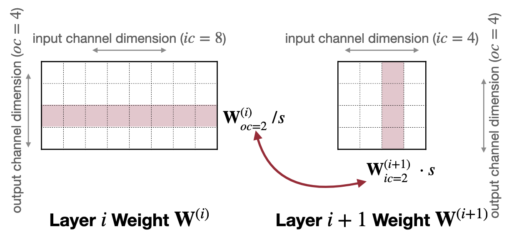

Let us first consider two adjacent layers in the model, shown above. We want to scale the layer $W^{(i)}\_{oc=j}$ by a scale factor $s^{-1}$ and the corresponding $W^{(i+1)}\_{ic=j}$ by $s$ so that the weights have a similar magnitude and the activation is maximally preserved. Such a transformation requires the activation function to be linear (so that successive multiplications of the scaled weight tensors result in the scaling factors cancelling out). Thus, ReLU activations are commonly used because they satisfy *positive scaling equivariance* -- that is, $\text{ReLU}(s\cdot x) = s\cdot \text{ReLU}(x)$ for $s > 0$. 

To make weight ranges as close as possible throughout the model, we set 

$$s_j = \frac{1}{r^{(i+1)}\_{ic=j}}\sqrt{r^{(i)}\_{oc=j}\cdot r^{(i+1)}\_{ic=j}}$$ 

where $r^{(i)}\_{oc=j}$ is the weight range of output channel $j$ in layer $i$, and $r^{(i+1)}\_{ic=j}$ is the weight range of input channel $j$ in layer $i+1$. For a linear activation, we can verify straightforwardly that 

$$\frac{r^{(i)}\_{oc=j}}{s}=r^{(i+1)}\_{ic=j}\cdot s.$$

This approach is limited because it best with activations that are linear or near-linear. Also, the scaling operations act in a greedy manner; thus, multiple passes are necessary to propagate changes throughout the model. This approach does not require retraining [[Nagel et al., ICCV 2019]](https://arxiv.org/pdf/1906.04721.pdf).

#### Adaptive Rounding

Another method of weight quantization is simply rounding the floating point values. Why Adaptive Rounding? The philosophy is that rounding to the nearest integer is not necessarily optimal, since weights are often correlated with each other. The best rounding scheme is the one that reconstructs the original activation the best [[Nagel et al., PMLR 2020]](http://proceedings.mlr.press/v119/nagel20a/nagel20a.pdf).

Essentially, we learn a tensor $\mathbf{V}$ that chooses between rounding up or down for each weight element. More specifically, we find $\mathbf{V}$ that satisfies

$$\text{argmin}\_{\mathbf{V}}||\mathbf{W}\mathbf{x} - \lfloor\lfloor \mathbf{W}\rfloor + \mathbf{h}(\mathbf{V})\rceil\mathbf{x}||^2_F + \lambda f_{reg}(\mathbf{V})$$

where:
- $\mathbf{x}$ is the input to the layer, $\mathbf{W}$ are the un-quantized weights, and $\mathbf{V}$ has the same shape as $\mathbf{W}$
- we also supply the elementwise function $\mathbf{h}: \mathbb{R}\rightarrow [0,1]$, such as a rectified sigmoid. 
- $f_{reg}$ regularizes $\mathbf{V}$ to encourage $\mathbf{h}(\mathbf{V})$ to be binary.

### 2. Activation quantization

We need to collect activation statistics to effectively quantize activations. There are many ways of doing so:

1. During training, we can use an exponential moving average (EMA) approach [[Jacob et al., CVPR 2018]](https://arxiv.org/pdf/1712.05877.pdf). In this approach, the range of the activations of the model are observed (with a greater weight assigned to later training cycles). Mathematically, the EMA activation range at epoch $t$, $\hat{r}^{(t)}\_{\text{max, min}}$, is defined in terms of the actual range of activations at epoch $t$, $r^{(t)}\_{\text{max, min}}$, as $$\hat{r}^{(t)}\_{\text{max, min}} = \alpha r^{(t)}\_{\text{max, min}} + (1-\alpha)\hat{r}^{(t-1)}\_{\text{max, min}}$$ for some empirically tunable parameter $\alpha \in (0,1)$.
2. We can also use a calibration batch after training to directly estimate the dynamic range of activations. We use the mean of the min and max of each sample to minimize effect of outliers. To construct this calibration batch, we usually picka a representative sample at random from the training set (e.g. 100 images). To quantize the observed range of activations, we can follow one of three methods.
    1. We can uniformly map the range \[ $\bar{r}\_{min}$, $\bar{r}\_{max}$\] to the quantized range \[ $q\_{min}$, $q\_{max}$\] as in the weight quantization above.
    2. We can minimize the MSE between inputs $\mathbf(X)$ and reconstructed quantized inputs $Q(\mathbf{X})$, as $$\min_{|r|\_{max}}\mathbb{E}\left[(\mathbf{X} - Q(\mathbf{X}))^2\right].$$ We can often assume a Gaussian or Laplace distribution with parameters estimated from the input distribution, for which the optimal clipping values $|r|\_{max}$ can be determined numerically (e.g. $|r|\_{max} = 2.83b$ for 2 bit quantization of a Laplace distribution with parameter $b$) [[Banner et al., NeurIPS 2019]](https://proceedings.neurips.cc/paper/2019/hash/c0a62e133894cdce435bcb4a5df1db2d-Abstract.html).
    3. We can also minimize the loss of information from quantization, measured by the Kullback-Leibler divergence between the distributions of initial and quantized inputs. In this case, however, we need to identify intuitively where to clip large activations to minimize KL divergence (see figure below) [[Szymon Migacz, 2017]](https://on-demand.gputechconf.com/gtc/2017/presentation/s7310-8-bit-inference-with-tensorrt.pdf). Widely used in TensorRT.

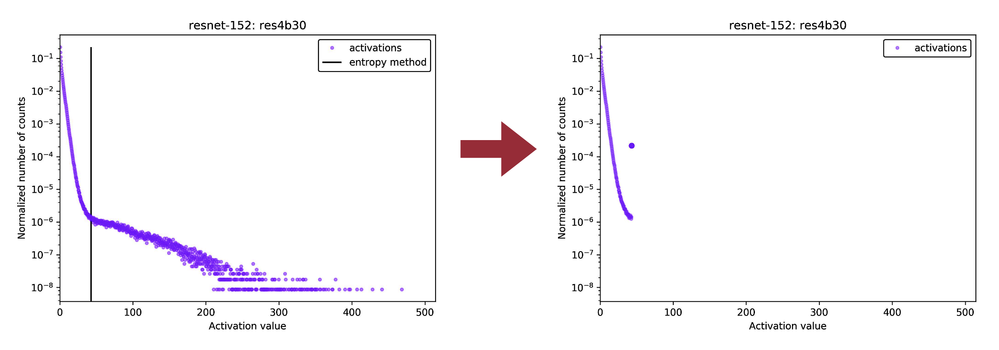

### 3. Bias quantization

A common assumption is that quantization error of a layer is unbiased, but according to [[Nagel et al., ICCV 2019]](https://arxiv.org/pdf/1906.04721.pdf) this is not necessarily true.

Quantization error can induce bias in subsequent layers, shifting the input distribution of later layers. If we denote the quantization error as $\epsilon = Q(\mathbf{W}) - \mathbf{W}$, we can subtract the quantization error term $\epsilon\mathbb{E}[\mathbf{x}]$ to correct the quantization bias in the approximation $$\mathbb{E}[y] = \mathbb{E}[Q(\mathbf{W})\mathbf{x}] - \epsilon\mathbb{E}[\mathbf{x}].$$ We can absorb quantization error into the bias, and can estimate it without additional calibration data from batch normalization parameters.

Smaller models seem to not respond as well to post training quantization, presumably because of their smaller representational capacity. Bias correction can help for smaller models.

### Performance comparison

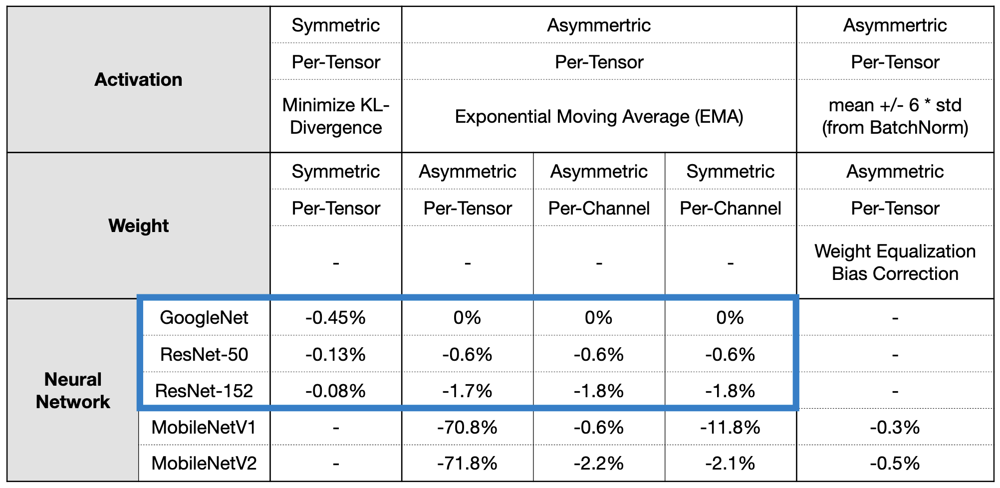

As we can see in the table above, in larger models quantization works quite well to decrease model size and computation without signficant losses in accuracy. Quantization is less consistent in smaller models (e.g. MobileNet), presumably due to their smaller representational capacity, but can still be compressed in many cases [[Nagel et al., ICCV 2019]](https://arxiv.org/pdf/1906.04721.pdf)[[Szymon Migacz, 2017]](https://on-demand.gputechconf.com/gtc/2017/presentation/s7310-8-bit-inference-with-tensorrt.pdf)[[Raghuraman Krishnamoorthi, 2018]](https://arxiv.org/pdf/1806.08342.pdf).

Now that we know how to quantized an already-trained model, *how can we improve the performance of quantized models?*

## Quantization-Aware Training (QAT)

We want to propagate gradients through the model and through quantization operations. For K-means quantization, this is relatively straightfoward; we can pool gradient updates for each centroid and update the centroid value. Learning the index has minimal benefit, so it stays fixed through finetuning [[Han et al., ICLR 2016]](https://arxiv.org/pdf/1510.00149.pdf).

### QAT with Linear quantization

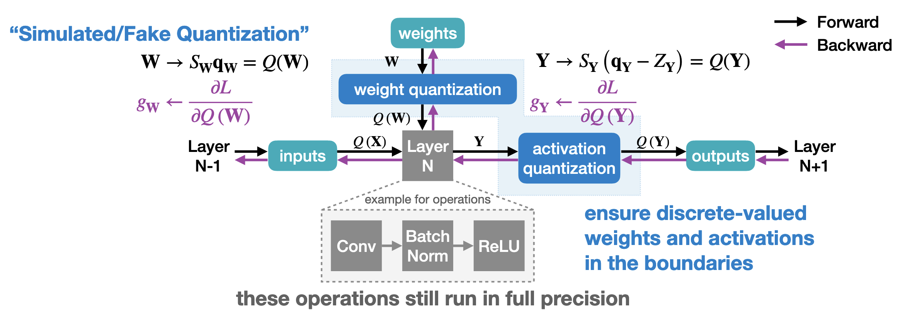

We maintain a full-precision copy of the weights so that small gradients are maintained without loss of precisions, but simulate linear quantization for feed-forward steps. How do we compute gradients for full precision and quantized weights? Because the quantization functions are discrete-valued, the gradient is zero almost everywhere so the weights and activations don’t get updated. The simplest solution is to use a Straight-Through Estimator, where we assume the gradient of the quantization function is the identity operator. Then, the gradient updates $\partial L/\partial Q(\cdot)$ for the weights and output don't inhibit gradient propagation. The quantization calculations $Q(\mathbf{W})$ and $Q(\mathbf{Y})$ must be recomputed after each gradient update.

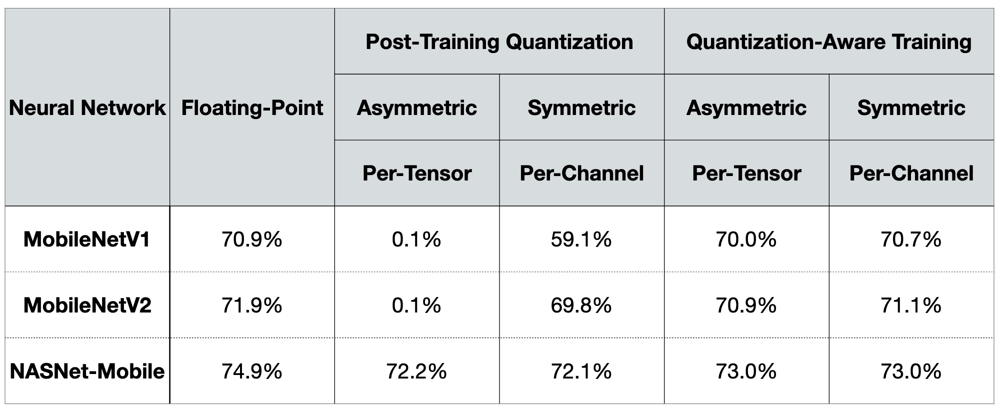

As we can see above, finetuning quantized models with QAT can recover much of the lost model performance [[Raghuraman Krishnamoorthi, 2018]](https://arxiv.org/pdf/1806.08342.pdf).

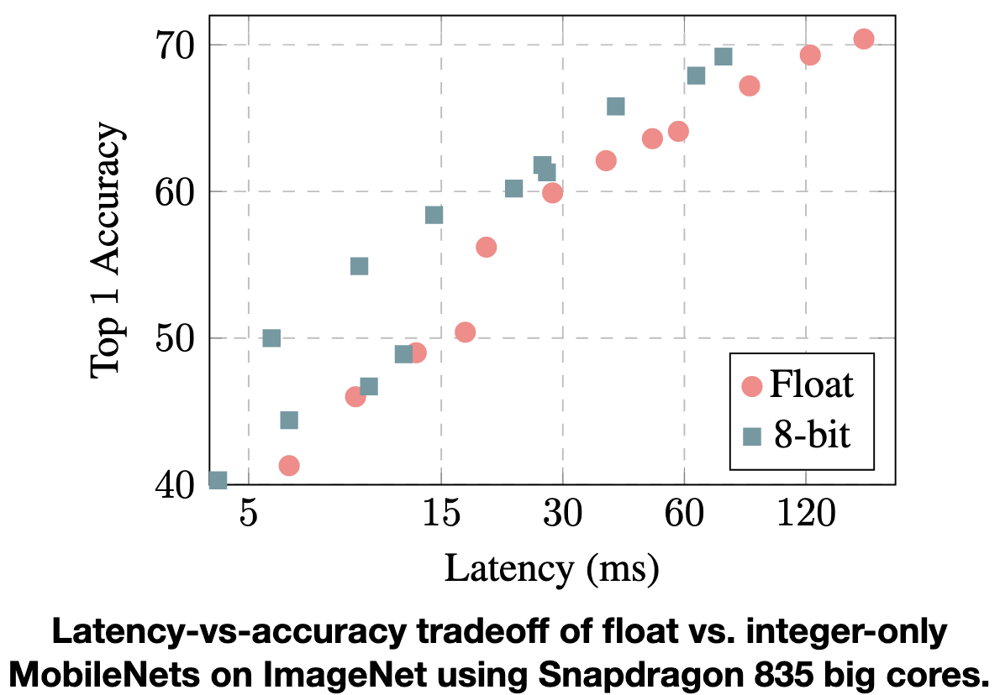

Quantized models also achieve a higher accuracy at a given latency constraint compared to float models [[Jacob et al., CVPR 2018]](https://arxiv.org/pdf/1712.05877.pdf). This area is moving very quickly; using specialized current Snapdragon hardware, we can reach >70% accuracy in less than 1 ms on this benchmark.

*Aside:* For an N-bit quantization, the memory usage goes as O(N) and computation goes as O(N^2); however, memory is usually much more expensive, so a balance has to be reached per-application.

## Binary and Ternary Quantization

Instead of integer quantization, we can use binary weights or outputs to decrease memory and operation costs. Compared to full-float operations, using binary weights reduces memory overhead by 32x and computation by 2x (since we now just have to compute the sums and differences of real numbers). Using both binary inputs and weights we can reduce memory by 32x and computation by 58x compared to the float operations [[Courbariaux et al., NeurIPS 2015]](https://proceedings.neurips.cc/paper/2015/file/3e15cc11f979ed25912dff5b0669f2cd-Paper.pdf)[[Rastegari et al., ECCV 2016]](https://arxiv.org/pdf/1603.05279.pdf). 

*How do we achieve this kind of speedup?*

### Binarization of Weights

There are two main ways to binarize the weights of a model. Deterministic binarization is the simplest, and is just the sign function.

Stochastic binarization quantizes probabilistically. For example, Binary Connect uses a hard sigmoid function to map inputs to +/- 1 [[Courbariaux et al., NeurIPS 2015]](https://proceedings.neurips.cc/paper/2015/file/3e15cc11f979ed25912dff5b0669f2cd-Paper.pdf). However, stochastic binarization is more computationally expensive and has more hardware overhead [[Courbariaux et al., 2016]](https://arxiv.org/pdf/1602.02830.pdf).

We can also introduce floating point scaling factor of the binarized matrix, which improves accuracy significantly as the binarized matrix still preserves the norm of the original matrix.

### Binary Activations and Weights

If both activations and weights are binarized, operations are significantly simplified, so that matrix operations are replaced with bit operations (e.g. multiplication ⇒ XNOR). Binarized matrices use $\pm 1$ as the binary values, so some care has to be taken to design fast computer operations (for which binary values are $\{0,1\}$).

For a given layer $i$, the output of a binary matrix multiplication is given by 

$$
\begin{align}
y_i &= \sum_j W_{ij}\cdot x_j\\
&= -n + 2\sum_j W_{ij}\text{ xnor }x_j\\
&= -n + \text{popcount}(W_i\text{ xnor }x)\ll 1.
\end{align}
$$

This final operation is very efficient to perform on computer hardware [[Rastegari et al., ECCV 2016]](https://arxiv.org/pdf/1603.05279.pdf).

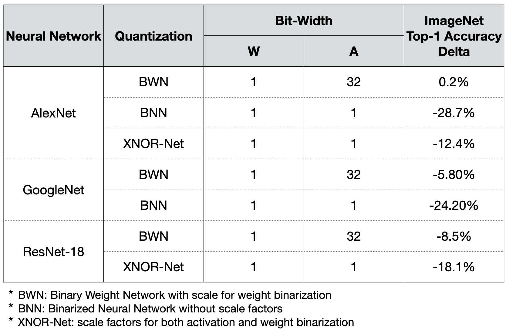

Here, we can see that Binary Weight Networks can preserve much of the accuracy of the original model, and that introducing a scale factor in binary quantization can help recover some of the accuracy loss [[Courbariaux et al., NeurIPS 2015]](https://proceedings.neurips.cc/paper/2015/file/3e15cc11f979ed25912dff5b0669f2cd-Paper.pdf)[[Rastegari et al., ECCV 2016]](https://arxiv.org/pdf/1603.05279.pdf). This method thus trades a modest decrease in accuracy for large decreases in memory usage and computation.

### Ternary Weight Networks (TWN)

We can improve model accuracy by using a symmetric ternary quantization instead of a simpler binary quantization. In a TWN, the quantized weights are

$$
q =
\begin{cases}
r_t&r > \Delta\\
0& |r| < \Delta\\
-r_t& r < -\Delta
\end{cases}
$$

where $\Delta = 0.7\times \mathbb{E}(|r|)$ and $r_t = \mathbb{E}\_{|r| > \Delta}(|r|)$. The quantization threshold is set to 0.7 empirically. The scaling factor $\Delta$ is, in effect, the L1 norm of nonzero elements [[Li et al., NIPS 2016]](https://arxiv.org/pdf/1605.04711.pdf).

Although ternary quantization requires 2 bits (so one bit representation is wasted, in a sense), the symmetry and zero centroid enables implementation with less complex hardware multipliers.

### Trained Ternary Quantization (TTQ)

Instead of having a fixed scale parameter $r_t$, TTQ learns positive and negative scale factors of quantization so the quantized weights are

$$
q =
\begin{cases}
w_p&r > \Delta\\
0& |r| < \Delta\\
-w_n& r < -\Delta
\end{cases}
$$

Both of these techniques further recover accuracy compared to binary quantization methods [[Zhu et al., ICLR 2017]](https://arxiv.org/abs/1612.01064).

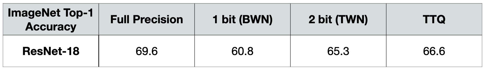

## Mixed-Precision Quantization

Becoming more popular, now supported by some NVidia GPUs.

We can have different precisions for each layer, which enables better accuracy and more quantized layers. However, selecting the proper quantization parameters has a large design space. We can use automated quantization methods with Actor-Critic models to optimize quantization factors. This Hardware-aware Automated Quantization (HAQ) tool improves accuracy in comparison to a uniformly quantized model, and learns qualitatively different policies depending on the hardware application that is running the model [[Wang et al., CVPR 2019]](https://arxiv.org/abs/1811.08886).
