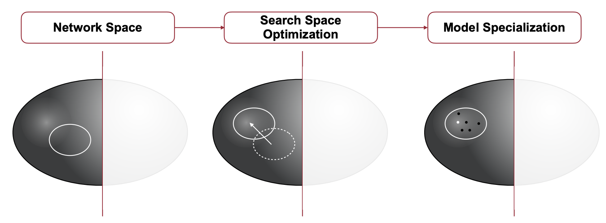

# Lecture 07: Neural Architecture Search (Part I)

## Note Information

| Title       | Neural Architecture Search (Part I) |
| ----------- | ------------------------------------------------------------ |
| Lecturer    | Song Han                                                     |
| Date        | 09/29/2022                                                   |
| Note Author | Anne Ouyang (aouyang)                                        |
| Description | Introduces basic concepts of neural network architectures and discusses the design principles of several typically manually-designed neural network architectures. Also introduces various strategies for neural architecture search, an automatic technique for designing neural network architectures |

## Neural Network Architecture

### Basic concepts and design principles

#### Primitive operations summary

| **Layer**                | Input Features       | **Output Features**  | **Weights**                        | **Bias** | **MACs**                                |
| ------------------------ | -------------------- | -------------------- | ---------------------------------- | -------- | --------------------------------------- |
| Fully connected / linear | $(n, c_i)$           | $(n, c_o)$           | $(c_o, c_i)$                       | $(c_o)$  | $c_o * c_i$                             |
| Convolution (2D)         | $(n, c_i, h_i, w_i)$ | $(n, c_o, h_o, w_o)$ | $(c_o, c_i, k_h, k_w)$             | $(c_o)$  | $c_o * c_i * k_h * k_w * h_o * w_o$     |
| Grouped convolution      | $(n, c_i, h_i, w_i)$ | $(n, c_o, h_o, w_o)$ | $(g * c_o / g, c_i / g, k_h, k_w)$ | $(c_o)$  | $c_o * c_i * k_h * k_w * h_o * w_o / g$ |
| Depthwise convolution    | $(n, c_i, h_i, w_i)$ | $(n, c_o, h_o, w_o)$ | $(c, k_h, k_w)$                    | $(c_o)$  | $c_o * k_h * k_w * h_o * w_o$           |
| 1x1 Convolution          | $(n, c_i, h_i, w_i)$ | $(n, c_o, h_o, w_o)$ | $(c_o, c_i, 1, 1)$                 | $(c_o)$  | $c_o * c_i * h_o * w_o$                 |

#### Stages

- A neural network architecture typically consists of the input stem, the head, and several stages
- Early stages have larger feature map sizes because need to keep the width small to reduce the cost
- Late stages have smaller feature map sizes so we can increase the width.
- **Downsample** is typically done in the first block through strided convolution or pooling to reduce the size of the feature map
- **Residual / skip connections** ($F(x) + x$) are added between later blocks with the same and input dimensions. 
  - Without those bypass layers, adding more layers would result in worse performance

## Manually-designed Neural Networks

- **AlexNet**: uses large kernel in early convolution stages
  - e.g. 11x11 conv and 5x5 conv layers in the beginning
- **VGG**: stacking multiple smaller kernels is better than using one large kernel
  - Only uses 3x3 convolution layers
    - With 2 layers of 3x3 convolutions we have a 5x5 receptive field
      - (image [source](https://miro.medium.com/max/1400/1*v72G1Y7yiPYMAK14BgSNYw.png))
        
      - pro: fewer parameters (small model size)
        - 3 * 3 + 3 * 3 = 18 < 5 * 5
      - drawback: introduces more layers, kernel calls, and more intermediate activation so potentially more latency
- **SqueezeNet**: 
  - Replaces the 3x3 convs with fire modules
  - Uses global average pooling in the head to reduce the cost of the head
  - **Fire modules** reduce the cost by using 1x1 convolutions
    - 
    - The model size decreased by 50x-510x compared to AlexNet, but the latency did not decrease since latency is not only related to FLOPS
- **ResNet**: 
  - Introduces the **bypass layer**
    - Very popular in deep neural networks today
    - It's possible to merge it into convolution layer
  - image [source](https://arxiv.org/abs/2101.11605)
  - 8.5x reduction in number of FLOPs if just directly using 3x3 convolutions
    - 
- **ResNeXt**: grouped convolution
  - Replaces 3x3 conv with 3x3 group conv
  - Equivalent to a multi-path block
  - 
  - However, it's better to launch fewer big kernels than multiple smaller kernels
- **MobileNet**: depthwise-separable block
  - **Depthwise convolution** is an extreme case of group convolution where the group number equals the number of input channels
  - Depthwise convolution can be used to capture spatial information
  - Use 1x1 convolution to merge information across different channels
    - image [source](https://www.researchgate.net/figure/Depthwise-separable-convolutions_fig1_358585116)
- **MobileNetV2**: inverted bottleneck block
  - Depthwise convolution has a much lower capacity compared to normal convolution, so we can increase the depthwise convolution's input and output channels to improve its capacity.
    - 

  - The cost is still affordable because depthwise convolution’s cost only grows linearly. 
  - Popular when first trying to deploy on mobile edge devices, but with more hardware accelerators there's a trend of shifting back to using more resnet-like architectures without the depthwise convolutions
- **ShuffleNet**: 1x1 group convolution & channel shuffle
  - Further reduces the cost by replacing 1x1 convolution with 1x1 group convolutions. Information across different groups are exchanged via channel shuffling
    - 
- Figure: accuracy-efficiency trade-off of different network architectures on the ImageNet benchmark
  - 
- We've looked at many manually designed neural networks. There are many decisions to be made, such as the number of channels, number of layers, number of kernels, connectivity, and resolution. Furthermore, getting the accuracy metrics of these models is very slow because we have to train these models. 
- The design space is huge, so manual design of network architectures is unscalable. 
- *Automatically designed models (asterisk) consistently outperform human designed models (circle)*
  - 

## Neural Architecture Search

- Components and goal
  - 
  - **Search space** is a set of candidate neural network architecture
    - e.g. how many times to repeat the bottleneck block

  - **Search strategy** defines how to explore the search space
  - **Performance estimation strategy** defines how to estimate/predict the performance of a given neural network architecture in the design space

### Cell-level search space

- Classifiers have normal (stride = 1) and reduction (stride > 1) cells

  - The output and input feature maps of normal cells have the same sizes; the output feature map is smaller than the input feature map in a reduction cell

- **NASNet cell-level search space** uses an RNN controller to generate the candidate cells in five steps

  - Fives steps
    - Diagram
    - 1-2: Find two inputs
    - 3-4: Select two input transformation operations  (e.g. convolution, pooling, identity)
    - 5: Select the method to combined the results
    - These steps will be repeated B times
    - An example of a generated cell 
      - 

  - Assume we have 2 candidate inputs (either from the previous layer or the layer before the previous layer), M candidate operations to transform the inputs, and N potential operations to combine hidden states
    - The size of the search space is
    - $(2 * 2 * M * M * N)^B = 4^B M^{2B} N^B$
  - Challenges for NASNet
    - Search cost
      - To collect feedback, we need to evaluate a lot of neural nets, which requires a lot of training time
    - Hardware efficiency
      - There are multiple irregular branches creating complex data dependency relations. As a result, instead of freeing memory, we might need to store a lot of intermediate activations. Furthermore, this type of architecture will be very hard to prune.
      - There are hardware-aware NAS techniques that will be introduced later

### Network-level search space

- **fixed topology**
  - The connection patterns are fixed; only the depth (number of building blocks) for each stage is searched
- **searchable topology**
  - When we have resolution in the design space (very popular in pixel-wise prediction tasks), we can model the design space as a series of downsample and upsample strategies
    - image [source](https://arxiv.org/abs/1901.02985)
    - Each path along the blue nodes correspond to a network architecture in the search space
      - image [source](https://arxiv.org/abs/1901.02985)

  - **NAS-FPN** (feature pyramid network)
    - Image [source](https://arxiv.org/abs/1904.07392)
    - Widely used in object detection
    - Combines multiple resolutions (higher and lower) so can detect both small and large objects
    - Not really hardware friendly, since feeding different resolutions into different stages it's quite irregular
    - The most performant candidate sometimes perform aggressive 4x/8x upsampling
    - We need to use such techniques carefully, since we need to balance accuracy with regularity. Irregular topologies can be very difficult to efficiently deploy on hardware and difficult to parallelize

### Designing the search space

- How do we design the search space?
  - There are several heuristics to narrow down the search space before performing the search

- **RegNet**: uses the cumulative error distribution as a criterion for the search space quality
  - image [source](https://arxiv.org/abs/1905.13214)
  - The search space represented by the orange curve is the best since most of the models have less than 50% error. 
  - Problem with this approach is that we need to collect a lot of data on the neural network accuracies to generate the curves, which requires a lot of training time.

- Designing the search space is very important when you're trying to target new sets of design constraints; for example, cloud ML (NVIDIA V100), mobile ML (iPhone 11), and tiny ML (STM32F756) have different amounts of system memory
  - Memory constraint is very important for tiny ML in addition to latency and energy constraints

- TinyNAS
  - Automated search space optimization + resource constrained model specialization
  - 

- **FLOPs heuristic**
  - We don't want to spend a lot of resources on training the model to get the data; instead, given the same memory constraints, we can analyze the FLOPs distribution of satisfying models
  - A good design space is likely to achieve high FLOPs under the same memory constraint
    - Use this to choose a good design space as your search space

  - Larger FLOPs -> larger model capacity -> more likely to give higher accuracy
    - image [source](https://arxiv.org/abs/2007.10319)

  - This is a pretty effective heuristic – there is a correlation between higher mean FLOPs and higher final accuracy
    - image [source](https://arxiv.org/abs/2007.10319)

### NAS Search Strategy

- **Grid search**
  - Traditional way of hyper parameter optimization
  - The entire design space is represented as the Cartesian product of single dimension design spaces (e.g. resolution and width)
  - 
    - Filter out the bad designs that already break the constraints
  - EfficientNet applies compound scaling on depth, width, and resolution to a starting network. 
    - **Compound scaling** means that we shouldn't push any of the hyperparameter choices to an extreme, but rather we need a systematic approach to scale different dimensions such that we can expand the total FLOPs of the new model by 2x.
- **Random search**
  - In Single-Path-One-Shot, random search can be competitive compared with advanced methods such as evolutionary architecture search given a good search space.
- **Reinforcement learning**
  - Overview of RL-based NAS
    - image [source](https://arxiv.org/abs/1611.01578)
  - The challenge is that accuracy is an non-differentiable objective –– how should we update the RNN parameters?
    - Solution: using is policy gradient method (REINFORCE) to update the parameters of the RNN controller (by turning p into a differentiable parameter
  - RL-based search strategy can be generalized to optimization problems with non-differentiable objectives
    - In ProxylessNAS, the architecture parameters are binarized to 0 and 1 values indicating whether a path should be activated. The binarization process is non-differentiable, and it's possible to use RL to approximate the gradient w.r.t the architecture parameters.
    - In practice RL is not easy to tune, and the lack of reproducibility makes it not popular in recent projects
- **Bayesian optimization**
  - Balances exploitation and exploration with the acquisition function (i.e. what is the next architecture to explore) in bayesian optimization
  - Not quite widely used
- **Gradient-based search**
  - In DARTS (Differentiable Architecture Search), output at each node is represented as a weighted sum of outputs from different edges
    - image [source](https://arxiv.org/abs/1806.09055)
    - Widely used recently
    - Pro: the probability of different paths is differentiable
    - Con: need to store a lot of activations in the memory
  - ProxylessNAS alternatively updates weight parameters and architecture parameters by sampling the branches with the highest probabilities
    - Gradients of the architecture parameters are calculated with continuous relaxation
  - We can also take latency into account for gradient-based search
    - F is a latency prediction model (typically a regressor or lookup table). We can calculate an additional gradient for the architecture parameters from the latency penalty term
      - Expected latency is a weighted sum of the latency of different building blocks based on the latency prediction model
    - Search for a model that is small and fast!
- **Evolutionary search**
  - Most useful and the easiest to use approach in NAS
  - Given a network, we can mutate it (e.g. changing the depth, number of layers, number of channels, crossover...)
    - Mutation on depth
      - e.g. changing from (stage 1 depth = 3, stage 2 depth = 3) to (stage 1 depth = 4, stage 2 depth = 2)
    - Mutation on operator
      - e.g. changing 3x3 kernels to 5x5 kernels
    - **Crossover**: randomly choose one operator among two choices (from the parents) for each layer
