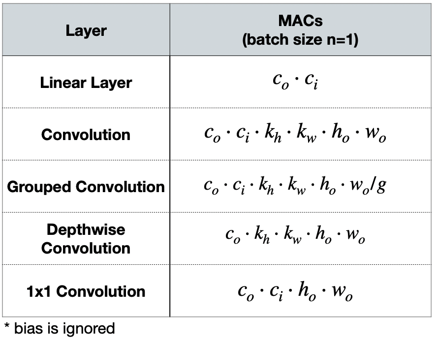
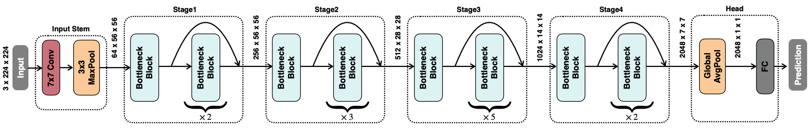
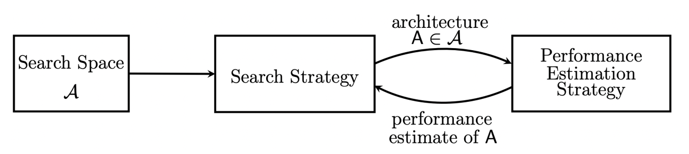
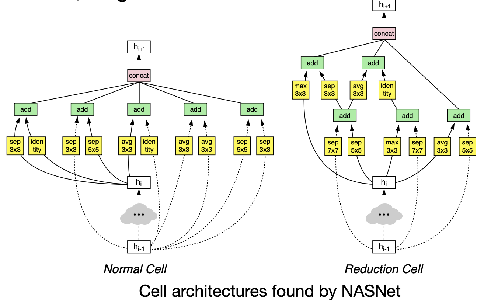
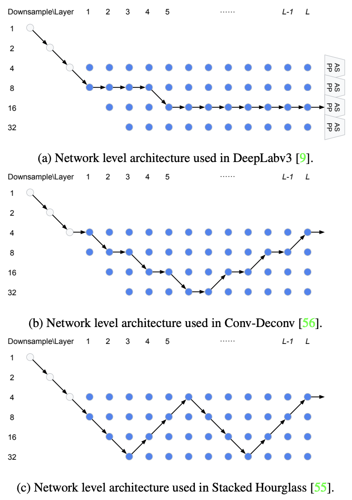
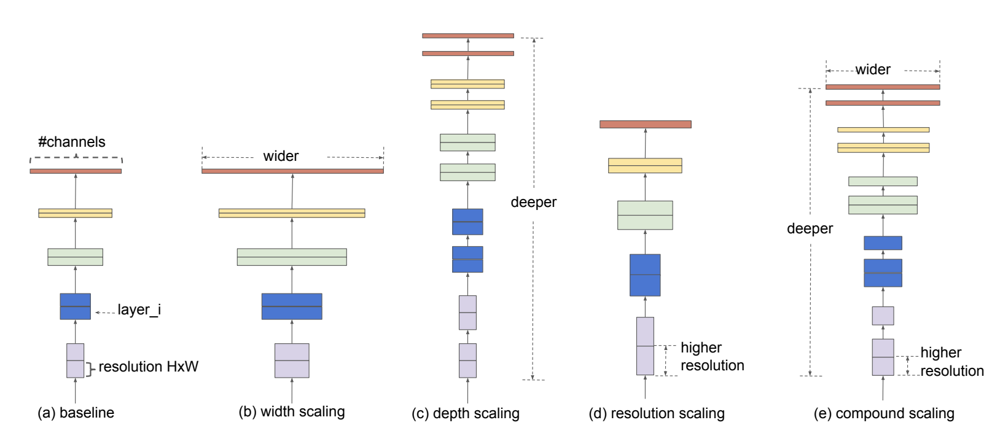
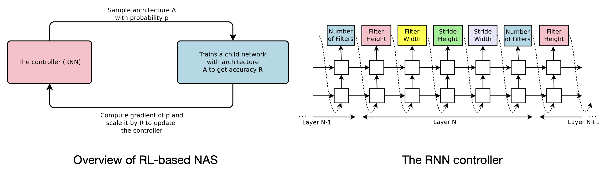
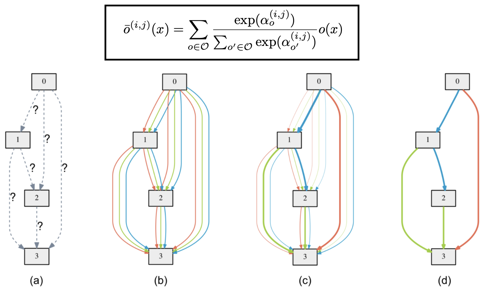

# Lecture 07: Neural Architecture Search (Part I)

## Note Information

| Title       | Neural Architecture Search (Part I)                                                                    |
| ----------- | ------------------------------------------------------------------------------------------------------ |
| Lecturer    | Song Han                                                                                               |
| Date        | 09/29/2022                                                                                             |
| Note Author | Alex Quach (aquach)                                                                                    |
| Description | Basic Recap for designing NNs, Introduced NAS and talked about the search space and strategy for NAS |

# Recap Basic NN Architecture Concepts

 MACs calculations for different NN layers (as described in previous lectures)

 Diagram of NN components [[He et al., CVPR 2016]](https://arxiv.org/pdf/1512.03385.pdf)

## NN Components
* Input Stem: Dramatically reduces dimensions, but increases number of channels. Uses large convolutions, often strided
* Stages: Follow the trend where earlier stages have larger feature map sizes, and gets reduced to smaller feature map sizes later (but with more channel width)
  * Downsampling is usually done in the first block of each stage, often increasing number of channels
  * Residual/Skip connections are usually added for the remaining blocks in the stage
* Heads: Task specific layers

## Advancements from manually designed models:
* AlexNet: Large-kernel convolutinos in early stages [[Krizhevsky et al., NeurIPS 2012]](https://proceedings.neurips.cc/paper/2012/file/c399862d3b9d6b76c8436e924a68c45b-Paper.pdf)
* VGG: Stacking multiple 3x3 convolutions uses less weights, but can be slower and uses more memory (went deeper) [[Simonyan et al., ICLR 2015]](https://arxiv.org/pdf/1409.1556.pdf)
* Squeezenet: Replace 3x3 convolution with fire modules [[Iandola et al., arXiv 2016]](https://arxiv.org/pdf/1602.07360.pdf) 
* ResNet50: Bottleneck block with bypass layer [[He et al., CVPR 2016]](https://arxiv.org/pdf/1512.03385.pdf)
* ResNeXt: Similar to ResNet but using Grouped Convolutions; requires more kernels so not as good for hardware [[Xie et al., CVPR 2017]](https://arxiv.org/pdf/1611.05431.pdf)
* MobileNet: Use depthwise convolution to reduce model size [[Howard et al., arXiv 2017]](https://arxiv.org/pdf/1704.04861.pdf)
* ShuffleNet: Using 1x1 group convolutions instead of 1x1 convolutions [[Zhang et al., CVPR 2018]](https://arxiv.org/pdf/1707.01083.pdf)

Depthwise convolution goes spatial, but separate channel
1x1 convolution is separate in spatial, but merges channels

## Problem with Manually-designed NNs:
* Need to tune hyperparameters like number of channels, layers, kernels, resolution, connectivity, etc
* Need to train + evaluate each time

# Neural Architecture Search (NAS)
 Diagram of Neural Architecture Search Process [[Elskan et al., JMLR 2019]](https://arxiv.org/pdf/1808.05377.pdf)

1. The Search space is the set of candidate NN architectures (what choices/building blocks do we use?)

2. The Search strategy is how we explore within the search space

3. The Performance Estimation Strategy choosing which metrics we care about to evaluate performance (accuracy, latency, GPU, energy, etc)
## NAS Search Space
### 1. Cell-level Search Space
Question: What should a single cell look like?

Example in NASNet: 
* Using a RNN controller to choose which inputs, input transformation operations, operations to combine hidden states
* RNN requires accuracy feedback from training models from scratch, so usually trains on small datasets (proxy tasks)
* NASNet may find irregular shaped cells, which are not friendly with hardware accelerators (but later lectures we'll see hardware-aware search algorithms)

 Examples of NASNet-found cell architectures [[Zoph et al., CVPR 2018]](https://arxiv.org/pdf/1707.07012.pdf)

### 2. Network-level Search Space
Questions: How many cells do we want? What depth do we want to use? How many stages?
* Fixed topologies can search for depth
* We can also represent the network-level search space with graph topologies 
  * Need to balance graph irregularity (that may have better performance) versus understandability/hardware friendliness

 Representing different network architectures with graph representations: 1) downsample; 2) downsample then upsample; 3) downsample then upsample then downsample then upsample [[Liu et al., CVPR 2019]](https://arxiv.org/abs/1901.02985)

## Designing Search Space for TinyML
Why is it important?
* Training is non-trivial (in terms of time/computation) to get understanding of search spaces
* Parameters like memory are constrained in TinyML (100s of KB)
* By optimizing your search space to be small and high quality, it's easier to converge and better models

### Search Space Optimization
Search Space Optimization helps figure out better search space before training
* Since we are memory constrained, it's generally better to fit more computation within the same memory constraints
* FLOPs is a heuristic that is a proxy for number of computations, which we suspect is better for higher accuracy
  * FLOPs is calculated within a constrained memory amount

## Search Strategy
* Grid: Simple, Cartesian product of design spaces
  * Brute force requires a lot of computation
  * EfficientNet uses grid search for applying compound scaling on depth, width, and resolution
 EfficientNet: grid search on width, depth, and resolution. Then compound scaling [[Tan and Le, ICML 2019]](https://arxiv.org/pdf/1905.11946.pdf)
* Random: Is actually quite competitive compared to evolutionary search.
  * Used as a baseline to compare new search strategies against
* Reinforcement Learning (RL):
  * Accuracy is non-differentiable, how to update RNN controller?
  * Samples architectures, trains child network, then computes the gradient on policy (REINFORCE)
 (left) Diagram of RL NAS process (right) RNN controller architecture to predict model parameters [[Zoph and Le, ICLR 2017]](https://arxiv.org/pdf/1611.01578.pdf)
* Bayesian:
  * Balancing exploration and exploitation using an acquisition function to propose next architecture
  * but not widely used
* Gradient-based:
  * Formulates NAS in a differentiable space by assigning probabilities to different candidate operations
  * but uses N times the memory
  * Can search based on gradient for latency too, using a latency prediction model
 Initial edges are unknown, then network weights are optimized into the final architecture [[Liu et al., ICLR 2019]](https://arxiv.org/pdf/1806.09055.pdf)
* Evolutionary
  * Mutations: Randomly changing # of channels, depth, etc
  * Crossover: Randomly choose one parent for each part of the network
