# Lecture 06: Neural Architecture Search (Part I)

## Note Information

| Title       | Neural Architecture Search (Part I)                                                                                            |
|-------------|-----------------------------------------------------------------------------------------------------------------|
| Lecturer    | Song Han                                                                                                        |
| Date        | 09/29/2022                                                                                                      |
| Note Author | Ria Sonecha (rsonecha)                                                                                       |
| Description | This lecture introduces basic concepts of neural network architectures and neural network design principles. It also introduces automatic neural architecture search techniques. |

## Neural Network Basics
### Recap of DNN Primitive Operations
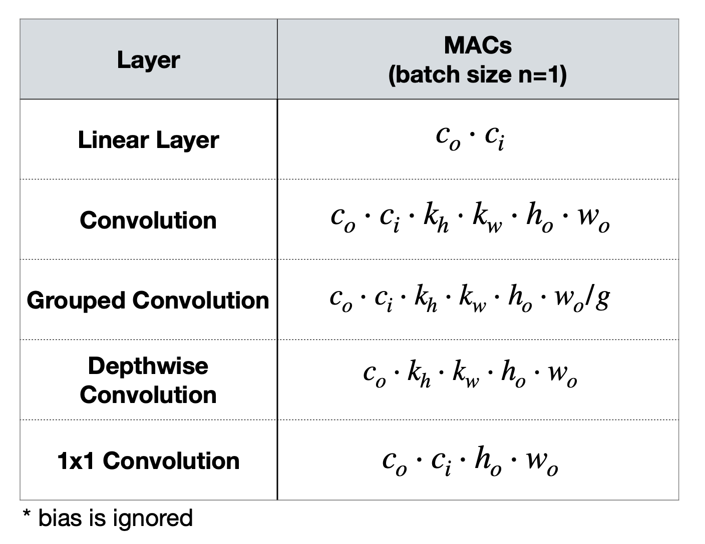

### Basic Neural Network Concepts
- Most neural networks are made up of an input stem, output head(s) which depend on the task, and several intermediate **stages**.
- Generally, early stages of the network have high resolution features with smaller widths (channels), and later stages have smaller feature maps with larger widths.
- Most stages start with a **downsampling** block which reduces feature map size via strided convolution or pooling layers.
- **Residual/skip connections** can be added to stages which have the same input and output dimensions and can help reduce error, especially for deeper networks.

## Manually Designed Neural Networks
- **AlexNet:** Uses large kernel sizes (11x11, 5x5) in early stages
- **VGG:** Reduces parameter count without reducing receptive field by stacking 3x3 kernels
  - 2 layer of 3x3 convolutions has the same receptive field as a 5x5 convolution, however the former has 18 weights while the latter has 25.
  - (image [source](https://miro.medium.com/max/1400/1*v72G1Y7yiPYMAK14BgSNYw.png))
    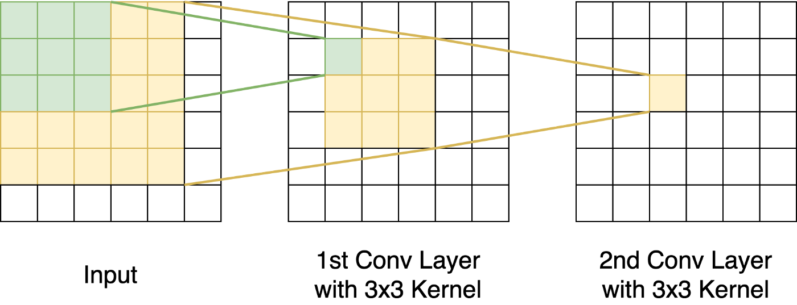
- **SqueezeNet:** Replaces 3x3 convolutions with Fire Modules and global average pooling to reduce the cost of the head.
  - *Fire Modules:* Use 1x1 convolutions to "squeeze" channels and reduce the number of input channels for the 3x3 convolutions.
  - 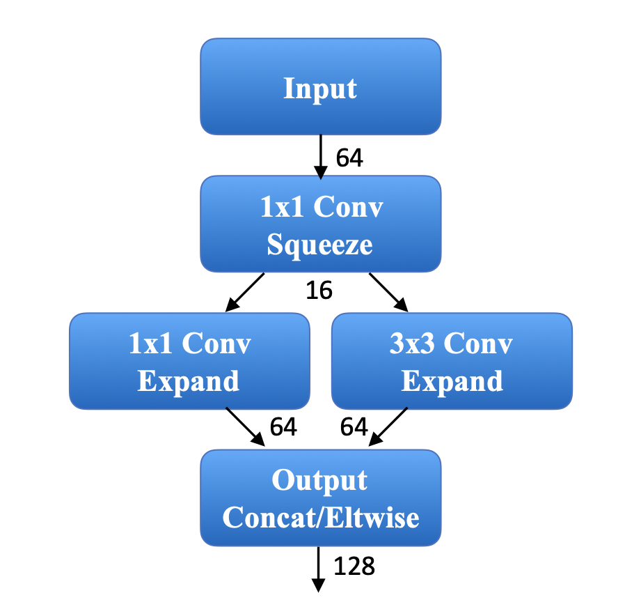
  - SqueezeNet reduced model size by 50x compared to AlexNet, but latency did not decrease by the same amount because the number of FLOPs, data movement, etc. did not change by as much.
- **ResNet50:** Introduced the bottleneck block, which is very popular in networks today.
  - *Bottleneck Block:* Uses a pointwise convolution to reduce channel size before the 3x3 convolution, and then another pointwise convolution to expand the number of channels back to its original size. This can help reduce the number of MACs by about 8.5x.
  - 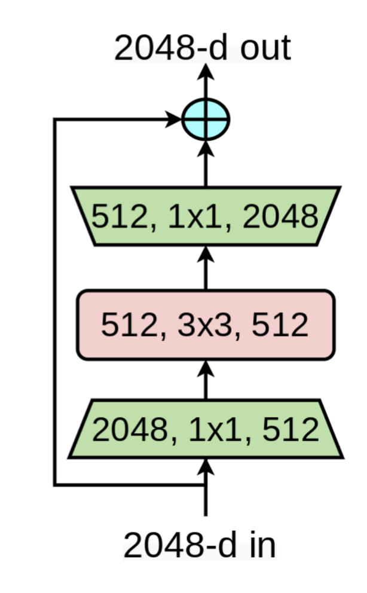
- **ResNeXt:** Replaces 3x3 convolutions with 3x3 grouped convolutions to further decrease model size.
  - This is equivalent to a multi-path block with many small channel activations.
  - 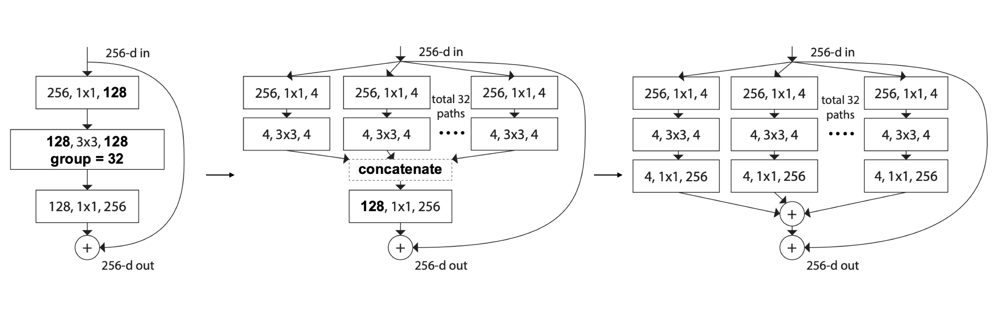
  - However, in terms of hardware optimization it is better to have fewer, larger kernel calls, than many small kernel calls.
- **MobileNet:** Introduces the depthwise-separable convolution layer.
  - A *depthwise convolution* is one where the group size is equal to the number of input channels. In order to fuse data across channels, they add an additional 1x1 convolution.
  - (image [source](https://www.researchgate.net/figure/Depthwise-separable-convolutions_fig1_358585116))
    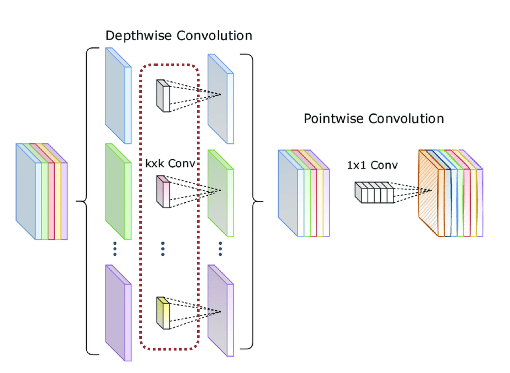
- **MobileNetV2:** Improves the performance of depthwise convolutions by increasing the number of input and output channels.
  - Since increasing the input and output channel sizes of a depthwise convolution only increases the number of parameters linearly, this is still an affordable cost.
- **SuffleNet:** Further reduces cost by replacing the 1x1 convolution with a 1x1 group convolution.
  - In order to exchange information across channels the network introduces channel shuffling.
  - 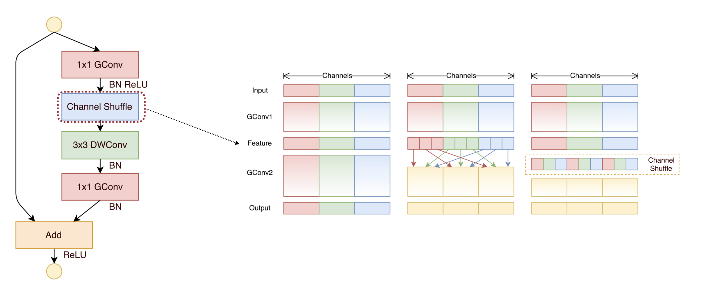

## From Manual to Automatic Design
- When designing neural networks we are dealing with a very large search space which makes manual design unscalable.
- Research has already shown that auto-design neural networks outperform manually designed networks in terms of MACs and accuracy.

## Neural Architecture Search Framework
- The goal of Neural Architecture Search (NAS) is to find the best network architecture in the search space to maximize an objective of interest (accuracy, efficiency, etc.)
- 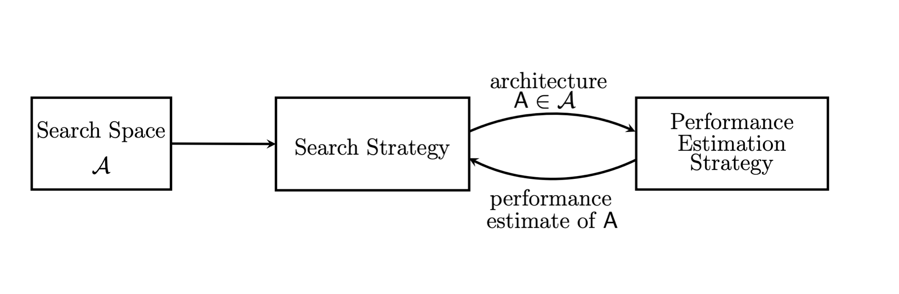
- **Search space** is the set of candidate neural network architectures.
- **Search strategy** defines how to explore the search space.
- **Performance estimation** defines how to estimate/predict the performance of a given neural network architecture in the design space.

## NAS Search Space
### Cell-level Search Space
**NASNET cell-level search space**
- Uses an RNN to generate a candidate cell through 5 steps: 1-2. Choose two inputs, 3-4. Choose two input transformations, 5. combine the results.
- These five steps are repeated B times to build the whole network.
- 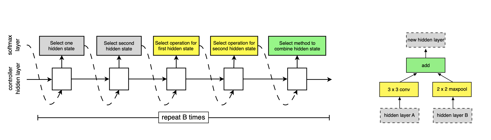
- What is the size of this search space? $(2 * 2 * M * M * N)^B$. For M=5, N=2, B=5 the there would be $3.2 * 10^{11}$ candidates in the search space.
- Challenges with NASNET:
  - The cost of collecting feedback is very high because it requires training many neural networks.
  - NASNET does not consider hardware limitations so it may design a model that has complex data dependencies and requires a lot of data storage.

### Network-level Search Space
**Fixed Topology**
- Search only the depth (number of blocks) for each stage while keeping the connection patterns fixed.
- This is a common method and an easier problem to solve because the search space is small.

**Searchable Topology**
- For tasks like pixel-wise prediction the search space can be modeled as a series of downsampling and upsampling layers.
- If we visualize the search space as a graph, each model in the space can be represented as a path.
- 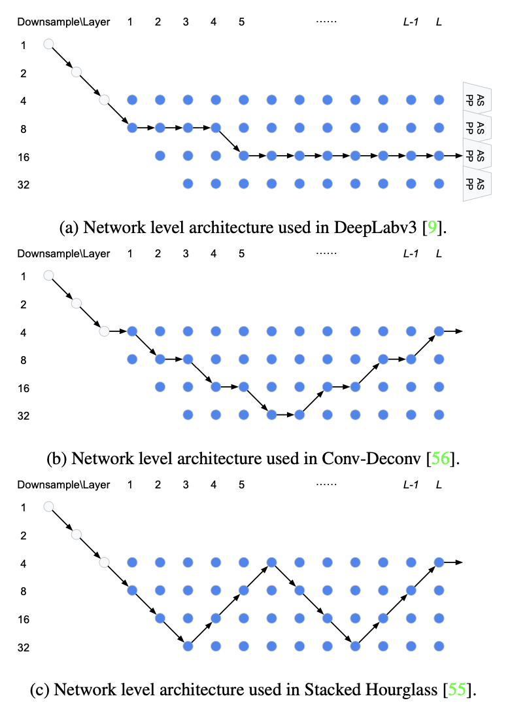
- *NAS-FPN (Feature Pyramid Network):* Extends a similar idea to object detection.
  - FPNs combine high and low resolution features in order to detect both large and small objects.
  - Unlike Vanilla FPN, which always upsamples by 2x, the autogenerated FPNs sometimes upsample by 4-8x.
  - These models are not necessarily hardware-friendly due to their lack of regularity.
  - Techniques like this demonstrate the need to balance between regularity and accuracy when designing networks.

## NAS Search Space Design
- There are many heuristics that we can use to decrease the size of the search space before beginning the search.

- **RegNet:** Uses cumulative error distribution as a criterion for search space quality.
  - 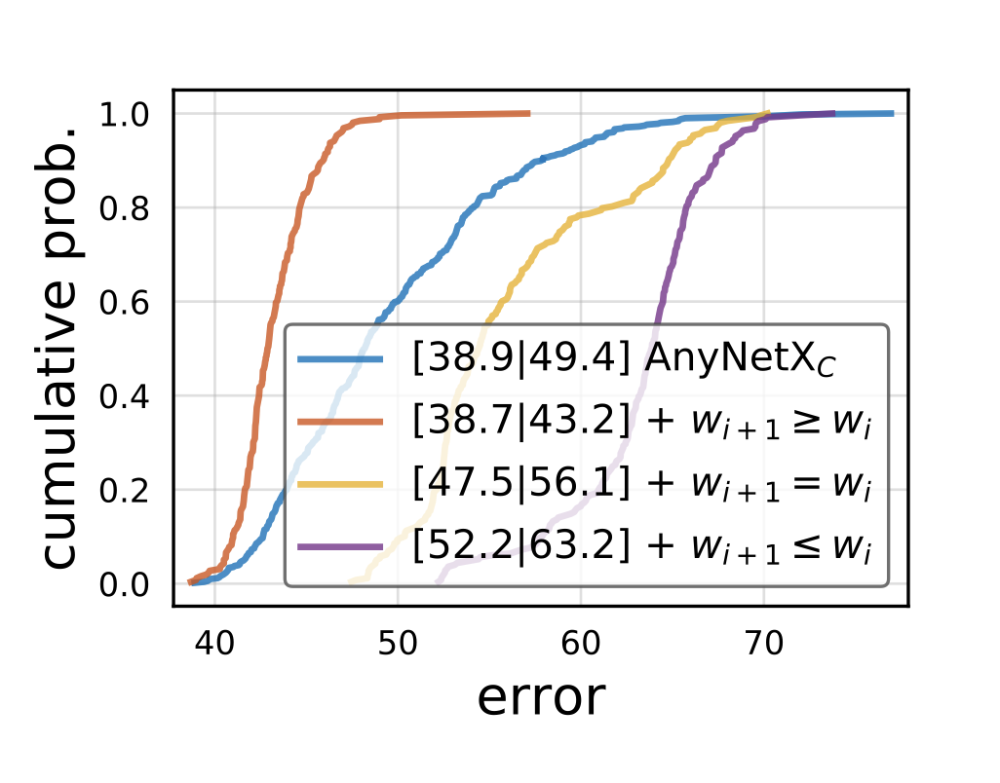
  - The space represented by the orange line is best because most of the models have error less than 50%.
  - This approach is challenging to scale because it requires collecting a lot of data on network accuracies, which means a lot of training time.

- Designing the search space is especially important when targeting new design constraints (ie running on GPU vs smartphone).
- Memory constraints are very important for TinyML.

- **TinyNAS:** Automated search space optimization + Resource-constrained model specialization
  - 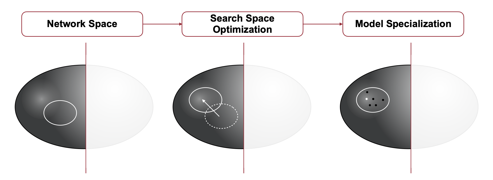

- **FLOPs Distribution**
  - Analyzing FLOPs can be used as a proxy for accuracy.
  - Larger FLOPs -> Larger model capacity -> More likely to give higher accuracy
  - Using this heuristic means we don't have to use resources to train models and measure accuracy.
  - This heuristic is quite accurate:
    - 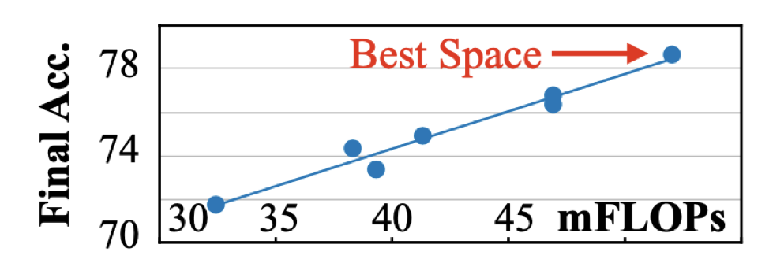

## NAS Search Strategies
### Grid Search
- Traditional way of hyper parameter optimization.
- Represent the design space as the Cartesian product of single dimension design spaces.
- To obtain the accuracy of each candidate network, we train them from scratch.
- *EfficientNet* performs grid search on depth, width, and resolution to design a new model with 2x FLOPs.
  - 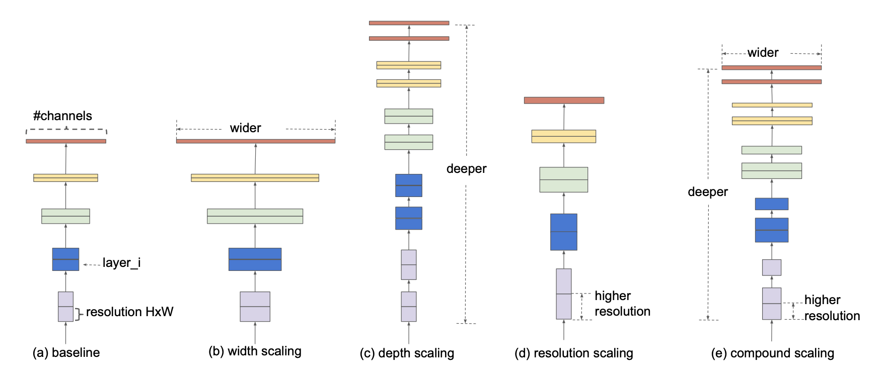

### Random Search
- Given a good search space, random search is a competitive baseline compared with advanced methods such as evolutionary architecture search.

### Reinforcement Learning
- 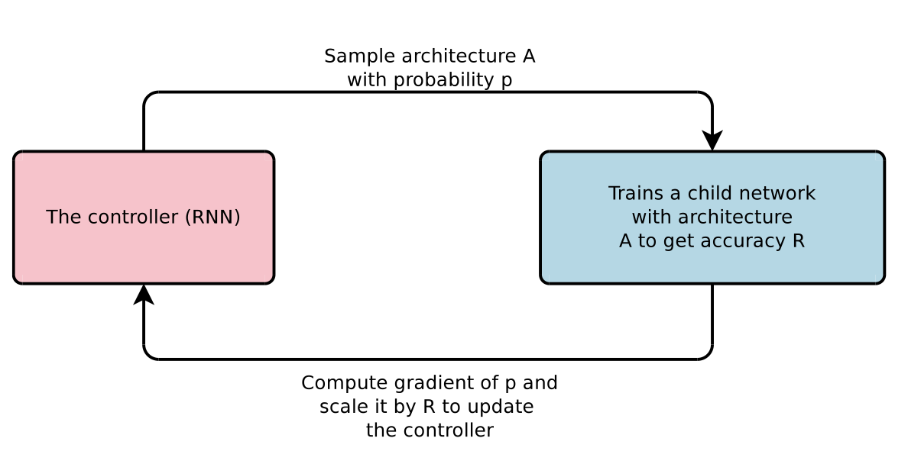
- Challenging because the objective (accuracy) is not differentiable.
  - Solution is using a policy gradient method to update the parameters of the RNN controller.
  - This strategy can be applied to other optimization problems with non-differentiable objectives.

### Bayesian Optimization
- The idea is to balance exploration and exploitation with the acquisition function.

### Gradient-based Search
- DARTS: Represent the output at each node as a weighted sum of outputs from different edges.
- ProxylessNAS: Updates weight parameters and architecture parameters by sampling branches with the highest probabilities.
  - Continuous relaxation makes it possible for us to calculate the gradients of the architecture parameters.
- It is also possible to take latency into account with gradient-based search.
  - Let F be a latency prediction model (typically a regressor or a lookup table). With this formulation we can calculate an additional gradient for the architecture parameters from the latency penalty term.

### Evolutionary Search
- Introduce "mutations" to a model and then perform "crossover" between two mutated models to create a new model from the parents.
- We can have mutations on depth as well as mutations on operator.
- Crossover involves randomly choosing one operator for every layer from the two parent options. 
