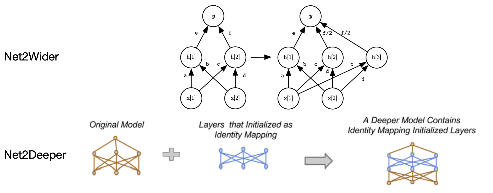
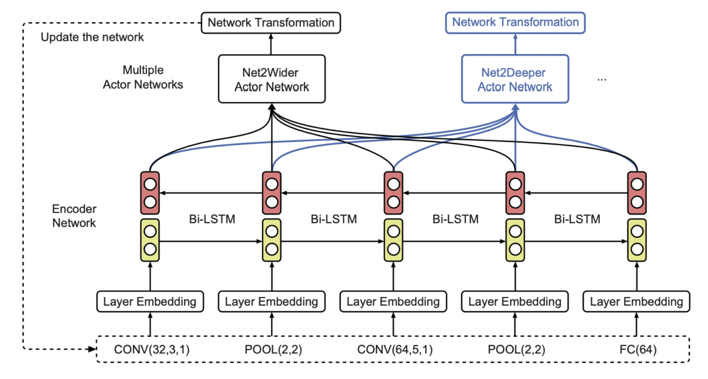
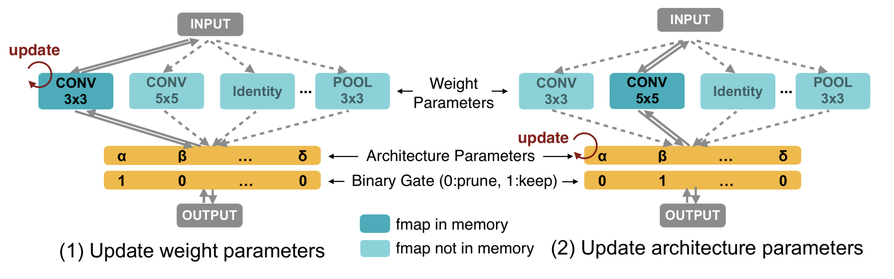
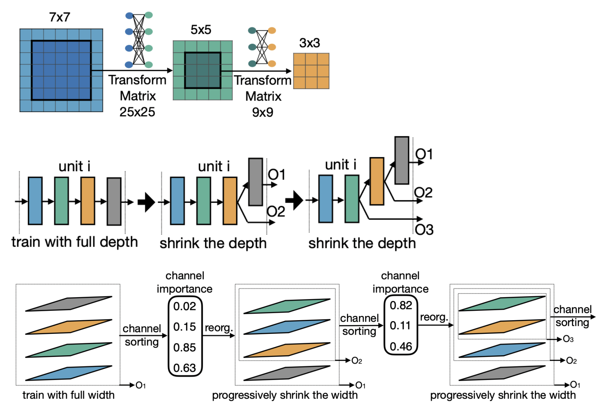
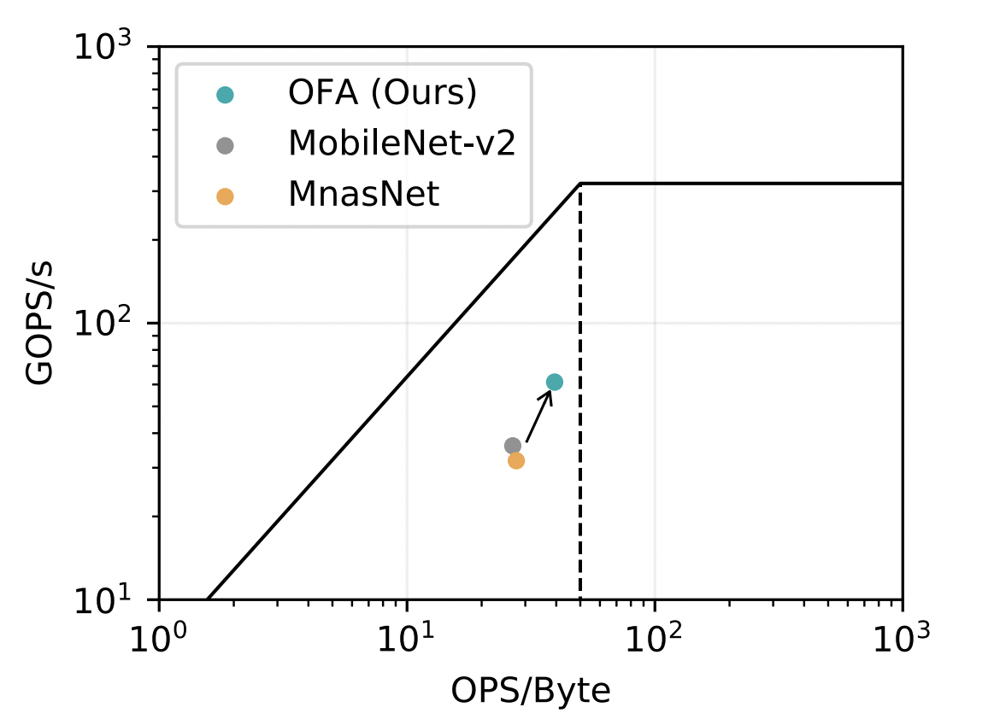
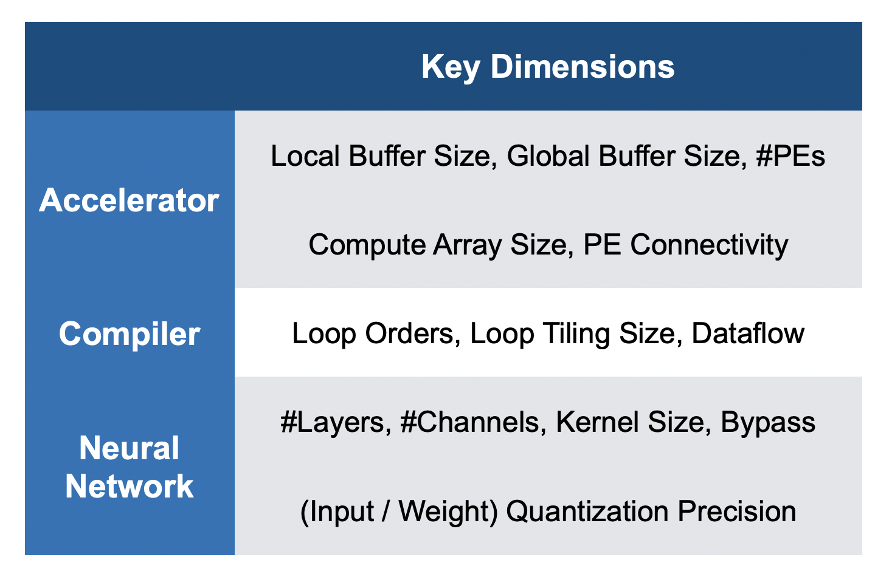
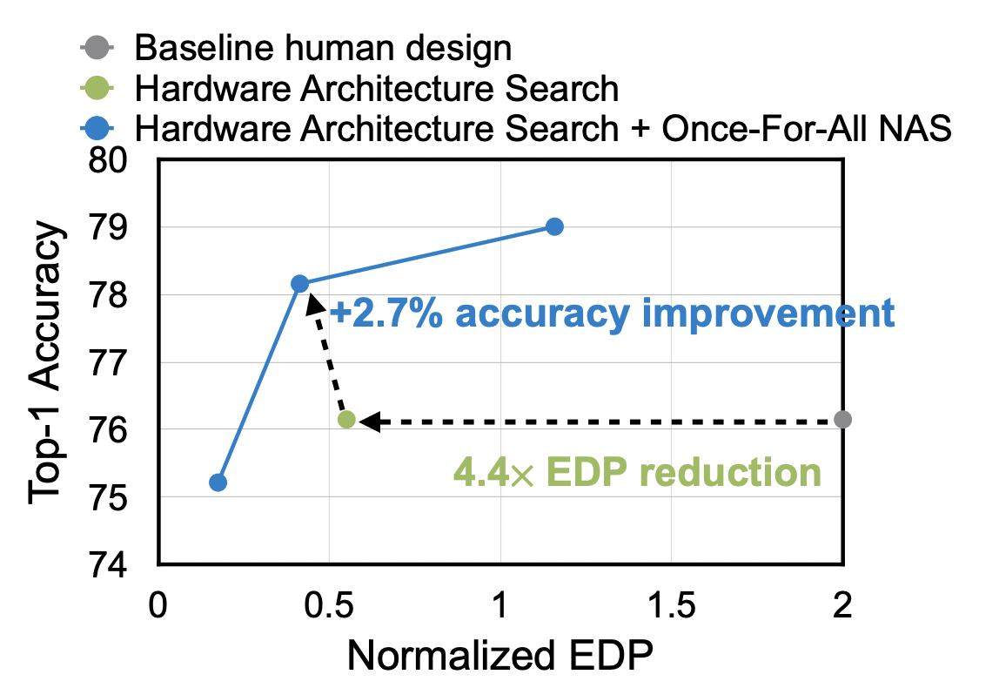

# Lecture 08: Neural Architecture Search (Part II) 

## Note Information

| Title       | Neural Architecture Search (Part II)                                                    |
|-------------|-----------------------------------------------------------------------------------------------------------------|
| Lecturer    | Song Han                                                                                                        |
| Date        | 10/04/2022                                                                                                      |
| Note Author | Saaketh Vedantam (saakethv)                                                                                                 |
| Description | Discussing performance estimation strategies of NAS and introducing hardware-aware NAS. |

## Performance Estimation in NAS

Basic idea: Train from scratch
- Train sampled model architecture from scratch on given training data
- Evaluate trained model on validation set to get accuracy $R$
- Takes too long! Each model takes hours to days to train, can't sample too many models feasibly

**Weight inheritance**: Inherit weights from pretrained models to reduce the training cost
- Examples: Net2Wider, Net2Deeper [[Chen et al., ICLR 2016]](https://arxiv.org/abs/1511.05641)

- Instead of sampling full model architecture, sample network transformations (make network wider/deeper) [[Cai et al., AAAI 2018]](https://arxiv.org/abs/1707.04873)

**HyperNetwork** [[Brock et al., ICLR 2018]](https://arxiv.org/abs/1708.05344): Trained network to generate weights given a sampled model architecture
- Hypernetwork $H$ outputs weights $W=H(c)$ based on architecture $c$
- $H$ is learned through gradient descent on training error $E_t=f_c(H(c), x_t)$

**Weight sharing** [[Pham et al., ICML 2018]](https://arxiv.org/abs/1802.03268): Share weights between different subnetworks
- Train a super-network that contains entire graph
- Generate architectures by searching for subgraphs from super-network
- Train subgraph from scratch

### Performance Estimation Heuristics

**ZenNAS** [[Lin et al., ICCV 2021]](https://arxiv.org/abs/2102.01063)
- Idea: A good model should be sensitive to input
- Measure log difference of output for perturbed input
- Calculate compensation term based on average standard deviation in each batch normalization layer
- Zen score (heuristic for performance) is sum of two values

**GradSign** [[Zhang and Jia, ICLR 2022]](https://www.cs.cmu.edu/~zhihaoj2/papers/gradsign-iclr22.pdf)
- Intuition: A good model has *denser* sample-wise local minima
    - Closer local minima means gradients of samples are more likely to have the same sign
- GradSign score is maximized when gradients of all samples have the same sign

## Hardware-Aware NAS

How do we efficiently search for efficient models?
- We want efficient training, inference, *and* search

Previous work
- Specialized models for each hardware is good
    - However, models are expensive to search for and train
- *Proxy task*: Simpler tasks to measure
    - NAS on smaller dataset (CIFAR-10 vs. ImageNet)
    - Small architecture space
    - Fewer epochs vs. full training
    - MACs/FLOPs vs. latency
- Issue: proxy tasks are suboptimal for estimating goal task

**ProxylessNAS** [[Cai et al., ICLR 2019]](https://arxiv.org/abs/1812.00332): Efficiently search on target task and hardware
- Build *over-parameterized* network with all candidate paths
- NAS becomes a *single training process* learning both weight parameters and architectural parameters
- *Prune* redundant paths based on architectural parameters
- *Binarize* architectural parameters to reduce memory footprint and activate only one path

### Latency Prediction

- Measuring latency on device is expensive
- *Latency model*: Take dataset of (Architecture, Latency) and build model to estimate latency
    - Layer-wise latency profile: lookup table
    - Network-wise latency profile: latency prediction model

### Diverse Hardware Platforms

- Design costs vary largely over hardware
- Existing models are heavily optimized for GPUs, but don't fit well on other platforms

Rather than training each network from scratch, can we train multiple models at the same time?

**Once-for-All Network (OFA)** [[Cai et al., ICLR 2020]](https://arxiv.org/abs/1908.09791)
- Train one network and specialize it for efficient deployment
- Select subnetwork, get accuracy and latency *without training* 
    - Much cheaper to sample subnetwork than train network
- OFA contains many child networks that are sparsely activated
- OFA can design specialized NN models for diverse hardware (memory/computation constraints)

How do we enable a network to have independent subnetworks that can all be trained together?
- Progressive shrinking: progressively prune the kernel size, number of layers, number of channels, etc.

Roofline Analysis
- Computation is cheap; memory is expensive
- OFA model has higher arithmetic intensity (Ops/Byte)
    - Less memory bounded
    - Higher utilization and performance

## Neural Hardware Architecture Search

- We want a data driven approach to design accelerator architecture
- Hardware-aware NAS focuses on off the shelf hardware
- Lots of design considerations for accelerator, compiler, and NN

**NAAS** [[Lin et al., DAC 2021]](https://arxiv.org/abs/2105.13258): Jointly search accelerator and neural architecture *in one optimization loop*
- Loop nest considerations: temporal mapping and spatial parallelism
- Encoding non-numerical parameters
    - *Importance-based encoding*: choose a loop order and parallelization based on dimension importance

- NAAS outperforms human design

