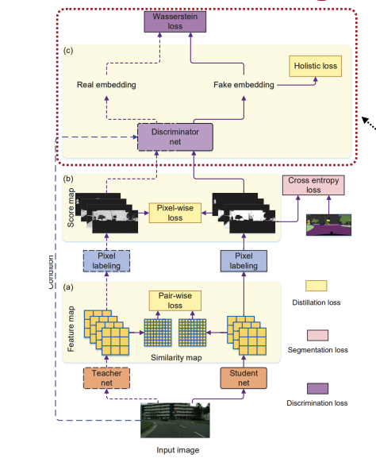
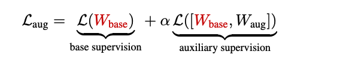

# Lecture 10: Knowledge Distillation

## Note Information

| Title       | Knowledge Distillation                                                                           |
| ----------- | -------------------------------------------------------------------------------------------------------- |
| Lecturer    | Song Han                                                                                                 |
| Date        | 10/13/2022                                                                                               |
| Note Author | Arman Dave (armdave)                                                                                            |
| Description | Introduce knowledge distillation, including self and online distillation, as well as distillation for different tasks; introduces network augmentation, a training technique for tiny ML models |

## Outline of this lecture

- introduce knowledge distillation

- how to match teacher and student networks

- self and online distillation

- distillation for different tasks

- network augmentation

## What Is Knowledge Distillation

[Distilling the Knowledge in a Neural Network](https://hanlab.mit.edu/files/course/slides/MIT-TinyML-Lec10-Knowledge-Distillation.pdf)

Challenge: limited hardware resources

Cloud AI (lots of resources) vs Tiny AI (limited resources)

Problem: tiny models underfit large datasets

Goal: Distill knowledge from large, cloud-trained models to "edge" models

### Knowledge Distillation (KD) Gen Structure + Example

Relies on *teacher* and *student* model

Input goes to both large and small model for training

Challenge: cross-entropy function wouldn't "punish" student since it still makes the correct (>0.5) prediction

Solution: **Temperature**

A temperature loss function smooths the probability output

**Formal Definition of Knowledge Distillation**

* $p(z_i, T) = \frac{exp(z_i/T)}{\sum{exp(z_j/T)}}$, for $i,j = 0,1,2...,C-1$ where C is the number of classes and T is the temperature (normally set to 1)

* Goal: align the class probability distributions from teacher and student networks

## What to Match

### Logits

Compare the logits of teacher and student model, respectively. Two possible error functions:

* Distillation loss: Cross Entropy Loss(teacher logits, student logits)

* L2(teacher logits, student logits)

### Intermediate Weights

Have a distillation loss function for Layer_i for i = 1...N

An FC layer is used to align the shapes of teacher and student weights

### Intermediate Features

Intuition: teacher and student networks should have similar feature distributions and not just similar output probability distributions

Choices for calculating error:

* Mininmize the maximum mean discrepancy between feature maps

* Minimize the L2 distance between feature maps

### Gradients

Aka Intermediate attention maps

Gradients of feature maps are used to characterize **attention** of DNNs

Attention = gradient of learning objective $L$ with respect to the feature map, $x$

When attention is large, small perturbations at pos $(i,j)$ of the feature significantly affect final output -> network learns to pay more "attention" on $(i,j)$

### Matching Sparsity Patterns

Intuition: teacher and student network should have similar sparsity patterns after the ReLU activation

Let $p(x) = 1[x >0]$

Minimize $L(I) = ||p(T(I)) - p(S(I))||$, where S and T corresponds to student and teacher networks

### Matching Relational Information

Conventional Knowledge Distillation (KD) focuses on matching features/logits for *one* input, but relational KD looks at relations between intermediate features from *multiple* inputs

## Self and Online Distillation

Conventionally, teacher model is larger than student model and is fixed (trained beforehand)

Disadvantage: must pay this training overhead before beginning to train student model

### Self Distillation

Train some "edge" model $T$

Then create another "edge" model $S_1$ with same architecture as $T$ and distill $T$ to $S_1$ in regular teacher -> student model

Then create "edge" model $S_2$, distill $S_1$ to $S_2$

Repeat for $S_2, ..., S_k$

* Network accuracy: $T < S_1 < S_2 < ... < S_k$

Best accuracy is actually is an ensemble of all models

### Online Distillation

Aka Deep mutual learning

The teacher model is not pre-trained. Rather, both models are trained at the same time

For both teacher and student networks, we want to add a distillation objective that minimizes the output distribution of the other party

Works best on small datasets

### Combined

Aka ONE: On-the-Fly Native Ensemble as the teacher network

Use deeper layers to distill knowledge to shallower layers

## Distillation for Other Applications

Beyond classification

### KD for Object Detection

Use different weights for foreground and background classes to handle the class imbalance

How do we convert bounding box regression to a classification problem? Simply discretize the x and y axis!

### KD for Semantic Segmentation

Add a discriminator network to provide the adversarial loss: the student is trained to fool the discriminator network

### KD for NLP

Aka attention transfer

Feature imitation + attention map imitation

## Augmentation

Conventional approach: 

1) Data augmentation during training to avoid overfitting

- [cutout](https://arxiv.org/abs/1708.04552)

- [mixup](https://arxiv.org/abs/1710.09412)

- [AutoAugment](https://arxiv.org/abs/1805.09501)

2) Dropout (of neurons) during training to avoid overfitting

^These techniques improve large NN performance but HURT tiny NN performance

### NetAug: Training Process

Build an augmented model that shares weights with original tiny NN model

- Step 1: Process data through both the base model and augmented model as normal

- Step 2: When calculating the gradient, we take the sum of the loss from base and augmented model

- Step 3: Choose different subnetworks in the augmmented model for auxillary loss

Results:
- For tiny NNs, NetAug improves both training and val accuracy
- For large NNs, NetAug improves training but hurts val accuracy

NetAug is **orthogonal** to KD. For the right task, NetAug can outperform KD. 
