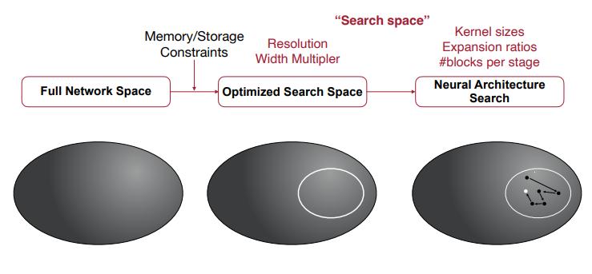
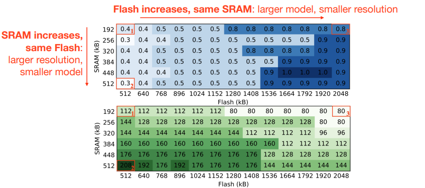
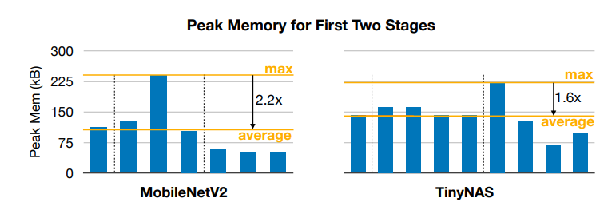
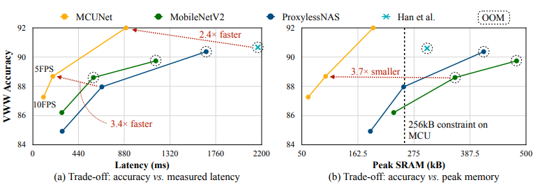
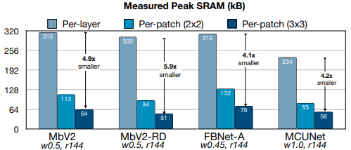
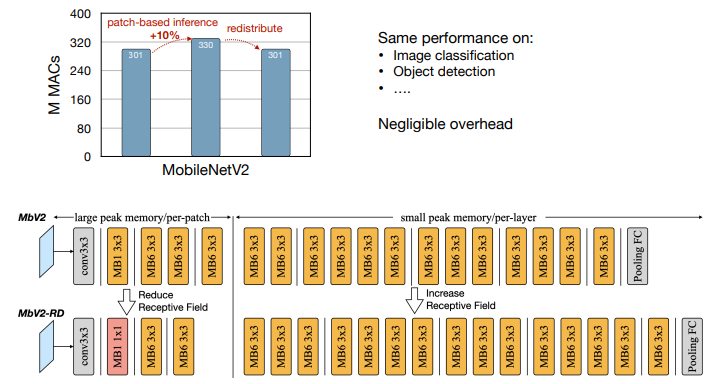
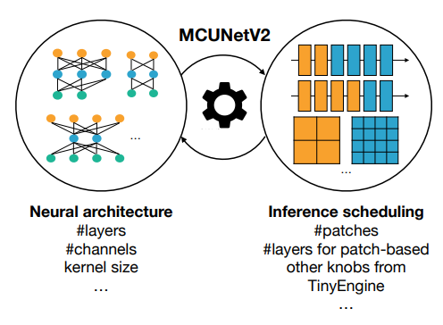
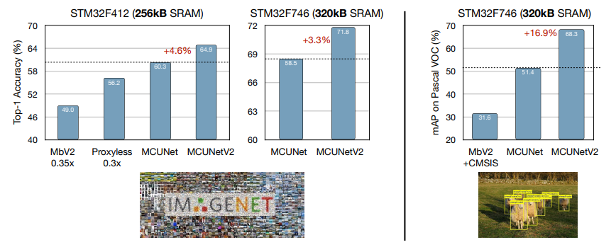
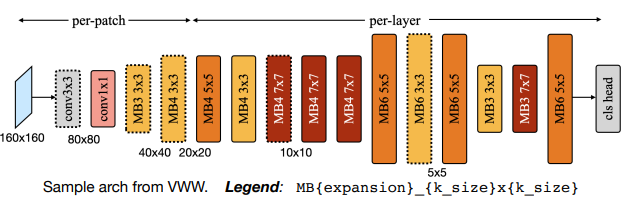

# Lecture 11: MCUNet: Tiny Neural Network Design for Microcontrollers

## Note Information

| Title       | MCUNet: Tiny Neural Network Design for Microcontrollers                                                         |
|-------------|-----------------------------------------------------------------------------------------------------------------|
| Lecturer    | Song Han                                                                                                        |
| Date        | 10/17/2022                                                                                                      |
| Note Author | Boxiang Wang (boxiangw)                                                                                         |
| Description | Discussing performance estimation strategies of NAS and introducing hardware-aware NAS. |

## What is tinyML?

TinyML and Green AI with **low energy**, **low latency**, **low cost** and **better privacy** are needed.

Deep Learning situations:

- Cloud AI: GPUs/TPUs
- Mobile AI: Smartphones
- **Tiny AI**: IoT/Microcontrollers
  - Billions of IoT devices based on microcontrollers
  - Low-cost: low-income people can afford access. Democratize AI.
  - Low-power: green AI, reduce carbon
  - Various applications

TinyML is challenging becuase the memory size is too small to hold DNNs. We need to reduce both weights and activation to fit DNNs for tinyML.

## Understanding the challenges of tinyML

Simplified memory usage estimation:

- Flash Usage
  - = model size
  - Static, need to hold the entire model
- SRAM usage
  - = input activation + output activation
  - Dynamix, different for each layer
  - **Peak SRAM** is important
  - Weights are not counted since they can be partially fetched.

For Microcontrollers, their SRAMs are like around 320kB which is too small to fit normal CNN models even compressed models sometime.

In this situation, we need to reduce not only model size, but also activation size.

**MCUNet** reduces not only model size but also activation size.

## Tiny neural network design

**MCUNet: System-Algorithm Co-design**: MCUNet comprises of two main parts: TinyNAS and TinyEngine. TinyNAS to search efficient neural architecture, TinyEngine to provide efficient compiler / runtime.

TinyNAS will design and auto-optimize NN model and pass it to TinyEngine, TinyNAS will then compile, execute and auto-optimize and pass it to processor.

### Problem: what is the right search space?

- Search space largely determines models' performance
- Option 1: reuse the carefully designed mobile search space (e.g., MnasNet space) for tinyML
  - Problem: Even the smallest sub-network cannot fit the hardware
- **Option 2: pick a search space for the IoT device** (explained below)

***TinyNAS: Two-Stage NAS for Tiny Memory Constraints***

Scale the MBNet-alike search space by using different resolution R and width multiplier W. GPUs, smartphones and microcontrollers will have different R\* and W\*. We first design the design space, then search the sub-network.

1. Automated search space optimization\
   Best configurations (width multiplier, resolutions) found for different SRAM, Flash combinations.

   

2. Resource-constrained model specialization
   - One-shot NAS through weight sharing
   - Small child networks are nested in large ones

**TinyNAS Better Utilizes the Memory**: TinyNAS designs networks with more uniform peak memory for each block, allowing us to fit a larger model at the same amount of memory.

**MCUNet Outperforming Manual&NAS Models**: MCUNet achieves higher accuracy at lower memory. Higher accuracy at 3x faster inference speed, 4x smaller memory cost on the Visual Wake Words (VWW) dataset.

**MCUNetV2: Patch-based Inference**: Further reducing SRAM by breaking the memory bottleneck.

1. Saving Memory with Patch-based Inference
   
  

2. Network Redistribution to Reduce Overhead
   
  

3. Joint Automated Search for Optimization
   
  

Advancing classification and detection

- ImageNet classification and Pascal VOC object detection
- int8 quantization
  
  

Dissecting MCUNetV2 architecture

- Kernel size in per-patch stage is small to reduce spatial overlapping
- Expansion ratio in middle stage is small to reduce peak memory
- Large in later stage to boost performance
- Larger input resolution for resolution-sensitive datasets like VWW(MCUNet: 128x128)
  
  

**RNNPool**: Non-linear Pooling for RAM Constrained Inference

- Typical CNNs have large intermediate activation maps
  - Linear pooling operators or stride convolution are limited to small receptive fields, e.g., < 3x3, due to significant loss of accuracy
- RNN Pool: A more refined aggregation over a large receptive field of the activation map
- Replace a sequence of blocks with RNNPool

**MicroNets**:

- SRAM and Flash usage can be easily calculated offline for a given model
- OP count is a viable proxy for latency when sampling from the same superset
- Energy consumption is only a function of OP count for a given MCU

## Applications

### Tiny vision

**Tiny Image Classification**：Visual wake words

- It can be used to activate the later ML pipeline
  - Vision counterpart of “Hey Siri”/“OK Google”
  - For example, only enable face recognition when a person is in front of the camera, which saves a lot of energy (the face recognition model is much larger than the VWW model)

**Tiny Object Detection**：Patch-based method allows for a larger input resolution

- Object detection is more sensitive to input resolution since we need to make a denser prediction.
- Patched-based inference can fit a larger resolution by breaking the memory bottleneck.
- We can further enable object detection on microcontrollers.
- Patch-based inference obtains better object detection results compared to existing work.

### Tiny audio

**Keyword Spotting**: General pipeline of keyword spotting

- Input: Overlapping frames of length $l$ with a stride $s$, giving a total of $T = (L-l)/s + 1$ frames.
- Human-engineered features: Translating time-domain signal into a set of frequency-domain spectral coefficients.
- Neural network: Generating the probabilities for the output classes.

**CNN for Small-footprint Keyword Spotting**: CNN architectures can outperform DNNs

- Spectral representations of speech have strong correlations in time and frequency, which is ignored by DNNs.
- DNNs are not explicitly designed to model translational variance within speech signals, which can exist due to different speaking styles.

### Tiny time series/anomaly detection

**Detect Anomaly with Autoencoders**:

- Introducing autoencoders
  - An autoencoder is a neural network that predicts its input (ideally x’ = x)
    - Encoder: Compress the input into a lower-dimensional code vector
    - Code vector: Abstraction of the input
    - Decoder: Reconstruct the output from the code vector
    - Training : Minimizing the reconstruction error
    - Inference: Detect anomaly inputs with live data
- Properties of autoencoders
  - Unsupervised: We don’t need labels for training.
  - Data-specific: They can only meaningfully compress data similar to the training dataset.
  - Lossy: The output will not be the same as the input.
