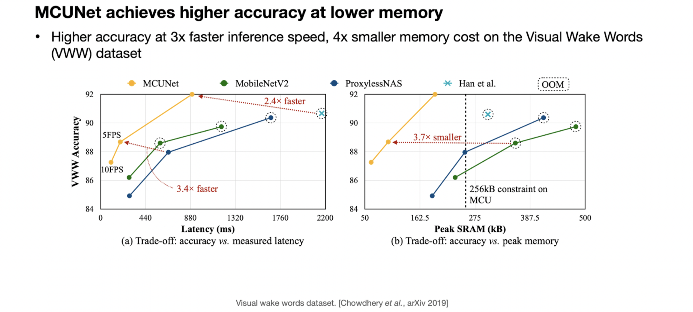

# Lecture 11: MCUNet - Tiny Neural Network Design for Microcontrollers

## Note Information

| Title       | MCUNet - Tiny Neural Network Design for Microcontrollers                                                  |
|-------------|-----------------------------------------------------------------------------------------------------------------|
| Lecturer    | Song Han                                                                                                        |
| Date        | 09/08/2022                                                                                                      |
| Note Author | Nazish Naeem (nazishn)                                                                                                 |
| Description | Introduction of tinyML and its applications                                                                     |

## What is TinyML?

TinyML is enabling machine learning/ AI at the edge for better privacy, low latency, low energy, and low-cost

### Advantages:
- Privacy: with tinyML, data does not need to be uploaded on the cloud for inference. The inference can be done locally on small devices without compromising privacy

### Why tiny Devices?
The question is why do we want to use a tiny device like a microcontroller? Tiny devices are very popular to be used because of the following advantages:
- Low Cost: tiny devices are low cost and easily accessible.
- Ubiquitous: tiny devices are found everywhere and enabling tinyML can open new doors for AI applications on these devices.
- Low Power Consumption: tiny devices are low power consuming and AI on these devices makes them efficient.
- Deployable: these tiny devices are deployable. We can put them in warehouses, smart homes, factories, etc for smart operations. Today billions of IoT devices are deployed that contain microcontrollers in them
### Applications:
TinyML opens the door for thousands of applications including
- Smart houses
- Smart manufacturing
- Personalized health
- Precision Agriculture

### Challenges:
Deploying any neural network on a small device is met with challenges which include
- Memory: Cloud AI is known to have memory in GBs while in a small device we only have a couple of kiloBytes available which is 100,000 times smaller than the cloud memory. The biggest challenge is to reduce the amount of memory that a neural network uses
- Latency: small devices require fast operations.
- Energy Consumption: small devices are known to be low-power devices. The neural networks deployed should be able to perform in the given power budget.

## Understanding the challenges of TinyML
To understand the memory challenges of tinyML, we need to first understand the memory (SRAM and FLASH)
- FLASH: is the permanent memory in any device. In the context of deploying a neural network, this memory holds the code and entire model weights
- SRAM: SRAM on the other hand is the temporary memory. It is used during operations. In the context of the neural network deployment and operation, all the operations, input, and output activations are held by this memory. In SRAM it is the peak memory that is important. Since there is no backpropagation (at the time of inference) and the weights are partially fetched from the Flash, the SRAM is only bottlenecked by the peak memory i.e., the maximum memory used by a layer in the network.
Example: For context, a tiny device like STM32 has a FLASH of 1MB and an SRAM of 256kB.
NOTE: This implies that we not only need to reduce the size of the network but also the size of the activations.

## How to solve these challenges?
Existing work either focuses on finding the best Architecture given a library or finds the best library given the architecture. Here we need to do both, we need to find the best architecture with the best library, known as MCUnet. MCUnet has a tinyNAS (for finding the best architecture) and a tinyEngine (for finding the best library).

## TinyNAS:
TinyNAS is an automatic search for neural architectures.
#### Step1: 
First step to start with is to determine the best search space for searching the best network. We first design the best search space knowing the memory and energy constraints of our device. Number of FLOPs, width multiplier, and resolution help in determining the best search space for the network.
The figure below shows how the best configuration (width multiplier and resolution) is found for a specific combination of SRAM and FLASH. We can see that for different sizes of SRAM and flash
- As FLASH memory increases with the same SRAM, we can increase the width multiplier but the resolution should decrease
- As the size of SRAM increases with the same flash, the width multiplier more or less remains the same (because we cannot fit more weights) but we can use a larger resolution (larger activations)

#### Step2: 
Once a search space is specified, TinyNAS designs networks with more uniform peak memory for each block, allowing us to fit a larger model at the same amount of memory.

#### Performance of MCUnet:
The following graph shows the performance of MCUnet

## Patch-based Inference:
Since SRAM use is dynamic, we care about peak SRAM the most. From the following example, we can see that the initial stages of the network use the most memory.

If we can reduce the memory usage of the initial stage, we can reduce the overall memory. We can save memory by breaking the memory bottleneck with patch-based inference. In patch-based inference, not all input is processed at once but a patch of input is processed at a time as shown in the figure below.

This helps in saving memory as shown in the figure below.

Patch-based inference saves up the memory but at the same time introduces an overhead of computation for the overlapping patches as shown below:

This overlap gets larger as the receptive field grows. One of the solutions is to this problem is to introduce a 1x1 convolutional layer to reduce the receptive field as shown below:

Another solution is the Joint Automated Search to find the optimized inference scheduling for a given neural architecture or vice versa. 

## RNN-Pool:
There are certain layers in a Neural Network that have high activations and high receptive fields that are hard to perform patch-based inference on, as shown below:

Typical CNNs have large intermediate activation maps and linear pooling operators or stride convolution are limited to small receptive fields, e.g., < 3x3, due to significant loss of accuracy. RNN-pool is another technique to reduce the peak SRAM. It is a non-linear pooling for RAM constrained inference.RNN Pool is a more refined aggregation over a large receptive field of the activation map. The figure below shows a detailed structure an RNN-Pool layer.

The following example shows how RNN-Pool can replace the existing layers in a neural network.

## Applications:
Following are some of the applications of TinyML
### TinyVision
Includes the classification and detection of objects using a tiny device. And can work as a wakeup call for a bigger task/operation
### TinyAudio
Common applications of Tiny Audio in our daily life are Keyword spotting, speech recognition, noise cancellation, etc.
### Tiny time-series/ anomaly detection
TinyML has many applications in domain of video surveillance, healthcare, adversary attacks, etc for detecting anomalies in the data commonly using an autoencoder.
