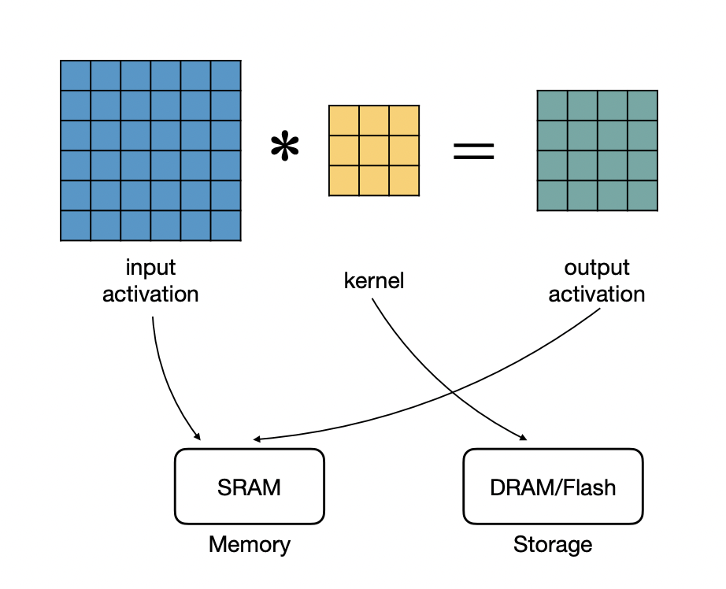
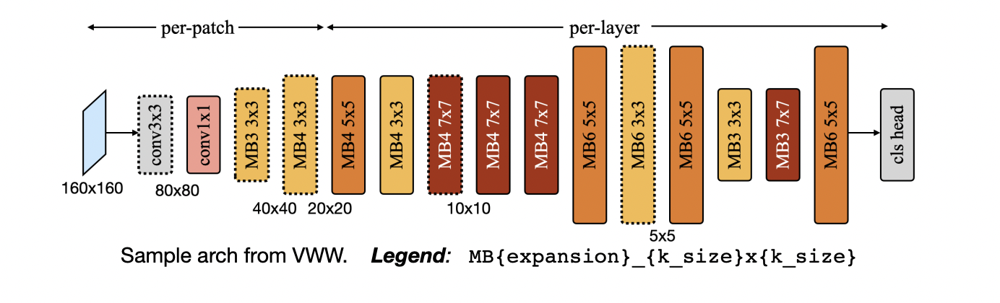
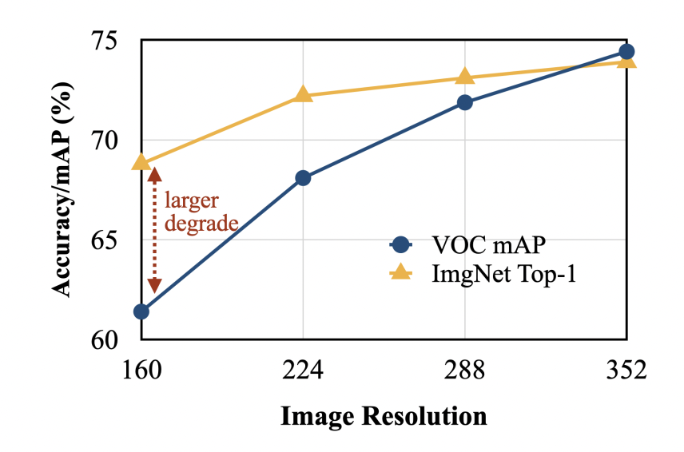

# Lecture 11: MCUNet: Tiny Neural Network Design for Microcontrollers

# Note Information

| Title | MCUNet: Tiny Neural Network Design for Microcontrollers |
| --- | --- |
| Lecturer | Song Han |
| Date | Oct 20, 2022 |
| Note Author | William Zhao (wzhao6) |
| Description | In this lecture, we introduce tinyML and the challenges associated with them. We also explain different approaches to designing neural networks to tackle these challenges. Lastly, we give some applications of tinyML.|

# Why tiny ML?

To understand why tiny ML is important, we look at the current trends in ML. Large models such as GPT-3 have 170B parameters and cannot fit on a single GPU, even for inference. Instead, large models are hosted on the cloud, and data need to be uploaded onto the cloud for inference. This is a major privacy concerns as all data is being uploaded online.

To resolve this, we previously introduced mobile-sized ML such as MobileNetV2, which can run locally on a phone. For example, an iPhone user can search through photos locally using ML. However, there are several advantages for making models even smaller and fitting them onto IOT/microcontrollers:

- Microcontrollers **cost** $0.1 to $10, allowing them to be deployed ubiquitously
- Microcontrollers have low **power consumption** (a few mW), meaning that they last a long time and have low carbon footprint

 These advantages enables many applications for tiny ML, including:

- Smart home
- Smart manufacturing
- Personalized healthcare
- Precision agriculture

# Challenges of tiny ML

To understand the challenges of tiny ML, let’s compare the resource availability on cloud, mobile and microcontrollers. Some example microcontroller memory sizes are:

|  | Arduino Nano 33 BLE Sense | STM32 F746ZG |
| --- | --- | --- |
| Memory (*SRAM) | 256 kB | 320 kB |
| Storage (Flash) | 1 MB | 1 MB |

******* microcontrollers have no DRAM. They are sometimes called “bare metal” as they also lack an OS, such as paging.

We can compare them with cloud and mobile AI sizes:

|  | Cloud AI | Mobile AI | Tiny AI (microcontrollers) |
| --- | --- | --- | --- |
| Memory (SRAM) | 32 GB | 4 GB | 320 kB |
| Storage (Flash) | ~ TB/PB | 256 GB | 1 MB |

Notably, tiny AI must be 13000x smaller than mobile AI, so prior research on mobile AI do not work for microcontrollers. In other words, while mobile AI focused on solving the **latency** and **energy** constraints on a mobile device, tiny AI must solve, in addition, the **memory** constraint.

## Memory vs Storage

Recall that flash is read-only, while SRAM allows both read and write access. In a convolution network, the weights do not change, so they can be statically stored on flash. However, the activations changes by layer and by example, so must be stored in SRAM. 

### Storage

The **entirety of the model’s weights** must be stored in the storage.

### Memory

When doing inference with an ML model, at each layer we only store the **input and output activations** for the layer, due to the sequential method for inference. Weight storage can be mitigated by only loading the part of weights needed for computation from the storage. The compiled code needs to be stored in memory as well. Lastly, we must have enough memory for every layer during inference, so the required memory is the **peak** **need** over all layers. Summarizing, we have:

$$
\text{Memory} = \max_{\text{layer}}(\text{Input Activation} + \text{Output Activation}) + \text{Code}
$$

## Size of current CNNs

Let’s look at the some CNN models and their sizes:

Notably, although prior work for mobile AI reduced the weight sizes by 4.6x, they also increased the activations by 1.8x. This is due to the inverted bottleneck design, where although the replacement of convolution layers with depthwise convolution layers reduces weight size, the increase in number of channels increases the activation size. In contrast, MCUNet reduces both **weight sizes** and **peak activation**. 

# MCUNet

To overcome the previous problems, we use NAS to optimize not only the model architecture, but also the underlying library. 

### TinyNAS for model architecture

The main design challenge with NAS is to design the **right search space**. As an analogy, finding a good architecture for NAS is like searching for a friend in a dark forest. If the search space is right (small and contains your friend), then you can quickly find your friend. However, if the search space is wrong (does not contain your friend), then you can never find your friend.

There’re 2 options:

1. Use prior search spaces (not designed for tiny ML)
    1. Problem: even the smallest subnetwork in these search spaces can’t fit IOT
2. New search space by scaling MobileNet-like search space, we scale by tuning the **resolution** (R) and **width** (W).

### How to tune?

Principle: **Compute is cheap**, but memory/storage is expensive

Since our model size is fixed, having more FLOPs tend to correlate with better performance. Therefore, a good design space should achieve highest FLOPs while following the memory constraints. The best tuning for parameters R, W are:

Note that as we get more memory, the resolution (R) increases. As we get more storage, the resolution (R) decreases and width (W) increases.

### One-shot NAS

We use one-shot NAS to search for architecture. Recall the workflow for one-shot NAS:

1. First train a super-net
2. Sample subnetworks from super-net, using either random sampling or progressive shrinking
3. Jointly fine-tune multiple subnetworks with weight sharing

### Results

Memory usage: Peak activation size is memory requirement. TinyNAS models have memory usage more spread out over layers, so its memory usage is more efficient.

Performance: Using 4x smaller memory and 3x less time for inference, MCUNet achieves better accuracy on Visual Wake Words dataset than MobileNetV2 and ProxylessNAS.

## Removing memory bottleneck

To further reduce SRAM, we need to change the inference algorithm. Traditionally, inference is scheduled **per-layer,** that is, each layer is computed before the next, but all activations in the same layer are computed simultaneously. This uses up lots of memory on the **bottleneck layers.**

We can instead use **per-patch** inference for a sequence of layers, with the steps:

1. Store the output in memory, at all times
2. Run inference normally (**per-layer**) on patches of the input
3. Update corresponding patches of output

This works because the activations get smaller after the first few layers (due to the pooling reducing resolution), so storing the output in memory has low memory cost. In practice, it achieves a 4-5 times smaller memory footprint by dividing the image into 9 patches.

### Removing halo

The lack of padding on the patch border means that the input patches will have some overlap. As the receptive field of output patches grow, the input patches will also grow, creating more overlap. This causes **repeated computation**, which is inefficient.

To solve this, a 3x3 convolution layer can be moved into the later layers, after per-patch inference is no longer needed. The original convolution layer is replaced by a 1x1 convolution layer, which doesn’t increase the receptive field.

## Joint automated search

MCUNet searches both the architecture and the inference scheduling simultaneously. For inference scheduling, MCUNet decides whether to use per-layer or per-patch inference, and the number of patches. 

## MCUNet-V2 patch-based inference performance

Using patch-based inference, MCUNetV2 achieves higher accuracy with **4x less peak SRAM** usage compared to MCUNet, on the visual wake word (VWW) dataset. It also achieves **significantly higher accuracy** on ImageNet classification and Pascal VOC object detection.

## MCUNet-V2 architecture

As we see from the architecture found by MCUNet-V2:

1. There’s smaller kernel sizes in the per-patch stage, so there is **less redundant computation** from halos
2. There’s smaller expansion ratios in middle stages, where memory usage is at its peak. This **reduces peak memory** need.
3. There’s larger expansion ratios in the final stages, where memory usage is already lower due to pooling.

Note that the rules above were not programmed by anyone. The NAS in MCUNet-V2 automatically discovered networks satisfying these rules. Due to the memory optimizations, MCUNet-V2 can work on **160x160 resolution** images. This is really useful in object detection, for example, where higher resolution is needed to locate the many smaller objects in the images.

# RNNPool

Recently, an alternative to convolution layers using RNN has been proposed. The RNN is used to replace convolution layers in a CNN for aggregating features, thus **quickly reducing the resolution**. This saves on peak memory usage.

 The RNNPool above works by:

- For each patch in the input layer, run RNN-pool
- There’re RNNs running top-to-bottom, and left-to-right to aggregate features along rows/columns. This results in one vector for every row and every column. The weights for this step is shared between top-to-bottom and left-to-right
- There’a a bidirection RNN running on all column representations and another running on all row representations, giving 4 output vectors total for the patch. The weights for this step is shared as well.

# MicroNet: Energy and Latency estimates

We have discussed memory usage, but not energy or latency. Empirically, it has been found that (on the same microcontroller)

1. Latency is proportional to **#operations**, for same **superset data** (i.e. image vs audio)
2. Energy is always proportional to **#operations**

# Applications

## TinyVision

### High level image classification

MCUNetV2 achieves 71% accuracy on real-world dataset like ImageNet, on microcontrollers. This is comparable to usual models such as ResNet-50. **Int4 quantization** is used for this model.

### Visual wakeword

MCUNet can be used to detect faces, which activates later ML pipeline, similar to audio wakewords like “OK Google” and “Hey Siri”. For example, by using MCUNet visual wakewords, we can activate a much larger face recognition model only when faces are detected by the tinyML model, **saving a lot of energy.**

### Object detection

The **resolution** for input image is critical for object detection task, since we need to find smaller and **denser objects** in the image. Patch-based inference allows us to use images with larger resolution on microcontrollers, and obtain better results on object detection tasks compared to previous works such as RNNPool.

### On-device training

To be taught in future lectures.

## TinyAudio

We use keyword spotting as an example. Keyword spotting is the task of detecting keywords from an audio sample. The typical pipeline for keyword spotting is:

1. Create frames of length l and stride s, for a total of $T = (L-l)/s + 1$ frames, where L is length of the audio
2. Calculate spectral representation: human-engineered features in the frequency domain for each frame
3. Use a neural network on the human-engineered features for the output

In this pipeline, **CNN** is better than other architectures since spectral representations of speech have strong correlations in time and frequency axis, and CNN is invariant to time translation. Therefore, we can apply CNN techniques discussed earlier for keyword spotting.

## Anomaly detection

Anomaly detection has many applications, especially on tiny devices, including:

1. Surveillance
2. At-home healthcare
3. Fraud prevention

To detect anomaly, we can use autoencoders. Autoencoders compresses its input into a low-dimensional code vector. 

Autoencoders cannot perfectly reconstruct the input since the input is compressed, so we look at the reconstruction error: difference between input and reconstructed output. We can detect anomalies as **large reconstruction errors.**

# Summary

In this lecture, we discussed:

1. What is tinyML and why is it important?
2. What are the new challenges of tinyML?
3. How to design neural networks (MCUNet and MCUNetV2) for tinyML?
4. What applications does tinyML have?

