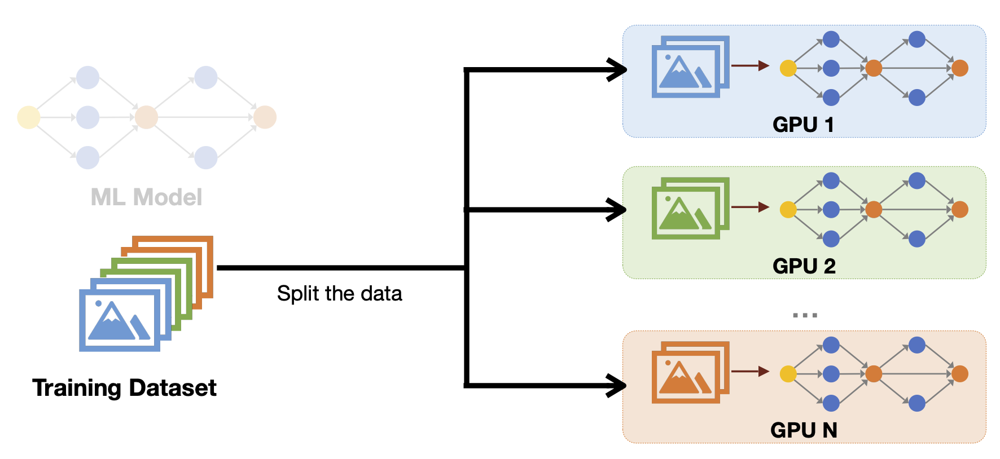
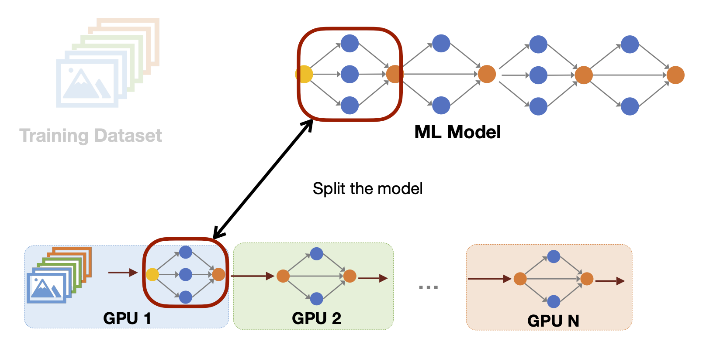
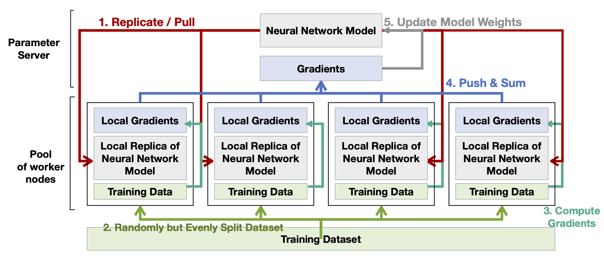
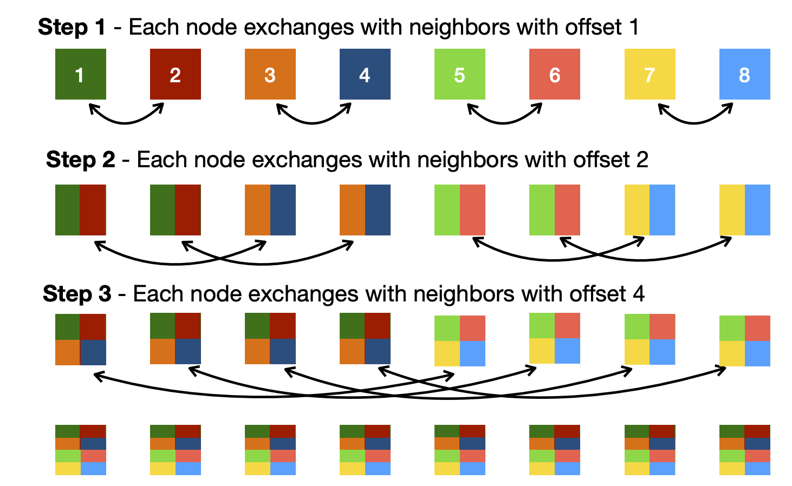
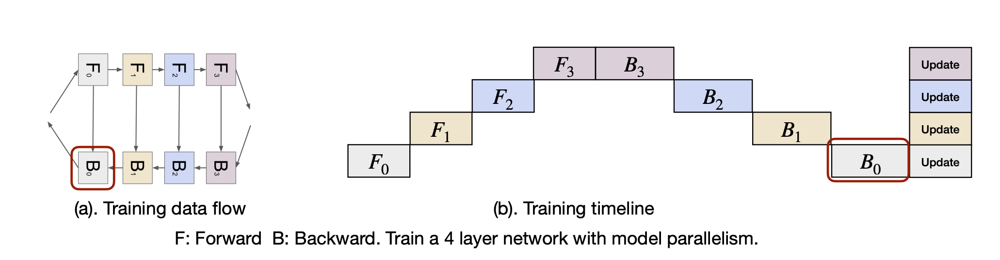

#  Lecture 13: Distributed Training and Gradient Compression (Part I)

## Note Information

| Title       | Distributed Training and Gradient Compression (Part I)                                                          |
|-------------|-----------------------------------------------------------------------------------------------------------------|
| Lecturer    | Song Han                                                                                                        |
| Date        | 10/25/2022                                                                                                      |
| Note Author | Weitung Chen (weitung)                                                                                       |
| Description | Learn the concepts of distributed training and how data and model parallelism help improve the training efficiency   |

## Lecture Plan
1. Background of distributed training
2. Basic concepts of distributed training
3. Data parallelism
4. Distributed communication schemes
5. Model parallelism

## Distributed training - background
* Higher accuracy models always require more computation
* ML Models are getting larger and taking longer time to train
	* The GPT-3 175B model would require 3.1M GPU hours to train (equivalent to 335 years for a single GPU)
	* Researchers and developers can make more iterations on their methods if the model trains faster
* If we can run a large scale distributed training with SUMMIT Super Computer, the training time can speedup from 2 days to 14 minutes without sacrificing accuracy. 
* SUMMIT Super Computer Spec:
	* CPU: 2 x 16 Core IBM POWER9 (connected via dual NVLINK bricks, 25GB/s each side)
	* GPU: 6 x NVIDIA Tesla V100
	* RAM: 512 GB DDR4 memory
	* Data Storage: HDD
	* Connection: Dual-rail EDR InfiniBand network of 23 GB/s 

## Distributed training - basics
* Two types of parallelism when it comes to distributed training:
	* data parallelism
	* model parallelism

### Data Parallelism
* Copy the same ML model across all devices
* Split the training dataset to multiple devices
* Easy to parallelize
* High utilization
* N copies of the ML model

### Model Parallelism
* Copy the training dataset to all devices
* Split the ML Model to multiple devices
* Hard to parallelize
* There will be a load balancing issue
* Single copy of the ML model

## Distributed training workflow - data parallelism
* Roles:
	* Parameter Server: Central controller of the whole training process. It receives gradients from a pool of workers and send back the results after summing them. 
	* Worker Nodes: Compute gradients using splitted dataset and send to parameter server. 
* Flow:
	1. The worker nodes pull the latest neural network model from the parameter server
	2. The training dataset is splitted among the workers
	3. The worker nodes compute the gradients
	4. The worker nodes push the gradients to the parameter server, and the server aggregates them together
	5. The parameter server updates the model weights and we can start over again from 1.

* The problem with this flow is that the bandwidth of the parameter server will be the bottleneck as the size of the worker pool grows. We need a distributed communication scheme to solve this problem, which is discussed in the next section. 

## Distributed training communication schemes
* The bottleneck of scaling up the distributed training is the communication
* To solve the centralized parameter server bandwidth problem, we need to come up with distributed communication schemes. The following are the communication primitives:
	1. Point-to-Point: transfer data from one process (device) to another
	2. Scatter and Gather: send a tensor to all other workers and receive a tensor from all other workers
	3. Reduce and All Reduce: Receive a tensor from all other workers, but averaging/summing during aggregation
* The parameter server uses the point-to-point send to all workers during pulling the latest model. It imposes the following bandwidth requirements:
	* worker: O(1)
	* parameter server: O(N)
* The parameter server uses the reduce operation when averaging the weights from all workers. Bandwidth req:
	* worker: O(1)
	* parameter server: O(N)
* The bandwidth O(N) at the parameter is a bottleneck to scale the distributed training
* Can we perform the aggregation of the weights without a central server? 
	* Yes! Perform All-Reduce
* All Reduce implementation
	* sequential - each step performs a single reduce operation: Time O(N), Bandwidth O(N)
	* ring - each step performs a single send and merge with the neighbors: Time O(N), Bandwidth O(1)
	* parallel - perform all reduce operations simultaneously: Time O(1), Bandwidth O(N^2)
	* recursive halving - each node exchanges with neighbors with offset 2^i (i = 0,1,2,...log(N)): Time O(log N), Bandwidth O(1)

## Distributed training workflow - model parallelism
* Data parallelism cannot train super large models as the model might not even be able to fit into memory
* Model parallelism split the model into different devices
* The naive approach of the model parallelism divides model into partitions and assigning different partitions to different accelerators

* The accelerators are significantly under-utilized if we assigned the training based on the flow image above
* The concept of optimizing this problem is to split a single batch into micro batches and allow pipeline parallelism. More chunks lead to more utilization
* When the layer is too large for the memory, we can split the layer and get tensor parallelism
* Alpa is a unified compiler for distributed training [[Zheng et al. 2022]](https://arxiv.org/pdf/2201.12023.pdf). It define the search space and automatically find the best parallel strategies. 
* Alpa searches for inter and intra operational parallelism

