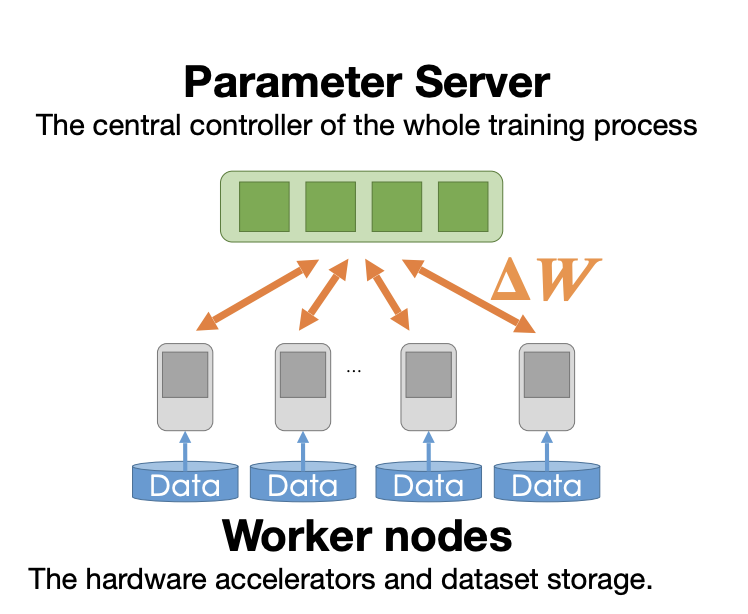
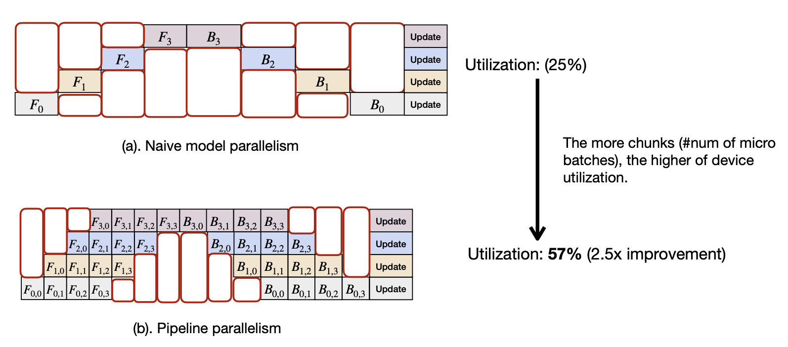

#  Lecture 13: Distributed Training and Gradient Compression (Part I)

## Note Information

| Title       | Distributed Training and Gradient Compression (Part I)                                                          |
|-------------|-----------------------------------------------------------------------------------------------------------------|
| Lecturer    | Song Han                                                                                                        |
| Date        | 10/25/2022                                                                                                      |
| Note Author | Veronica Muriga (wmuriga)                                                                                       |
| Description | Leveraging data and model parallelism to reduce training times and alleviate computational demands on training infrastructure   |

## What are the techniques that enable us to train NN faster?
- Background and motivation of distributed training
- Basic concepts of distributed training
- Techniques to make distributed training faster
    - Data parallelism
    - Model parallelism
- Distributed communication schemes across nodes

## Background
-	Distributed training is necessary because of the expensive computational requirements needed for model training
-	Higher accuracy models come at the cost of higher computation cost, and training models on one GPU takes many hours
-	We want to increase the number of GPUs to decrease the number of training hours
-	Distributed training is necessary to maximize on developer productivity with their time
-	SUMMIT super computer specs: 
    -	CPU: 2 16-core IBM POWER9
    -	GPU: 6 NVIDIA Tesla V100
    -	RAM: 512 GB DDR4 memory
    -	Data storage: HDD
    -	Connection: Dual-rail EDR InfiniBand network of 23 Gbps
-	Distribution across 256 SUMMIT nodes can reduce training time by almost 211x without degradation in accuracy

## Data Parallelism
-	Data is split into different chunks
-	Each GPU trains on a chunk of the data
-	The same model is shared across devices
-	Relatively easy to parallelize data chunks across devices, and high utilization of devices

## Model Parallelism
-	The ML model is divided across different GPUs
-	A single copy of data is passed across the GPUs
-	Have to move activations through devices
-	Potential complication: the GPUs depend on each other so load balancing is difficult
-	Hard to parallelize across devices, have to consider the load balancing issue

## Distributed training with data parallelism
-	In this framework, there are two different roles:
    - Parameter server- receives gradients from workers, and sends aggregated results to each worker
    - Workers- compute gradients using split dataset, and send results back to parameter server
-	The same NN model is replicated/pulled from the parameter server to the worker
-	The training data set is also divided among workers
-	In each cycle: 
    - Each worker computes its local gradient and pushes them to the centralized parameter server, which sums up all these gradients and updates the global model using the weights that have just been collected and summed up
    - Each node then pulls an updated copy of the NN model from the parameter model
-	For a large number of workers, the communication overhead will be large; the bandwidth requirement would grow linearly with the number of workers, such that the centralized server then becomes he bottleneck
-	We therefore explore conducting distributed training without a centralized server
-	Potential ways of mitigating the centralized parameter server bottleneck (class discussion):
    -	To reduce incast (when all nodes send back results to the server at the same time), each node could announce their gradients when they’re done instead of everyone doing it together
    -	Selectively broadcast to the other nodes such that everyone gets a broadcast at the end
    -	Set a hierarchy of nodes that exchange the gradient at the same time 
    -	Divide a set of nodes into different structures with each structure having a different update priority time

Distributed Communication Primitives
-	Point-to-point communication
    -	Data is transferred form one process to another
    -	Send and Recv are the most common distributed communication schemes
-	Collective communications 
    -	Scatter and gather: primitives are performed across all workers 
    -	Reduce and All Reduce: collectives perform communication patterns across all workers
    -	Reduce is similar to gathering but has averaging or summing
    -	All-reduce involves performing reduce on all workers
-	Schemes used in Parameter Server:
    -	Replicate and pull for send operations (parameter server sending weights to all workers). Requires bandwidth of O(1) on worker side and O(N) on server side
    -	Push and sum for reduce (average of all workers). Requires bandwidth of O(1) on worker side and O(N) on server side

-	Difference between send and scatter? Scatter distributes different components of an element to different workers while send is for sending the same elements to different workers 
-	The naïve all-reduce implementation is sequential; for n nodes, we have to reduce n different sets
-	The better all-reduce implementation has nodes talking to each other, such that finally one node has received information from all the nodes, and not everyone is talking to everyone else, each node just transmits to and from its own immediate neighbours, so time is still O(N) but bandwidth is reduced to O(1) since each step performs a single send and merge. 
-	Parallel reduce can be used to reduce time complexity: all reduce operations are implemented at the same time, leading to time O(1), but trads off bandwidth which increases to O(N2) since each node is talking to all other nodes
-	To combine advantages of ring and parallel, we can implement recursive halving all reduce:
    -	Each node exchanges information with immediate neighbours
    -	Each node exchange info with neighbours two offsets away
    -	Each node exchange info with neighbours four offsets away; each node will then have information from all neighbours in three timestamps (log n timestamps, where n is number of nodes)

Model parallelism
-	Training a super large model may have too many parameters to fit in memory 
-	Data parallelism is not enough in this case, we also have to divide different parts of the model to different GPUs, and they share the same data for inference 
-	Naïve workflow implementation:
    -	Each node has its a copy of a part of the model 
    -	All nodes have to work together to complete one step update
    -	However, nodes are idle for some time, so this approach results in super low utilization
-	Gpipe:
    -	Divide training data into several chunks 
    -	This ‘pipelines’ training such that computation can overlap
    -	Model parameters do not change within a single batch 
    -  	A near linear speed up is observed while training transformers

-	Edge cases of model parallelism
    - What if even a single layer cannot fit GPU memory? We need to not only split the model but also split the layer among GPUs, such that we have tensor parallelism 
-	Alpa: automating best practices for dividing the model or the tensor into chunks to improve utilization
    - Define the search space for parallel strategies
    - Search for inter- and intra-operational parallelism
    - Optimizing chuck and tensor splitting through automatic search eliminates the need for manual configuration

## Citations 
1. Deep Gradient Compression. Lin et al. 2018
2. Scaling Distributed Machine Learning with the Parameter Server. Mu Li et al. 2014

