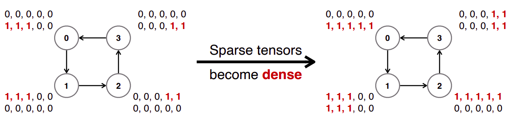

# Lecture 14: Distributed Training and Gradient Compression (Part II)

## Note Information

| Title       | Introduction to TinyML and Efficient Deep Learning Computing                        |
| ----------- | ----------------------------------------------------------------------------------- |
| Lecturer    | Song Han                                                                            |
| Date        | 10/27/2022                                                                          |
| Note Author | Alex Gu (gua)                                                                       |
| Description | Bottlenecks in distributed training, gradient compression, delayed gradient updates |

## Outline of this lecture

- Understand the bandwidth and latency bottleneck of distributed training
- Overcome the bandwidth bottleneck using gradient compression
- Overcome the latency bottleneck using delayed gradient update

# Section 1: Bottlenecks in Distributed Training

First, distributed training **requires synchronization, causing a high communication frequency**. The local gradients must be synchronized and aggregated across all nodes.

Second, larger models lead to **larger transfer data size, leading to longer transfer times**.

Third, with more training nodes, there will be **more communication steps** and **longer latency**

Finally, with a cellular network, there may be **poor network bandwidth and intermittent connection.**

# Section 2: Gradient Compression

There are two general ways to reduce gradient size, gradient pruning and gradient quantization. Let's look at some techniques for both:

## Gradient Pruning

### Sparse Communication [[Fikri Aji et al., 2017]](https://aclanthology.org/D17-1045.pdf)

Since communicating all the gradients may be expensive, one optimization is to only send the gradients with top-k magnitude

As one can see, this improves training speed, but fails on modern models like Res-Net.

 

### Deep Gradient Compression [[Lin et al., 2018]](https://arxiv.org/pdf/1712.01887.pdf)

The reason this failure occurs is because when momentum updates are used, there is significant deviation between the true updates and the updates when gradients are dropped. The effect can be seen in the image below: when sparse communication is used, the pruned gradients are accumulated, and when you use accumulated gradients directly, you'll get an update in the wrong direction. The fix to this is to accumulate the momentum terms, not the gradients.

In addition, in the first few epochs of changing, the weights of a neural network change rapidly, and tricks like local gradient accumulation will lead to inexact gradients, making the problem worse. Therefore, the authors of Deep Gradient Compression both warm up the learning rate and warm up the sparsity (shown below). This helps the optimizer gradually adapt to larger sparsities.

The authors show that at 99.9% sparsity, the model with Deep Gradient Compression is able to perform better than various ablations.

### PowerSGD [[Vogels et al., 2019]](https://arxiv.org/pdf/1905.13727.pdf)

One problem with DGC is that sparse tensors become more dense after all-reduce operations:

Therefore, instead of fine-grained pruning, we use a low-rank factorization of the matrix instead.

We see that there is a near-linear speedup in terms of the number of workers when using PowerSGD.

Nevertheless, the accuracy is kept at the same level

## Gradient Quantization

### 1-Bit SGD [[Seide et al., 2014]](https://www.microsoft.com/en-us/research/wp-content/uploads/2016/02/IS140694.pdf)

In 1-bit SGD quantization, we use a column-wise scaling factor and use one-bit for each quantized gradient depending on whether it is positive or negative. The quantization error is then stored locally for gradient updates.

### Threshold Quantization [[Strom et al., 2015]](https://assets.amazon.science/57/cf/1fc5a69d4a6dbc860bd4f3e0dd64/scalable-distributed-dnn-training-using-commodity-gpu-cloud-computing.pdf)

In threshold quantization, we pick a threshold $\tau$. We quantize values with absolute value over $\tau$ to $\pm \tau$, and the rest of the values to $0$. The choice of $\tau$ must be done empirically.

### TernGrad [[Alistarh et al., 2016]](https://arxiv.org/pdf/1610.02132.pdf)

In TernGrad, we quantize $\frac{g_i}{\max(g)}$ to $0, 1, -1$ with probability $\frac{|g_i|}{\max(g)}$. This way, we have that $\mathbb{E}[\text{Quantize}(g_i)] = g_i$. This ensures there is no quantization error accumulated.

# Section 3: Delayed Gradient Update [[Zhu et al., 2021]](https://proceedings.neurips.cc/paper/2021/file/fc03d48253286a798f5116ec00e99b2b-Paper.pdf)

While the methods in Section 2 primarily focus on addressing the bandwidth bottleneck, delayed gradient updates help address the **latency** bottleneck. Right now, the problem with conventional methods are that local updates and communication are performed sequentially, so that the worker will have to wait for the communication to finish before the next step, as shown here.

The idea is delayed gradient averaging: with no delay, each local machine is blocked when waiting for synchronization. However, with a delay, the workers will continue to perform computations locally while parameters are in transmission. This way, even if the latency increases, the total training time may remain unaffected.

One issue that may arise is staleness: in this example, the 3rd iteration's gradients only arrive at the 6th iteration:

If we directly update the weights by $w_{(i, j)} = w_{(i, j)} - \eta \overline{\nabla w_{(i-D)}}$,the model's performance will hurt because the gradients would be stale. Instead, applying gradients with correction terms, $w_{(i, j)} = w_{(i, j)} - \eta( \nabla w_{(i, j)} - \nabla w_{(i-D, j)} + \overline{\nabla w_{(i-D)}})$, mitigates this issue, as seen here:

We can see that delayed gradient averaging works well on real world benchmarks as well!

