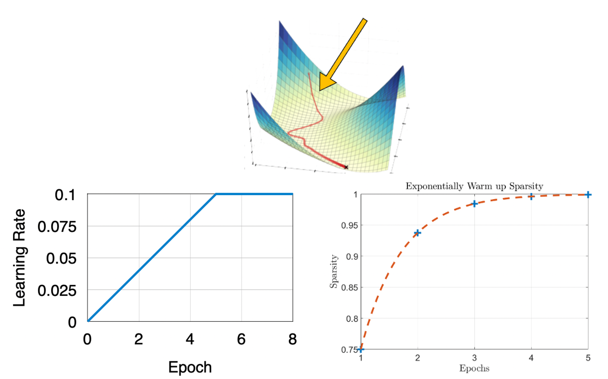

# Lecture 14: Gradient Compression and Delayed Gradient Averaging

## Note Information

| Title       | Gradient Compression and Delayed Gradient Averaging  |
|-------------|------------------------------------------------------|
| Lecturer    | Song Han                                             |
| Date        | 10/27/2022                                           |
| Note Author | Nicolas Filliol (nfilliol)                           |
| Description | Understand bandwidth and latency bottleneck of distributed training; overcome bandwidth bottleneck by gradient compression; overcome latency bottleneck by delayed gradient update.|

## Bottlenecks in Distributed Training
### Problems of Distributed Training
In previous lectures, we have seen that communication becomes the bottleneck for distributed training. If there is a pool of local workers computing each its local gradients, the gradients must somehow be synchronized among the workers. One approach to this is using a parameter server, to which workers can push their local gradients, are then summed up and the newest network weights can be pulled again.

The problem gets worse for **larger models**. Larger models have more parameters, leading to larger transfer data size and thus longer transfer times. Let's consider a real example: ResNet50 with its $24.46$ million parameters requires a bandwidth of 2.3Gb/s when training on a 2080Ti GPU with iteration time of 330ms (batch size 32). Compared to that, normal Ethernet bandwidth is typically 1Gb/s and the bottleneck is evident.

Additionally, **more training nodes** suggests that the communication protocol requires more communication steps, i.e. there is longer latency.

## Gradient Compression
As noted above, communication bandwidth is a big bottleneck in distributed training. This sections covers an approach to reducing the communication bandwidth using gradient compression, either with pruning or quantization methods.

### Reduce Transfer Data Size

Recall the basic workflow of the parameter-server based distributed training. Local workers push their local gradietns to the server which then updates the parameters in its neural network model that can then be pulled by local workers again. For the pushing gradients step, we want to reduce the data size that needs to be transfered by applying pruning or quanitization to the gradients.

An overview of existing techniques for gradient compression is given below:
* Gradient Pruning
    1. Sparce Communication
    2. Deep Gradient Compression
    3. PowerSGD
* Gradient Quantization
    1. 1-Bit SGD
    2. TernGrad

### Sparse Communication
The idea of sparse communication is to prune the gradienty by sending only the gradients with top-k magnitude and keeping the unpruned part as error feedback for the local gradients [[Fikri *et al.*, 2017]](https://arxiv.org/abs/1704.05021), [[Lin *et al.*, 2017]](https://arxiv.org/abs/1712.01887).

Using the residuals as a feedback and accumulating locally makes it more likely for the local gradient to be large in the next iteration, such that it has a higher chance to be sent out in the next iteration. This approach works for simple neural networks but fails on modern models like ResNet because of momentum that is used in their optimizers.

### Deep Gradient Compression
Momentum is an extension to standard gradient descent that helps to overcome local minima and oscillation of noisy gradients. Most modern deep neural networks (e.g. AlexNet, VGG, ResNet, Transformer, BERT) use optimizers that include momentum.

The formulas in the picture show that we compute a velocity term $u_t$ which is based on the previous velocity $u_{t-1}$ and the current gradient $g_t$. Instead of the gradients, the velocity $u_t$ is used to update the parameters $w_t$.

Local accumulation of gradients (using the residuals) requires a correction if momentum is used. Without correction, the new velocity $u_{t+1}$ based on accumulated gradients no longer matches the direction of the actual velocity, as can be seen in the picture below.

Instead of accumulating the gradients, it is enough to accumulate velocities. That way, the accumulation aligns with the steps taken in vanilla momentum SGD (i.e without gradient compression and residual accumulation).

In early stages of training, the network is changing rapidly. Local gradient accumulation and stale gradients will aggravate the problem. Using **Warm Up Tricks**, performance can be improved [[Lin *et al.*, 2017]](https://arxiv.org/abs/1712.01887):
1. Warm up the learning rate
2. Warm up sparsity by exponentially increasing sparsity in first several epochs (helps optimizer to adapt to sparsity)

Using all methods together, image classification with 99.9% gradient sparsity can be achieved while maintaining accuracy. Furthermore, a gradient compression ratio of 597x for AlexNet and 277x for DGC has been demonstrated by [[Lin *et al.*, 2017]](https://arxiv.org/abs/1712.01887). The reason that this compression ratio is below the theoretical 1000x is based on the fact that there is an index overhead (indices of unpruned gradients) and that biases are not pruned.

Similar results in terms of performance are provided also for language modeling tasks.

### PowerSGD
There remains one problem, however. Sparse gradients get denser during the all-reduce scheme (see lecture 13) because every worker has different pruned gradients and reducing (summing) two sets of gradients will thus lead to a reduced set of gradients which is less sparse.

PowerSGD addresses the irregular sparse patterns in gradient compression and prevents gradients from getting denser by adapting a low-rank factorization instead of using fine-grained pruning [[Vogels *et al.*, 2019]](https://arxiv.org/abs/1905.13727). The low rank matrix dimensions are the same across all servers and thus, gradients getting denser is not a problem anymore.

![[PowerSGD]](figures/lecture-14/nfilliol/power_sgd.png)

PowerSGD is able to reduce the transferred gradient data size while keeping accuracy at the same level. It is also integrated into PyTorch and thus easy to use.

### Gradient Quantization
1-bit SGD uses a column-wise scaling factor to enable quantization of the gradients and thus reduce the data size. Similarly to pruning before, the residual is accumulated in the local gradient [[Frank *et al.*, 2014]](https://www.microsoft.com/en-us/research/wp-content/uploads/2016/02/IS140694.pdf).

More specifically, we use one bit to differentiate between positive and negative values and assign the column-wise scaling factor (average) to it.

Alternatively, we can use a ternary representation to perform threshold quantization [[Nikko, 2015]](https://www.amazon.science/publications/scalable-distributed-dnn-training-using-commodity-gpu-cloud-computing). $\tau$ is used for both the threshold and reconstruction value and is chosen in advance (empirically). The quantized gradient consists hence of the three values $\{-\tau, 0, \tau\}$ and again, the residual is accumulated in the local gradient to account for the mismatch.

TernGrad manages to remove the step of quantization error accumulation [[Wen *et al.*, 2017]](https://arxiv.org/abs/1705.07878). By quantizing $\frac{g_i}{\max(\mathbf{g})}$ to $-1, 0, 1$ with probability $\frac{|g_i|}{\max(\mathbf{g})}$, such that $\mathbb{E}[\text{Quantize}(g_i)]=g_i$, quantization error accumulation is done on the fly.

## Delayed Gradient Update
As discussed before, networking latency is another big bottleneck in distributed training. This sections covers ways how networking latency can be tolerated.

### Latency Bottleneck
In data centers, different workers are typically connected trough wired ethernet or infinity band which has bandwidth as high as 100Gb/s and latency as low as 1us. On the other hand, mobile phones connected through WiFi or Cellular network have much smaller bandwidth up to 1Gb/s and latency of ~200ms. As seen above, bandwidth can always be improved by hardware upgrades and/or gradient compression and quantization. Yet, latency is very hard to improve because of physical limits: traveling from Shanghai to Boston at the speed of light still takes 162ms, which is much too long for some applications.

Above figure shows typical training speeds and latency. In a cluster, network latency does not affect training but in a home, wireless connection slows the training by a certain margin. Finally, long distance training across the world slows down training by a very large margin.

Vanilla Distributed Synchronous SGD algorithms suffers from high latency as shown below. Local updates and communication are performed sequentially, a worker thus has to wait for the transmission to finish before executing the next step.

A simple but effective approach is Delayed Gradient Averaging [[Zhu *et al.*, 2021]](https://proceedings.neurips.cc/paper/2021/hash/fc03d48253286a798f5116ec00e99b2b-Abstract.html). Instead of blocking all local machines to wait for synchronization, the workers keep performing local updates while the parameters are in transmission. As soon as the parameters/gradients are received after $D$ time steps, they are applied locally (=delayed gradient averaging). Included is a correction where the local gradients from $D$ steps ago are removed as they are included in the delayed, global average. Using this approach, communication is covered by computation and latency has no longer an impact on total training time. 

Experiments showed that with delays up to 20 iterations, training performance/accuracy is very well maintained (drop of less that 0.5%) [[Zhu *et al.*, 2021]](https://proceedings.neurips.cc/paper/2021/hash/fc03d48253286a798f5116ec00e99b2b-Abstract.html).