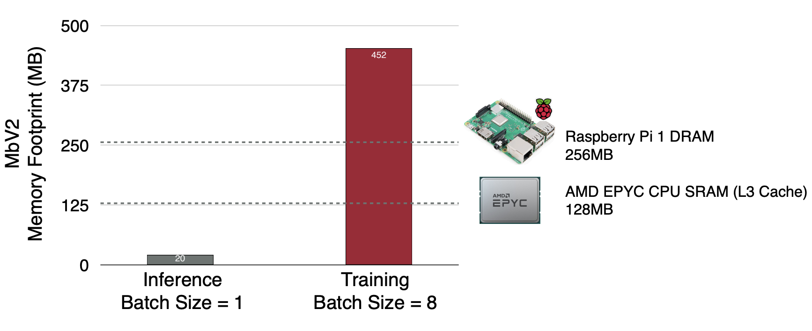
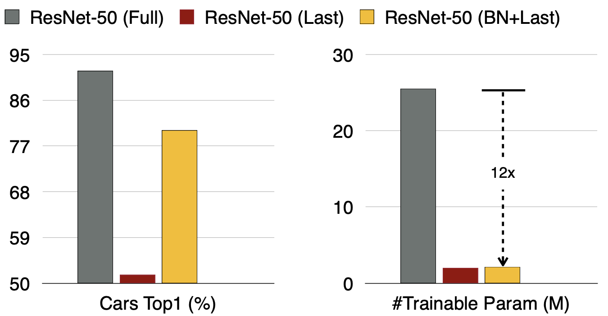
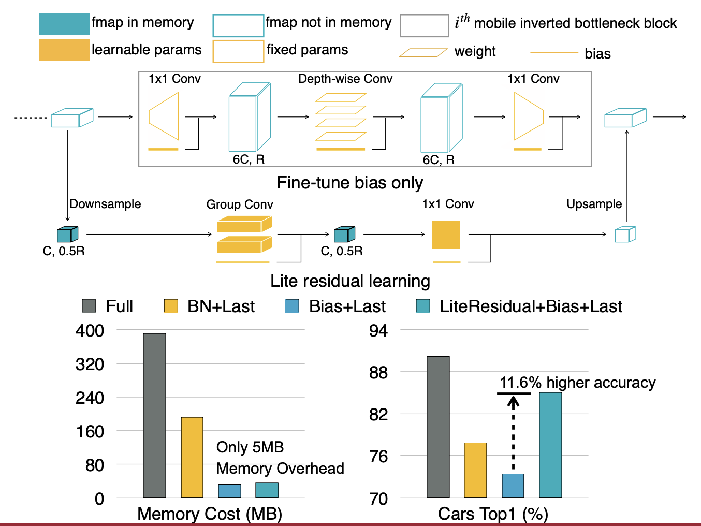
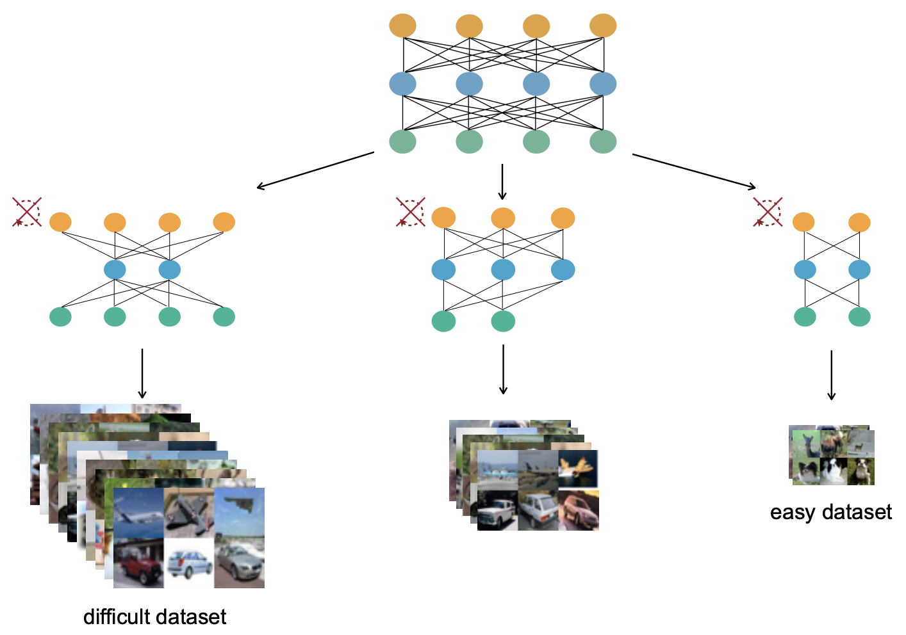
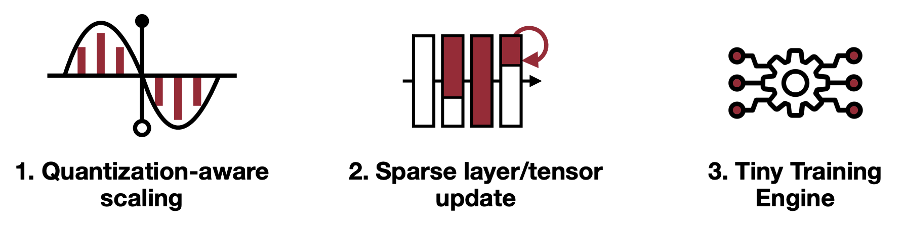
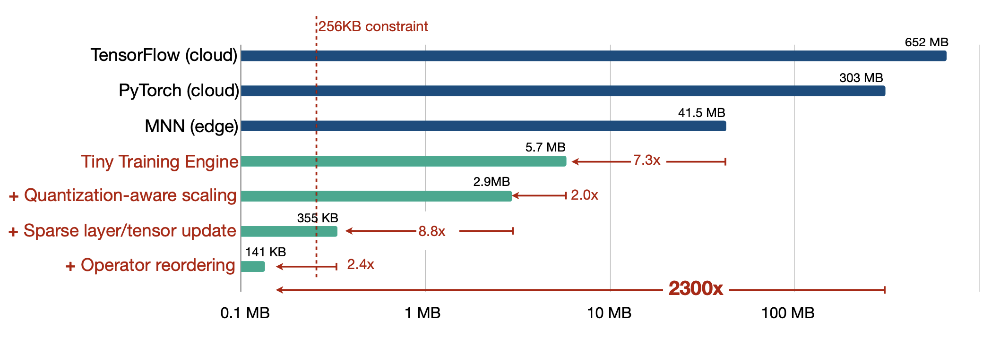
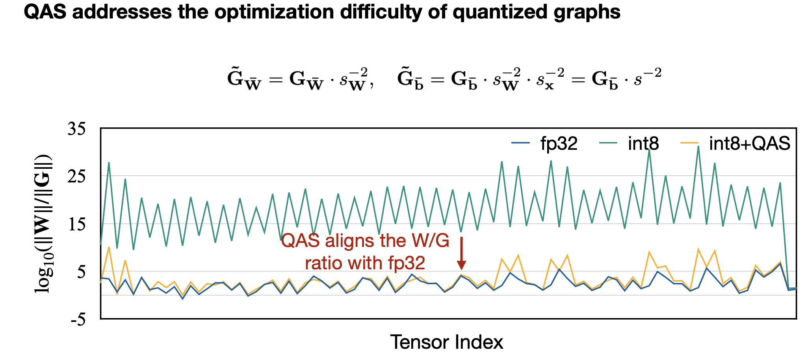
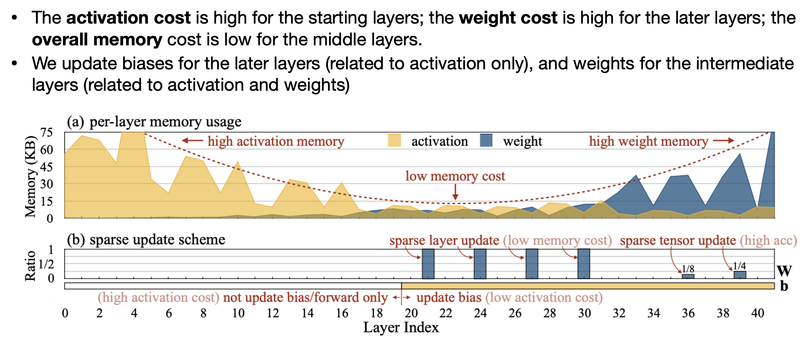
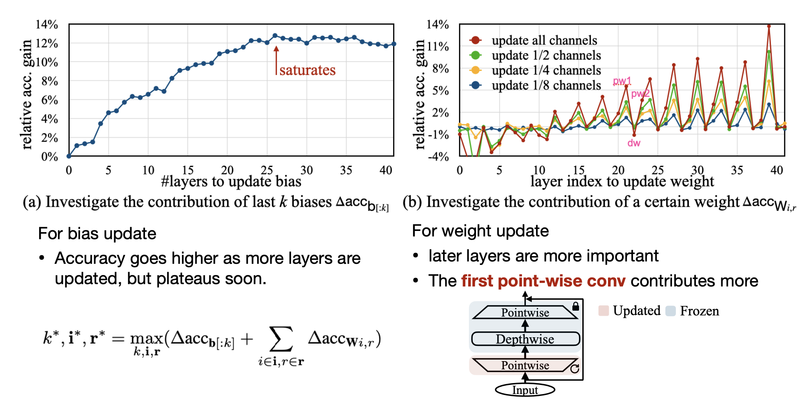

# Lecture 15: On-Device Training and Transfer Learning (Part I)

## Note Information

| Title       | Introduction to TinyML and Efficient Deep Learning Computing                                                    |
|-------------|-----------------------------------------------------------------------------------------------------------------|
| Lecturer    | Song Han                                                                                                        |
| Date        | 11/07/2022                                                                                                      |
| Note Author | Andrew Feldman (abf149)                                                                                         |
| Description | Using DNNs within the resource-constrained context of microcontrollers                                          |

## Outline of this lecture

- "Analyze the memory bottleneck of on-device training"
- "Introduce efficient algorithms for on-device transfer learning"
    - Activations bottleneck training memory
    - Bias-only- and lite-residual-based on-device transfer learning
- "Study the system support for on-device training"
    - Quantization in the on-device context
    - Sparse update for on-device training
    - System support for on-device training

## Key principles

### On-device learning design principles

- "Parameter efficiency does not translate to memory-efficiency"
- "The main memory bottleneck of the training is the activations, not #trainable parameters"
- "TinyTL saves the activation memory by fine-tuning bias only, and lite residual learning"
- However, you don't get actual performance/energy savings without **algorithm-system co-design**

## Background & Motivating on-device training

- Mobile and embedded devices live at the edge of the network, where the users are
- These devices interact with users, and often the user experience requires adapting device behavior in response to data generated from user interaction
- If edge device behavior is determined by a DNN, then the process of adapting to new data is a process of re-training
- It is more environmentally-friendly to do this re-training on-device. Microcontrollers are already small, cheap and relatively-environmentally-inoffensive devices but it is costly to send data back to a server and retrain
- The system as a whole must protect the privacy of user data generated at the edge within embedded and mobile devices. Keeping generated data on-device accomplishes this goal but imposes a requirement of on-device training*

*Alternatively cryptographic techniques can be combined with distributed training and/or federated learning to solve this problem without on-device training, but that approach has its own complexities and limitations and is out-of-scope for this discussion.

## The memory-bottleneck of on-device training

### Key metrics

- Activation memory - RAM for holding input/output and intermediate activations
- Weight storage - nonvolatile storage for holding weights which may be reused from inference-to-inference
- Performance metric
    - Any DNN optimization for microcontrollers requires a model of the relationship between DNN architecture and inference execution time
    - FLOPs are a commonly-used proxy for performance, however FLOPs optimization empirically has a limited impact on real performance at best

### Activation memory is the bottleneck

- Device constraints
    - Memory constraint - total weight/activation size may exceed device weight storage and activation memory
    - Energy constraint - battery-life and thermal considerations impact energy as a design parameter

- Activation memory:
    - Cloud AI (GPU): 32GB RAM
    - Mobile AI (mobile CPU/SoC): 4GB RAM
    - Tiny AI (embedded microcontroller): 320kB RAM!!
        - 13k times smaller than Mobile AI, 100k times smaller than Cloud AI
- Weight memory: 1MB typical on Tiny AI, 260k times smaller than Mobile AI and 1M times smaller than Cloud AI
- => Both weight and activation memory must be reduced

However DNN training and DNN generally entail a number of considerations which cause activation memory to be the bottleneck during training:
- Batch-size (i.e. 8 typ.) - multiplier on activation size
- Training-only: need to store intermediate activations
- Empirically, activations are usually larger than model weights even for batch-size 1
- => Activation requires 6.9x typ. more memory than weights

- Most systems have a process to orchestrate the movement of weights and activations through the cache hierarchy, between CPU and RAM or storage
    - The most efficient configuration is to fit the largest percentage of all weights and activations in cache which is fast and energy-efficient

### Parameter-efficient transfer learning

- As the system adapts to new information acquired in the course of user interaction, we assume that the network's existing knowledge still has some value and requires only some correction
- Therefore we consider here how to *fine-tune* an existing architecture and its weights to comprehend the new data
- The best accuracy is obtained by fine-tuning the whole network, however this entails a high memory footprint owing to the need for all weights to be in cache at the time they are consumed or modified, as well as the need for a large number of intermediate activations to be stored.
- As we see above, we can attain *parameter-efficient training* by fine-tuning the final classifier and retuning all batch-norm layers (which each require only a handful of parameters to be loaded into memory.) This results in a good compromise between accuracy and a reduction in the number of trainable parameters. The reduction in trainable parameters against full fine-tuning is 12x.
- **But crucially trainable parameters is a poor proxy for memory footprint** - the aforementioned 12x parameter reduction translates to only 1.8x  memory footprint reduction!
    - Just like we saw with FLOPs - not every proxy is a good proxy!

## Tiny Transfer Learning (TinyTL)

- Two key principles of TinyTL
    - Dramatically reduce memory footprint by fine-tuning only biases, the one class of parameters which requires no intermediate activation storage during training
        - Double-punch: removes intermediate activations *and* dramatically reduces the number of trainable parameters as there is a limited number of biases in the model
    - Train a "lite" residual network
        - "Key principle - keep activation size small"
            1. "Reduce the resolution"
            2. "Avoid inverted bottleneck"
        - Example from lecture slides: 1/6 channel & 1/2 resolution & 2/3 depth => ~4% activation size
- Exploit that ReLU is more memory-efficient than sigmoid, h-swish

### In-memory training

- Bias-only training plus lite residual model reduces training memory to 16MB for representative network, enabling **in-L3 training**
    - Contingent on batch 1 training, enabled by **group normalization**
- Much more efficient than training from DRAM

### TinyTL + OFA

- Observation: relative accuracy of different neural net architectures is substantially a function of dataset
- This motivates use-case dependent DNN architecture
- NAS based on OFA can be used to source application specific DNN architectures for TinyTL

#### Experimental results

- Impact of bias-only fine-tuning & lite residual
    - 12x memory savings from bias fine-tuning **alone** but 16.3% accuracy loss
    - Residual => +11.6% (4.7% accuracy loss)
- Comparative results
    - Up to 6.5x training memory savings against full-model fine-tuning **without accuracy loss**
    - TinyTL attains greater memory savings than dynamic activation pruning

## Algorithm-system co-design for on-device training

### A summary of stacking different TinyML techniques to fit in even smaller microcontroller memoriese (<256KB uC memory is the target in this example)

### Challenges of quantization

- Shortcoming of existing quantization-aware training (QAT) - training process employs "fake quantization"/rounding to fp32 quantization grid. 
    - No memory savings at training time - fp32 intermediate activations
- Shortcoming of existing techniques to train on real int8/int32 quantized graphs - -10% top-1 accuracy after int8 training vs fp32 training
    - Reason: gradients (as a proportion of weight values) are much smaller in int8 quantization than for fp32
    - Note: assume batch-norm folding for true quantized training
    - Proportionally-smaller gradients result from computing gradients against quantized values which are roughly rescaled by $s^{-1}_{w}$ relative to the floating-point values. This leads to the weight/gradient ratio being off by about a factor of $s^{-2}_{w}$
- => **Quantization-aware scaling (QAS)**: formulae (shown below) rescale gradients to restore floating-point weight-to-gradient ratio, roughly speaking

    

#### Experimental results

- (Against representative DNN) +11.5% improved top-1 accuracy from Int8 SGD to Int8 QAS

### Sparse updates

- As discussed previously - full-network retraining is expensive in terms of memory footprint
    - Also, updated weights need to live in SRAM (Flash is read-only)
- Updating only last layer is cheap and saves on backprop but damages accuracy significantly
- Bias updates require back-propagating all the way to the first layer
- **Sparse updates** - update only a subset of activations; no need to backprop to first layer

#### Contribution analysis

    
    

### Tiny-training engine (TTE)

- Conventional training frameworks perform autodiff & any graph optimizations at runtime
    - Focused on flexibility
    - Heavy runtime
        - Supported operations and especially dependencies => >100MB static memory
        - Run-time autodiff
        - "Operators optimized for the cloud, not for edge"
    - Memory overhead
        - Intermediate result buffers
        - Full-gradient computation
- TTE separates runtime, compile time
    - Autodiff & graph optimization at compile time
    - On-device fine-tuning & more extensive graph optimizations

#### Strategies for addressing the challenges above

- Compile-time autodiff, graph pruning and op reordering
    - Operator reordering: shorten reuse distance to complete all uses of a datum quickly and then release that datum from memory
- Only included needed dependencies in the binary!
    - Lightweight, portable, efficient

#### Experimental results

- Backward graph pruning + sparse update in IR + operator reorder => 22-28x memory saving
    - 8-10x from weight/activation pruning
    - Related to operator reordering, 2.7x - 3.1x peak memory reduction on MCUNet owing to releasing Gradients earlier
    - TTE sparse: 21-23x speedup against Tensorflow lite full (MbV2, Proxyless, MCUNet)
- 20x smaller memory, 23x faster speed vs full update

#### Broad platform support

- Diverse models (CNN + Transformers)
- Diverse platforms
    - Compiles to intermediate representation where optimizations may be performed (including sparse updates and graph pruning) before targeting backend 
    - Diverse frontends
        - PyTorch
        - TensorFlow
        - Jax
    - Diverse hardware backends
        - Apple M1
        - Raspberry Pi 
        - Smartphones
        - ...And more
    - Vision & NLP models on Raspberry Pi 4B+

