# Lecture 16: On-Device-Training and Transfer Learning Part II

## Note Information

| Title       | On-Device-Training and Transfer Learning Part II                                               |
| ----------- | ------------------------------------------------------------------------------------------------------ |
| Lecturer    | Ian Lee                                                                                               |
| Date        | 11/03/2022                                                                                             |
| Note Author | Ian Lee (ianl)                                                                                         |
| Description | Continue to explore other learning techniques like on-device and transfer learning                     |

### Lecture overview
1. Co-Design for On-Device Training (Part II)
2. Privacy Leakage in Federated Learning
3. Compilers, Languages and Optimizations for Deep Learning
4. Graph-level optimization

### 1. Co-Design for On-Device Training (Part II)
* Key question is: Can we learn on the edge?
* For example,  a self-driving car gathers a lot of new data everyday, can we use the data to update the model locally?
* This is important as it helps us enable better customization on the spot, and preserves privacy
* But due to activations, training is more difficult than inference.
* Last lecture, we talked about co-design: first algorithm, then the system side.
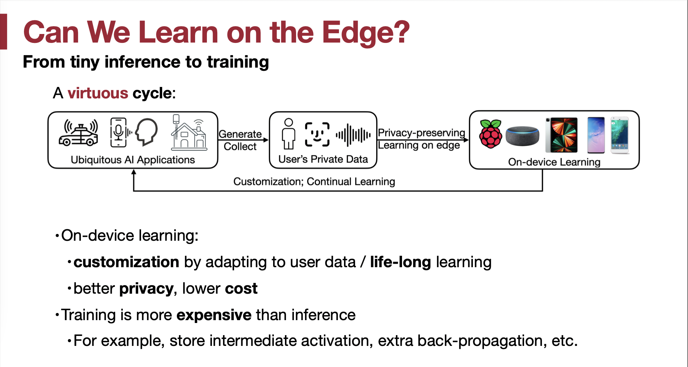

* Last time, we talked about
    * Using quantization-aware (only 8-bit for training) scaling to compensate the difference between size of weight and gradient.
    * Using sparese layer update to focus on the layers that are actually useful to move only partial data (and using contribution analysis to decide which layer to update/keep fixed)

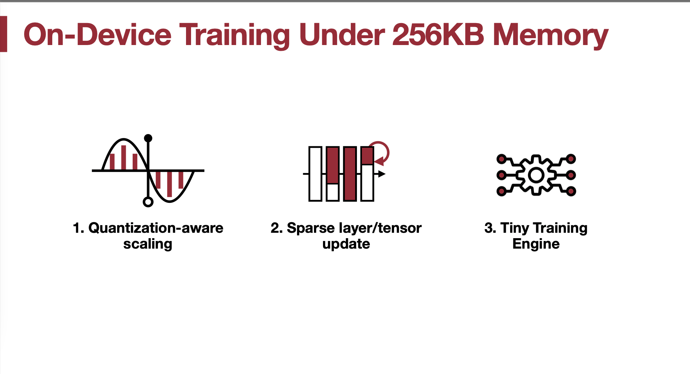

* In this lecture, we will talk about Tiny Training Engine to bring all the theoretical improvement techniques discussed in last lecture into action (speed ups).

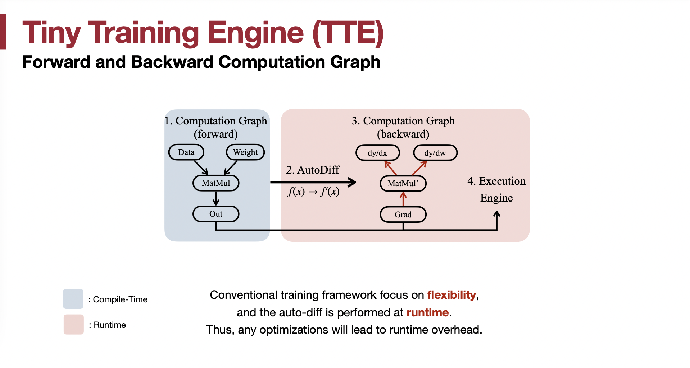
* Overall, in Tiny Training Engine (TTE), we get the forward and backward computationg graph done in compile time. The auto-differentiating part from the graph is done in runtime and contributes to the latency of the model.
* Our key question is to offload work to compile time instead of runtime.
* Drawbacks for autodiff in runtime due to heavy dependencies and large bandwidth, also we need customized kernel for on-device training because conventional approachs are heavy in memory, with operators optimized for the cloud (not edge).
* Also, ctivation is heavier in early stage due to the large resolution, and for the weights, it is heavier in the later stage, so we tradeoff by updating different layers. For exisiiting mechanism, there is no support for sparse backpropagation and update.
* Our end goal is to push everything (work) into compile time to minimize runtime overhead and to allow for extensive graph optimization.
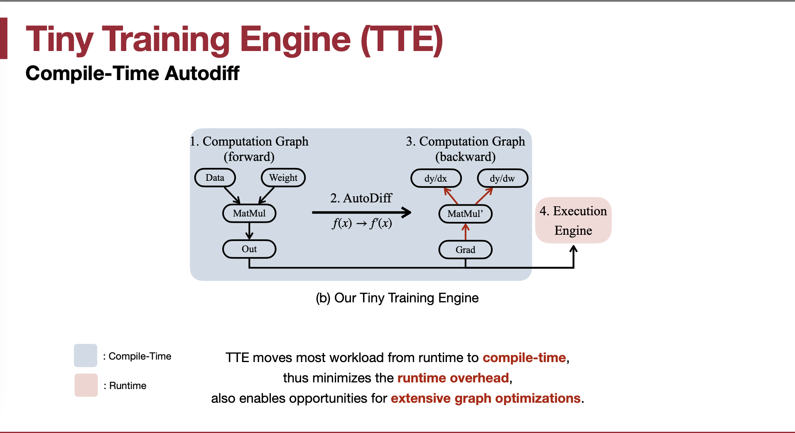

* Tiny Training Engine workflow
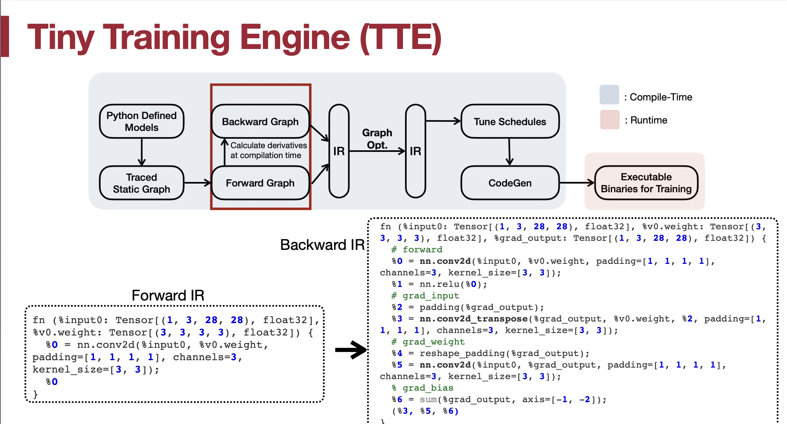
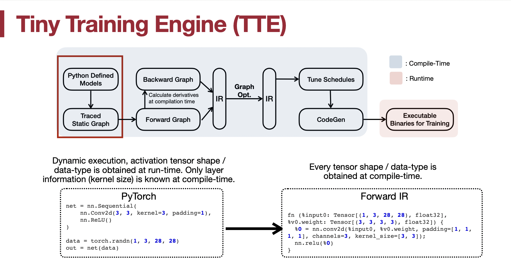
* Key ideas behind TTE is: using Forward IR (from figure 5) allows every tensor shape and data-type to be obtained at compile-time, allowing graph-level optimization in advance.
* In Backward IR, only gradient to weight requires storing intermediate activation. So, to estimate, if forward takes 10 million seconds, then backward takes 3 convolution = 3x the work of forward with respect to the latency.

####  Graph level optimization in TTE
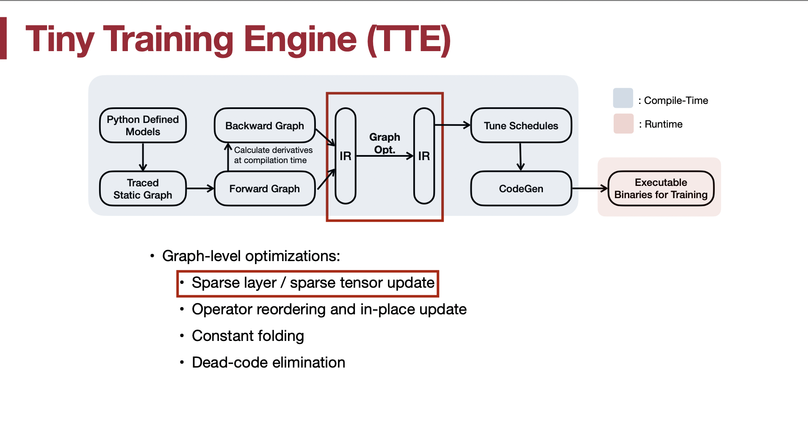
* For sparse layer update, the key idea is: There are 4 types of updates. Depending on what we want, for example, in bias-only update, we can trim the operations related to that and saves time. This method is quite effective compared to full update doing full backpropagation to layer 1, it saves size from 6.5x to 8.7x smaller, helping with Image recognition tasks and language-related tasks like those using BERTs.
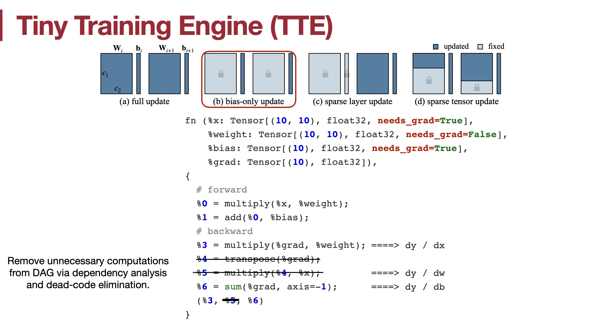
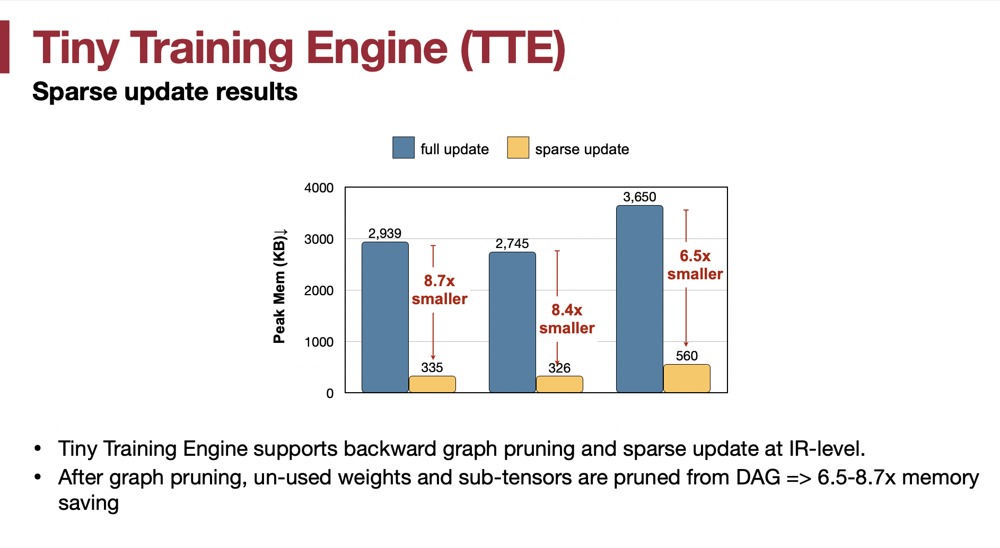

* We can also perform operator reordering and in-place update to optimize intermediate representation in the TTE workflow:
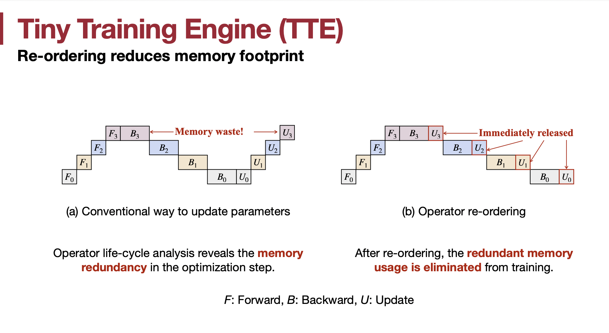
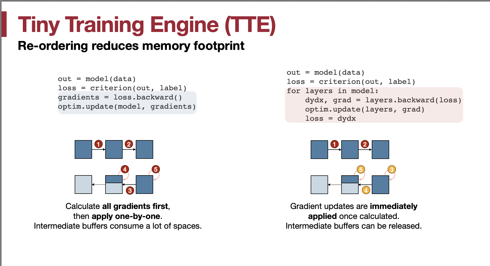
* Conventional way to update parameters (all forward, then all backward, all updates, very linear and simple code but inefficient) spend a lot of time storing the gradients in memory before it is consumed, leading to optimization opportunity. What we can do is to release memory space by updating immediately after Backward for operations that don't depend on each other. 
* The drawback is to maintain this relationship (for loop, calculate backward, then immediate update, then we calculate the gradient, do the update, so on and so far). This greatly simply the buffer and lead to lower memory usage and higher reduction. See below for example:
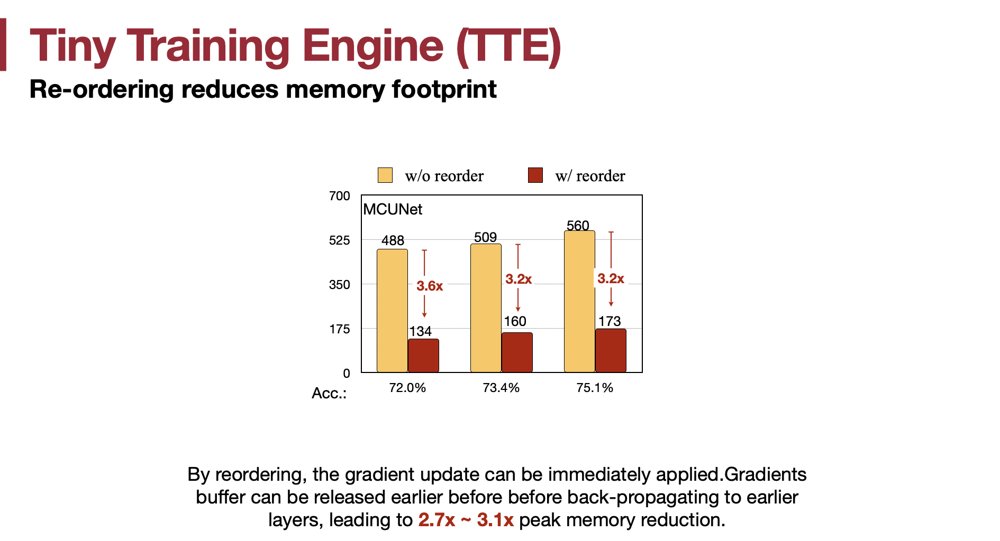

* We can further validate the memory reduction by using a operator Life cycle analysis (for each buffer, check start and end time). We can see that after the optimization, all operators finish in 200 cycles versus 240 cycles. From the left (vanilla graph), we can see that majority of the memory is consumed in gradients and activation. By fusing oeprations and doing the in-place gradient update, we can reduce memory usage decently:
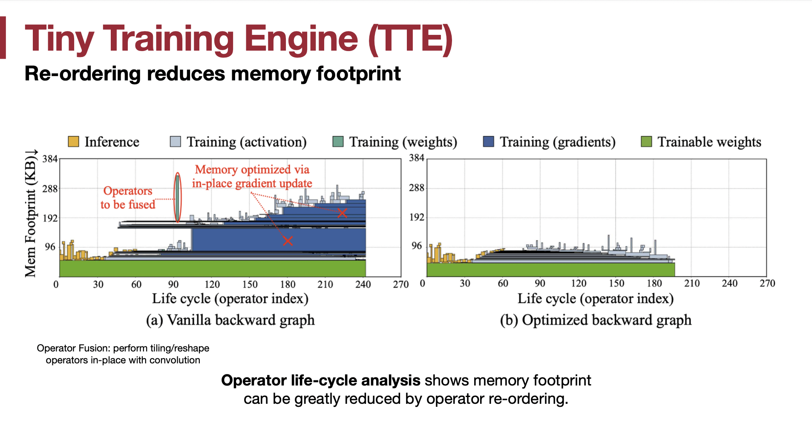

* Now, after we do all the sparse layer update, graph optimizations, and tuning the schedules (including separating the environment of runtime and compile time), TTE generates a light-weight, efficient library.
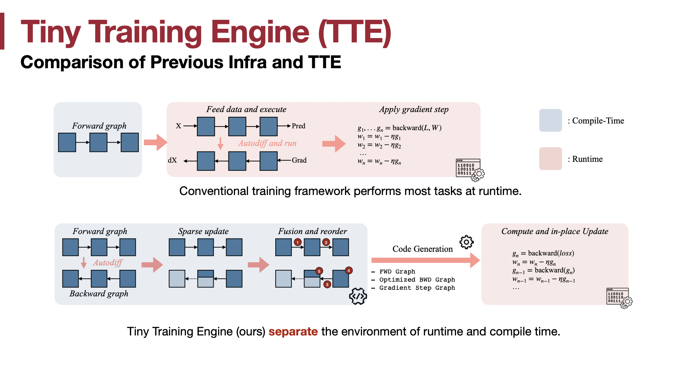
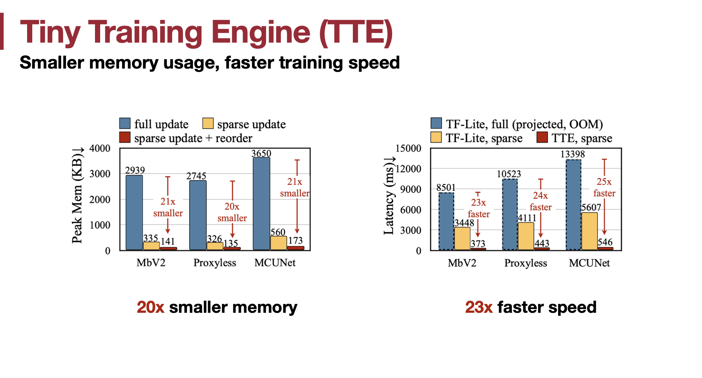

#### Extending TTE to more platforms
* TTE can be applied to various model types, frontends, backends, and platforms as seen.
* The take-aways of TTE are:
    * Quantization-aware training helps us efficiently optimize quantized graph
    * Sparse learning (which happens in our brains too) update only layers deemed important to save memory
    * Moving workload to compile time makes runtime faster, and optimizing schedules and kernels help improve throughout, with example results seen below:
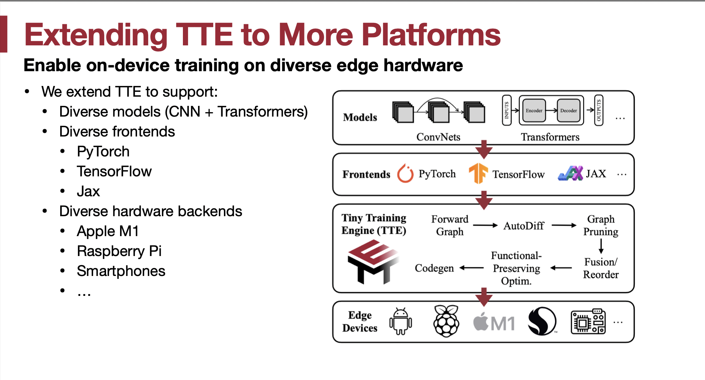
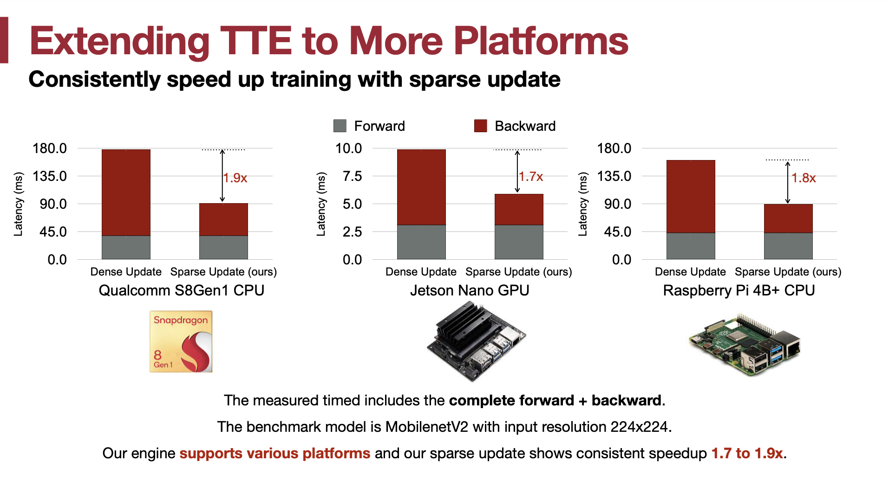

### 2. Privacy Leakage in Federated Learning
* Key question: Can we leak raw data from federated learning?
* Explaining what federated learning is: 
    * It is when devices use their own local data to update its own model, and only exchange model update instead of raw training data
    * Why we need federated learning (customization, privacy to keep data locally)
* Example is the FavAvg algorithm, where users input help with training and provide them a better customized experience.
* Our question is: Does this actually protect the users?
* Key question is: Can we recover the input data from gradients? If that is possible, we should not share gradient the way we do!
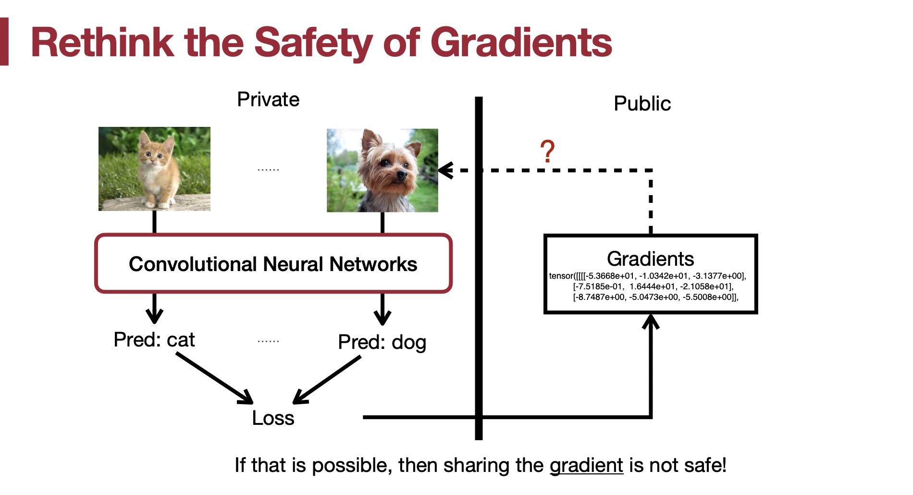

#### Gradient Inversion techniques
* There are multiple exisiting work on gradient inversion:
* [[Exploiting Unintended Feature Leakage in Collaborative Learning [Melis et al., 2018]]](https://arxiv.org/abs/1805.04049)
* [[Membership Inference Attacks against Machine Learning Models [Shokri et al., 2016]]](https://arxiv.org/abs/1610.05820)
* There are 4 steps in general
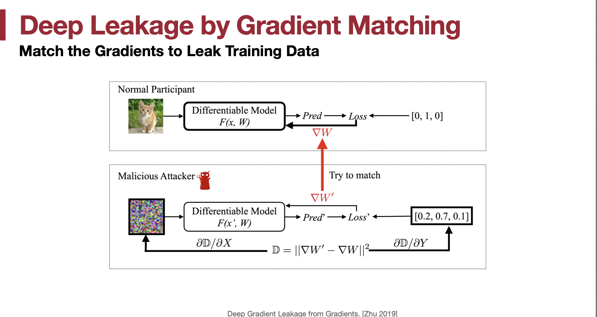
1. Initialize dummy data
2. Feed dummy data and label and calculate loss
3. Match dummy vs real loss
4. Use chain rules to update dummy training data -> eventually dummy data looks similar to real data

* [[Deep Leakage from Gradients [Zhu et al., 2019]]](https://arxiv.org/abs/1610.05820)

#### Deep leakage
* Neither gaussian nor laplacian noise can protect against leakage
* However, if we compress the gradient, this makes it harder to crack the data = efficiently protect privacy (gradient compression)
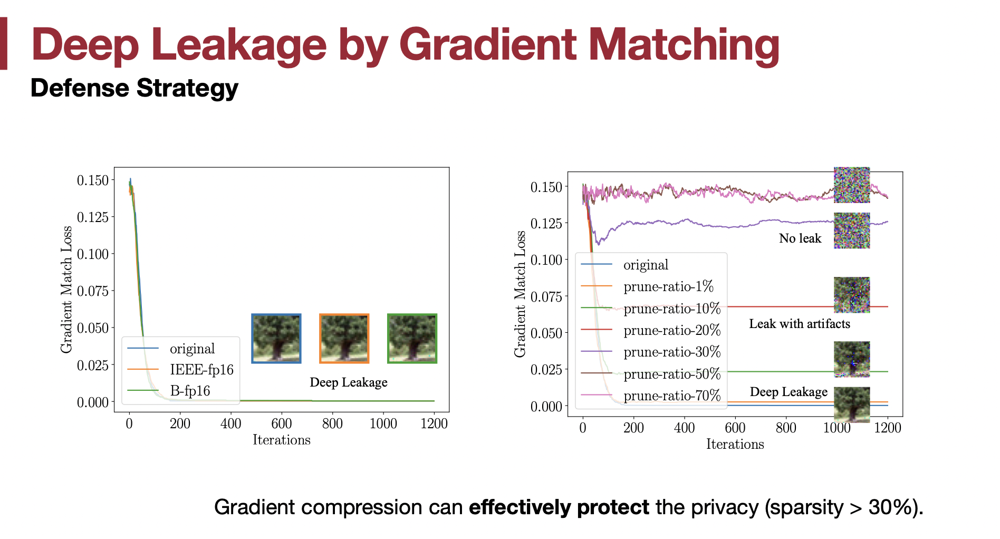

### 3. Compilers, Languages and Optimizations for Deep Learning
* Using low-level instructions (Fast C++ vs C++) can lead to 10x reduction in time
* Halide is optimized for this: it includes Algorithm and Schedule (what to compute and how to compute, for example, its speed up:)

* [[Decoupling Algorithms from Schedules for Easy Optimization of Image Processing Pipelines [Ragan-Kelley et al., 2013]]](https://arxiv.org/abs/1610.05820)
https://people.csail.mit.edu/jrk/halide12/halide12.pdf
* In general, developing efficient tensor programs is difficult
    * We have Halide, a domian specific language for parallel computing
    * We have TVM, a domain specific compiler for deep computing
        * Allows us to separate algorithm and schedule (still engineering expenive)
    * We have AutoTVM, a learning-based optimizer to generate efficient schedules
        * Allow us to use machine learning to optimize machine learning models
        1. Choose schedule x from a surrogate model
        2. Evaluate f(x)
        3. Add (x, f(x)) to training data
        4. Fit data
        5. repeat from step 1, with new x
        * In general, auto-based method outperforms manually written baseline methods

### 4. Graph-level optimization
* Did not cover in full details in lecture, but for reference you can search up MetaFlow 