# Lecture 16: On-Device Training and Transfer Learning (Part II)

## Note Information

| Title       | On-Device Training and Transfer Learning (Part II)           |
| ----------- | ------------------------------------------------------------ |
| Lecturer    | Song Han                                                     |
| Date        | 11/03/2022                                                   |
| Note Author | Zijie Zhao (zijiezha)                                        |
| Description | Algorithm-system co-design for on-device training; Privacy leakage in federated learning. |

## Tiny Training Engine (TTE)

### Motivations

Today's lecture talks about Tiny Training Engine [(TTE)](https://github.com/mit-han-lab/tinyengine), which is the implementation of all algorithms to turn theoretical saving into speed-up and memory saving. The existing frameworks cannot fit training into tiny devices due to the following: 

* **Runtime is heavy** 
  * Heavy dependencies and large binary size (>90MB) 
  * Autodiff at runtime 
  * Operators optimized for the cloud, not for edge 

* **Memory is heavy**
  * A lot of intermediate (and unused) buffers 
  * No support for sparse backpropagation

The conventional training framework focus on flexibility, and the auto-diff is performed at runtime.

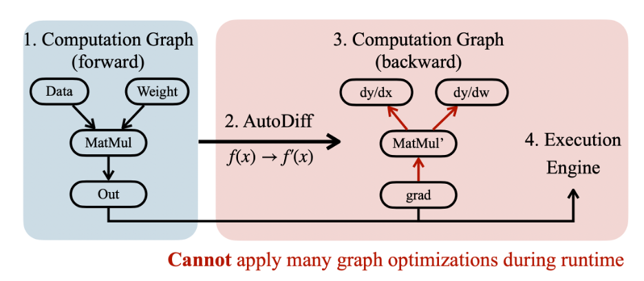

TTE moves most workload from runtime to compile-time, thus minimizing the runtime overhead, and also enables opportunities for extensive graph optimizations.

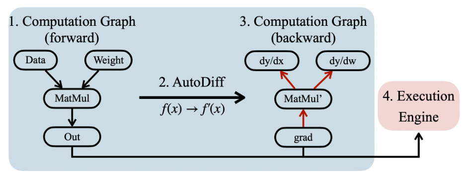

### Whole picture

We start with a Python-defined model and retrace the static graph to obtain the forward one. Then we calculate the derivatives at the compile time to obtain this backward graph, and we use our intermediate representation (IR) to optimize this graph. Then we tune the schedule since we already know the workload size for a particular device. Finally, we generate the high-performance code which will be executed.

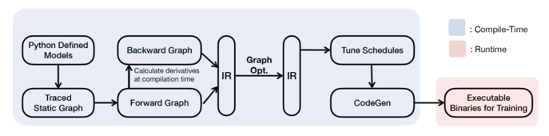

For the graph-level optimizations with IR, we have:

* **Sparse layer / sparse tensor update**

We have four different types of updates: (a) full update, (b) bias-only update, (c) sparse layer update, (d) sparse tensor update. Tiny Training Engine supports backward graph pruning and sparse update at the IR level. After pruning, unused weights and sub-tensors are pruned from DAG (8-10x memory saving). Combined with operator reorder (22-28x memory saving).

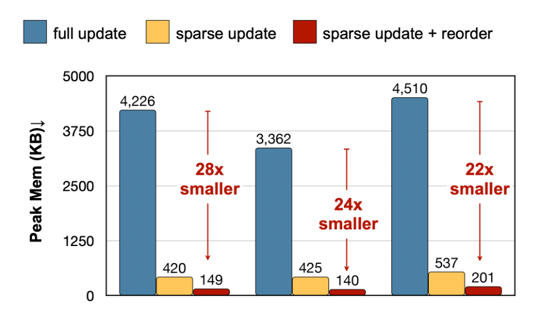

* **Operator reordering and in-place update** 

For a conventional way to update parameters, we have a big pretty long cycle between a producer and the consumer in **subfigure (a)**. Operator life-cycle analysis reveals the memory redundancy in the optimization step.

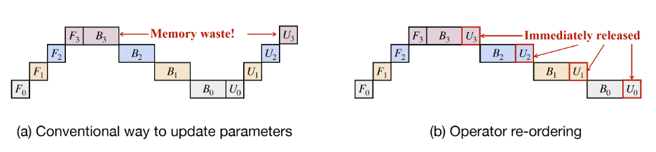

What about consuming this tensor immediately after the gradient is calculated, as shown in **subfigure (b)**? We can immediately do the update as soon as the backward is done for that layer is done. The second layer it's not started yet, but it doesn't prevent us from updating layer three because the gradient for layer three is already computed. We can do similar things for other layers. After reordering, the redundant memory usage is eliminated from training.

The control logic is a little bit complicated but not rocket science, but this greatly simplified the buffer and made it more memory efficient. By reordering, the gradient update can be immediately applied. Gradients buffer can be released earlier before back-propagating to earlier layers, leading to **2.7x ~ 3.1x** peak memory reduction. 

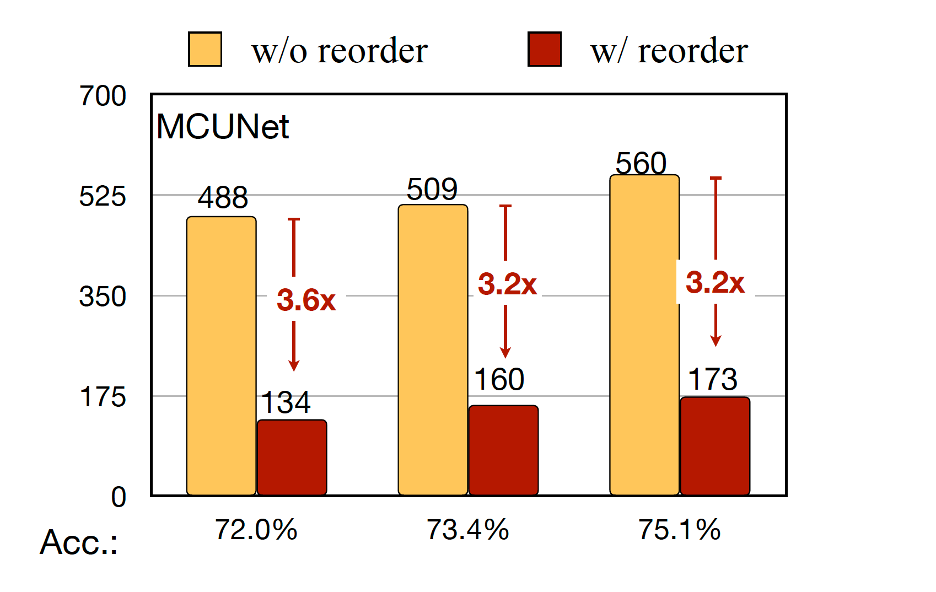

After those operations, we can obtain a graph with all the dimensions and remove all the redundant computations. We can tune the schedule, such as fine-tuning the blocking size of the loop, given a particular hardware platform.

In the last part, we can generate the binary by only combining the operators used in the graph. So we can deliver a very lightweight, portable, and efficient binary on the microcontroller.

### Extending TTE to more platforms

TTE provides systematic support for sparse update schemes for

* Diverse models (CNN + Transformers)
* Diverse frontends
  * PyTorch 
  * TensorFlow 
  * Jax
* Diverse hardware backends
  * Apple M1
  * Raspberry Pi 
  * Smartphones

### Performance

Conventional training framework performs most tasks at runtime. **However, TTE separates the environment of runtime and compile time.**  It could achieve 20x smaller memory and 23x faster speed.

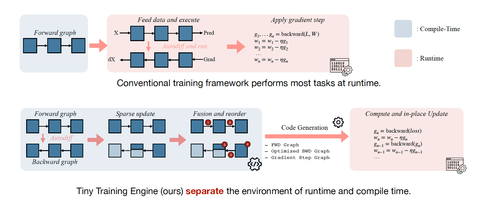

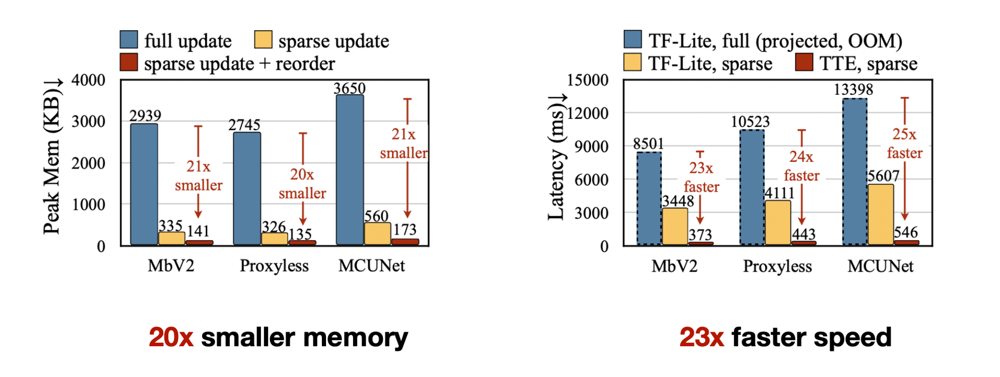

## Privacy Leakage in Federated Learning 

### Brief review of **federated learning** 

Why do we need federated learning?

* Customization: e.g. Different users will have different accents for speech recognition.
* Security: e.g. Data cannot leave the device because of security and regularization.

**FedAvg Algorithm**  [[McMahan 2016]](http://proceedings.mlr.press/v54/mcmahan17a/mcmahan17a.pdf): 

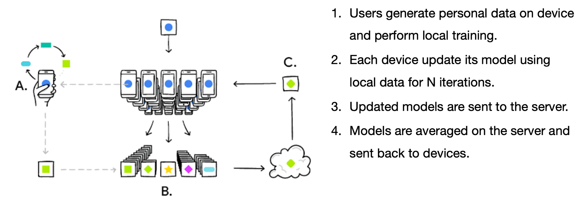

### Privacy leakage

#### 1. Weaker ways of **gradient inversion** 

**Membership Inference** [[Shokri 2016]](https://arxiv.org/pdf/1805.04049.pdf):

Idea: Use ML API to construct 'shadow' training sets for input/output pairs. Then feed into the attack model to learn the pattern.

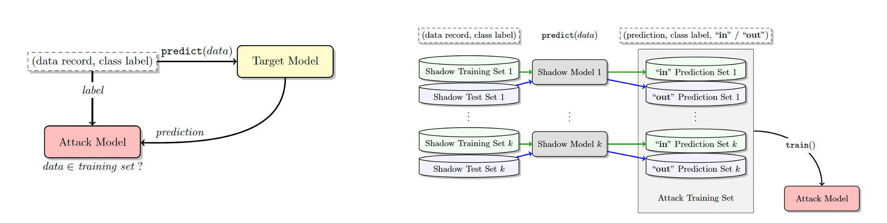

**Property Inference** [[Melis 2018]](https://ieeexplore.ieee.org/stamp/stamp.jsp?arnumber=7958568&casa_token=ZNUofwwSiqcAAAAA:ztZZ4-85niuwZW0vztjq5P7J_f6efjf8KKQS-N3yrPxreyekHYLYRriuEtlgQx6zNY--GsjeAsY):

Idea: Use gradients as the latent vectors to train a GAN to generate images. 

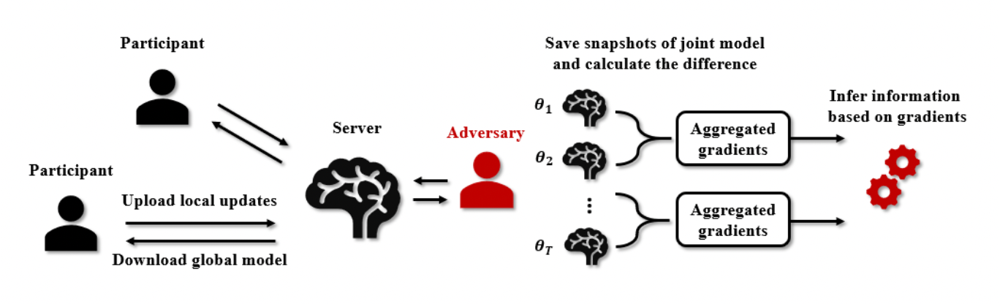

#### 2. **Deep leakage by gradient matching** 

Workflow  [[Zhu 2019]](https://proceedings.neurips.cc/paper/2019/file/60a6c4002cc7b29142def8871531281a-Paper.pdf):

1. Initialize a dummy (data, label) pair. 
2. Feed the (fake) dummy data and label and calculate the dummy loss 
3. Match the distance between dummy loss and real loss. 
4. Update the dummy training data and label using chain rules. 

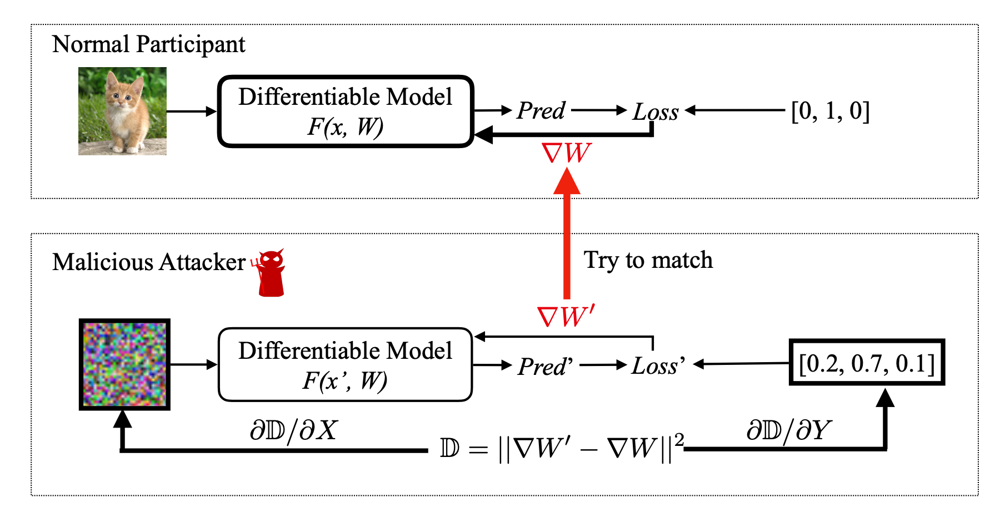

While normal participants calculate \nabla W to update parameters using its private training data, the malicious attacker updates its dummy inputs and labels to minimize the gradient distance. When the optimization finishes, the evil user is able to steal the training data from honest participants.

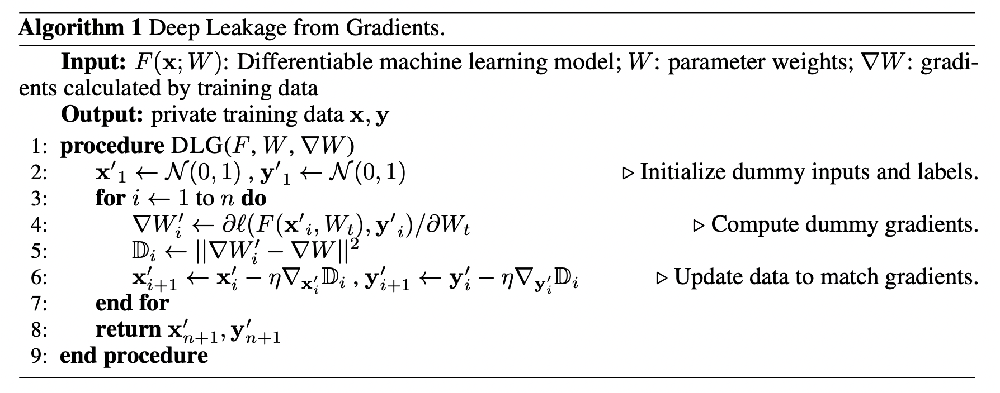

To recover the data from gradients, we first randomly initialize a dummy input $x_0$ and label input $y_0$. We then feed these “dummy data” into models and get “dummy gradients”. 

$\nabla W_0 = \frac{\partial l(F(x', W), y')}{\partial W}$

Given gradients at a certain step, we obtain the training data by minimizing the following objective:

$x^{'*}, y^{∗'} = arg min_{x' ,y'} ||\nabla W' − \nabla W||^2 = arg min_{x' ,y'} ||\frac{\partial l(F(x' , W), y' ) }{\partial W}− \nabla W||^2$

### Defense of privacy leakage

Some intuitive methods but don't work well:

* Adding noise: Neither gaussian nor laplacian noise can defend the leakage unless serious accuracy drop is acceptable. 
* Using quantization: Half precision (FP16 / BFP16) **cannot protect** the privacy as well. 

Gradient compression can **effectively protect** privacy (sparsity > 30%). The reason is that when we try to match the gradient, it's like you have fewer equations and much fewer matches, but you have the same amount of parameters to solve. You're trying to match the gradient, but suddenly, most of the gradient are pruned, so you have less clue to the malicious attacker and, therefore, it's less likely to attack. 

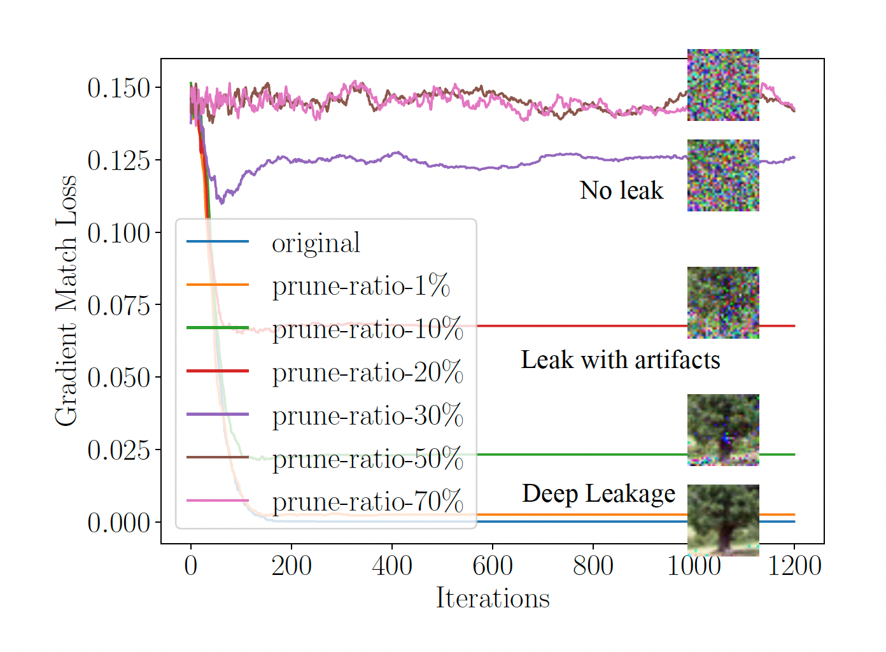

Additionally, it is harder to attack high-resolution images. The reason is that the number of gradients is fixed. If you have a larger input resolution, you need to attack more pixels and calculate more pixels, but you have the same number of equations equal to the number of the gradient size. This provides an interesting perspective to rethink the safety of gradients.

## Lecture summary

* Algorithm-system co-design for on-device training 
  * Why training a quantized model is difficult and how to improve. 
  * Full-update is too expensive => using sparse update. 
  * System support for efficient on-device training. 
* Why federated learning 
  * There are a vast amount of isolated data.
  * Federated learning allows joint training without exchanging data. 
* Rethink the safe of gradients
  * Rethink the safe of gradients 
  * Conventional studies show “shallow” leakage of gradients (membership, property) 
  * DLG shows deep leakage from gradients (exact original data) 
  * The most effective method to defend leakage is gradient compression. 

