# Lecture 17: TinyEngine - Efficient Training and Inference on Microcontrollers 

## Note Information

| Title       | Introduction to TinyML and Efficient Deep Learning Computing |
| ----------- | ------------------------------------------------------------ |
| Lecturer    | Song Han                                                     |
| Date        | 11/08/2022                                                   |
| Note Author | Anne Ouyang (aouyang)                                        |
| Description | Introduces the TinyEngine library for efficient training and inference on microcontrollers |

## 1. Introduction to Microcontrollers

Microcontroller units are low-cost and low-power with wide applications such as smart retail, personalized healthcare, precision agriculture, and smart homes. They are ubiquitous in our daily lives and can be found in vehicles, robots, office machines, medical devices, mobile radio transceivers, vending machines, and home appliances. There are several dozen microcontroller architectures and vendors such as

- STMicroelectronics: STM8 (8-bit), ST10 (16-bit), STM32 (32-bit)
- Texas Instruments: TI MSP430 (16-bit), MSP432 (32-bit), C2000 (32-bit)
- Microchip Technology: Atmel AVR (8-bit), AVR32 (32-bit), and AT91SAM (32-bit)

Microcontrollers are essentially simple miniature personal computers designed to control small features of a larger component without an operating system (OS). Some advantages of microcontrollers are

- cost-effective
- low power
- small chip area

And some disadvantages are

- low computational capability
- small memory / storage space
- limited instruction set

### Basic structure of microcontrollers

A microcontroller is commonly with the following features:

- Central processing units (CPUs)
- Volatile memory, e.g., SRAM
- Nonvolatile memory, e.g., ROM, Flash memory
- Serial input/output, e.g., serial ports (UARTs)
- Peripherals, e.g., timers, event counters and watchdog
- Analog-to-digital converters (ADCs)
- Digital-to-analog converters (DACs)

Comparing the technical specifications of a microcontroller vs. laptop:

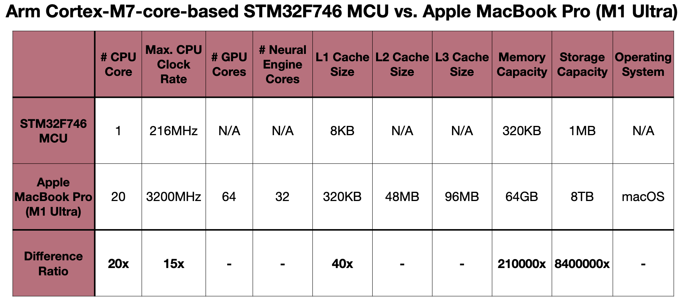

Comparing the memory hierarchy of a microcontroller vs. laptop:

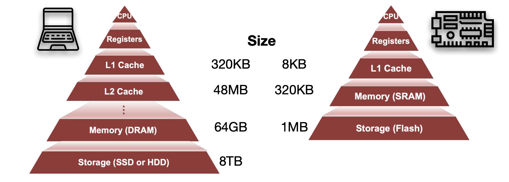

(Note: How to effectively utilize the L1 cache is one of the most critical factors to boost MCUs’ performance)

## 2. Neural Networks on Microcontrollers

One of the challenges in deploying a neural network on a microcontroller unit is that the memory is too small to hold DNNs:

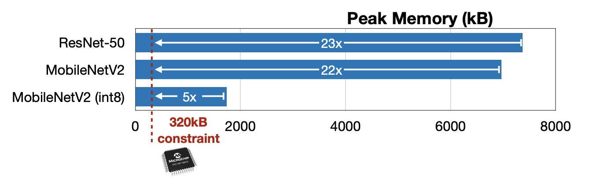

Typically for a neural network, the synapses / parameters / weights are stored in the flash and the neurons / features / activations are stored in SRAM.

### Primary Data Layouts in Neural Networks

Convolutions (both activations and weights) typically operate on four-dimensional tensors: $N$ feature maps/kernels of $C$ channels of $H \texttimes W$ spatial domain. Different channel data layouts should be used under various circumstances.

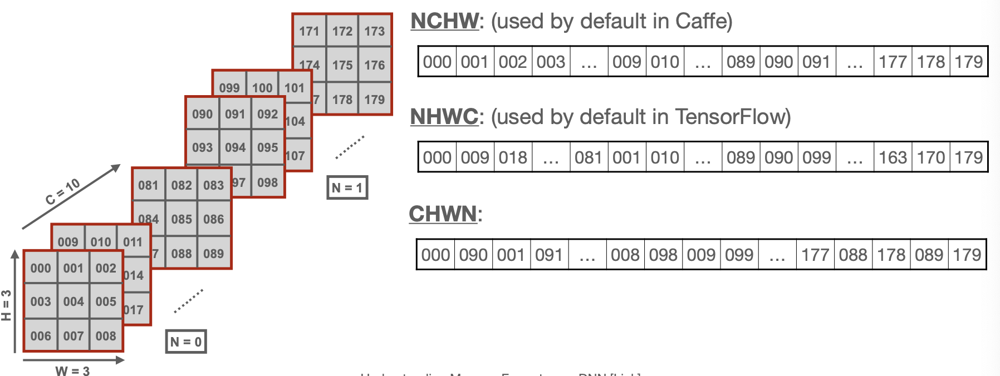

## 3. Optimization Techniques in TinyEngine

### Loop Unrolling

**A loop transformation technique that optimizes a program's execution speed at the expense of its binary size.** 

It reduces the overhead of loop control such as 

- Arithmetic operations for pointers (e.g. i, j, k)
- End of loop exit condition test (e.g. k < N)
- Branch prediction

Since we are replicating the loop body a number of times in the code, there is a tradeoff between binary size and reduced overhead.

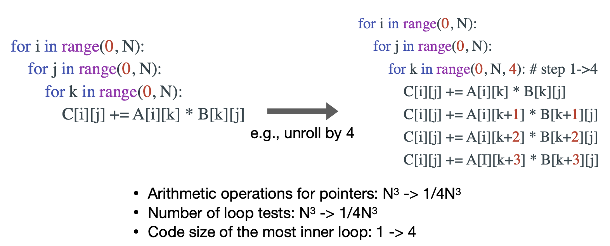

### Loop Reordering

**A loop transformation technique that optimizes a program's execution speed by reordering the sequence of loops**

Loop unrolling improves the data locality of caches. Since data movement (cache misses) is expensive, finding the right loop ordering to reduce cache misses is important. This can be done by changing the order of loop iteration variables (e.g. i, j, k $\rightarrow$ i, k, j)

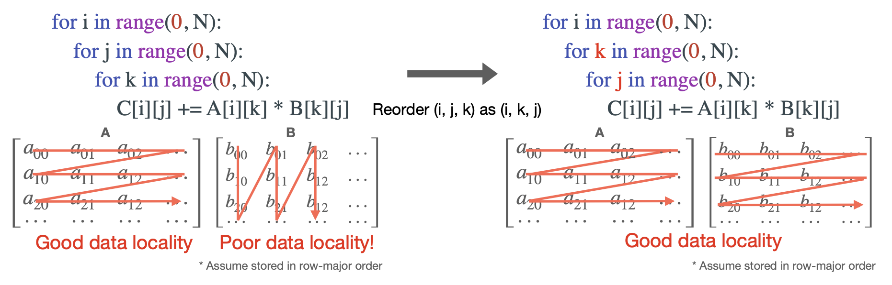

### Loop Tiling

**A loop transformation technique that reduces memory access by partitioning a loop's iteration space into smaller chunks or blocks.**

Like loop reordering, loop tiling can be used to reduce cache misses. If the data is much larger than the cache size, data in the cache will be evicted before reuse, resulting in an increase in cache misses. Loop tiling reduces cache misses by partitioning the loop iteration space, therefore fitting accessed elements in the loop into the cache and ensures that the data stays in the cache until it is reused. 

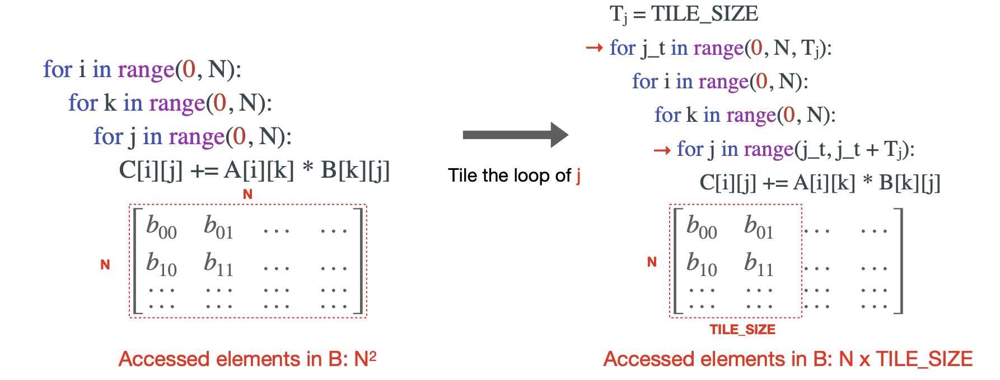

The tile size can be determined according to the cache size or form multi-level caches.

### SIMD (Single Instruction Multiple Data) Programming

**Performs the same operation on multiple data points simultaneously.**

This is available on mostly all current processors. With SIMD programming, we can exploit data-level parallelism in loops and achieve speedup by quantization (e.g. int8, fp16). 

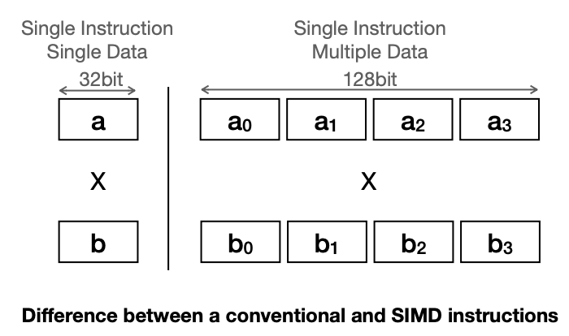

SIMD programming results in a constant factor speedup due to parallelism. The factor depends on the size of the data type and the vector lane width.

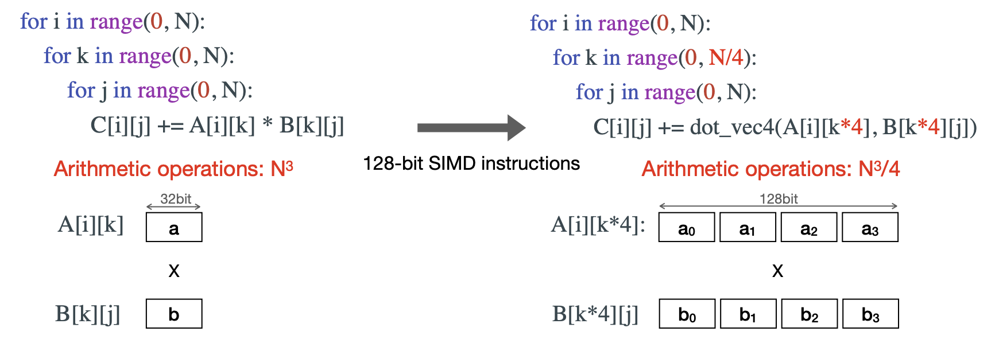

### Image to Column (im2col) Convolution

**Rearranges input data to directly utilize matrix multiplication kernels.**

It converts the image in a form such that Generalized Matrix Multiplication (GEMMs) calls can be used instead of the convolution operations. There's a benefit to this since there are many optimized implementations of GEMM. On the other hand, one con is using more memory. However, the implicit GEMM can solve the problem of using additional memory. The implicit GEMM is a variant of direct convolution, and operates directly on the input weight and activation tensors.

The following diagram illustrate the conversion from convolution to GEMM:

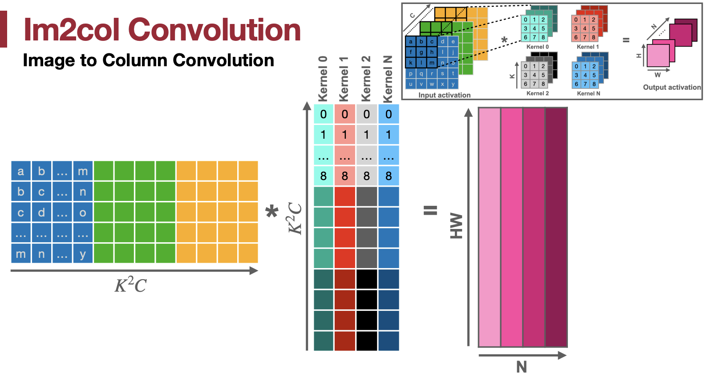

### In-place Depth-wise Convolution

**Reuse the input buffer to write the output data, so as to reduce peak SRAM memory.**

Many popular neural network models, such as MobileNetV2, have “inverted residual blocks" with depthwise convolutions which reduce model size and FLOPs, but significantly increase peak memory (3-6x). To reduce the peak memory of depth-wise convolution, we utilize the “in-place” updating policy with a temporary buffer.

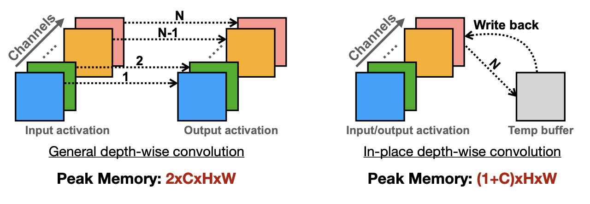

As the diagram above illustrates, since in a depth-wise convolution each channel is computed independently, we can use just one temporary buffer the size of $H \texttimes W$ and write back to the input activation buffer, resulting in almost a 2x peak memory reduction from general depthwise convolution.

### NHWC for Point-wise Convolution, and NCHW for Depth-wise Convolution

**Exploit the appropriate data layout for different types of convolution.**

For pointwise convolutions, NHWC results in better locality than NCHW, so TinyEngine adopts the NHWC data layout for point-wise convolution.

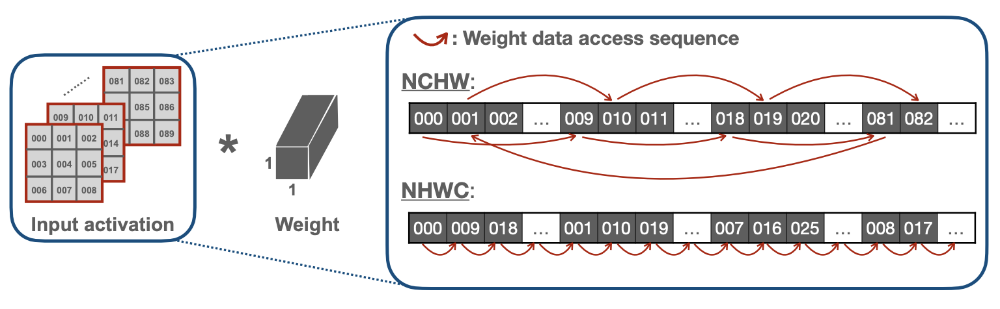

On the other hand, NCHW results in better locality for depthwise convolutions. 

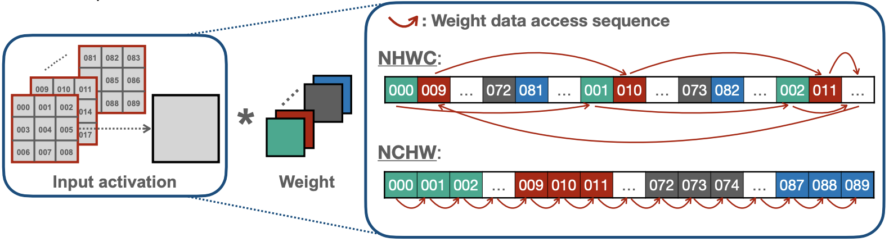

### Winograd Convolution

**Reduce the number of multiplications to enhance computing speed for convolution.**

For a $3 \texttimes 3$ kernel, direct convolution requires $9 \texttimes C \texttimes 4$ MACs for 4 outputs:

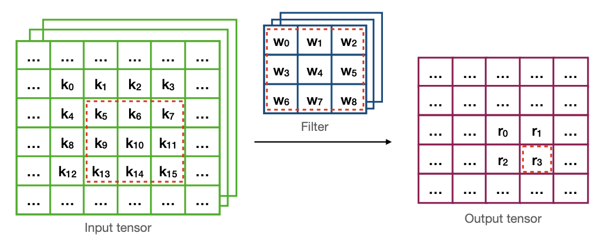

Winograd convolution uses a transformation such that only $16 \texttimes C$ MACs are needed for 4 outputs, resulting in 2.25x fewer MACs:

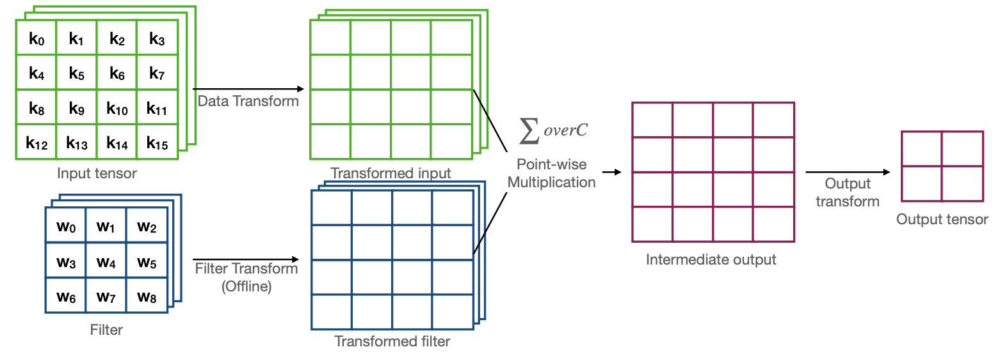

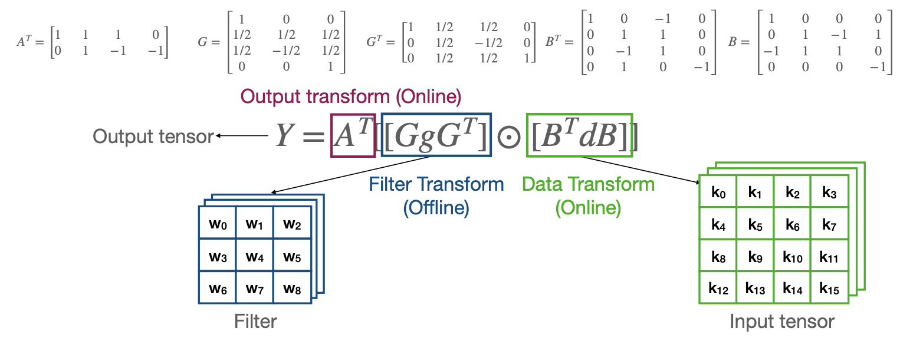

## TinyEngine and MCUNet

The source code for both projects are on Github – please feel free to try!

- [MCUNet](https://github.com/mit-han-lab/mcunet)
- [TinyEngine](https://github.com/mit-han-lab/tinyengine)
