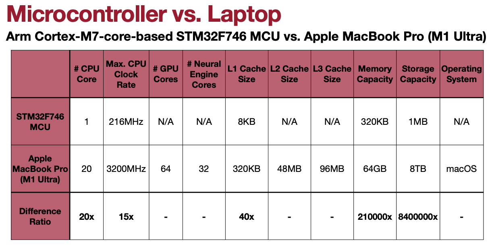
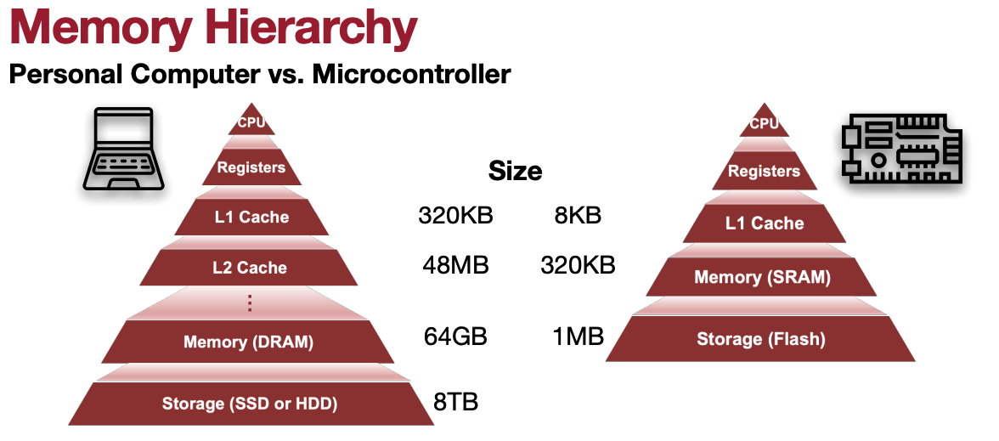

# Lecture 17: TinyEngine - Efficient Training and Inference on Microcontrollers

## Note Information

| Title       | TinyEngine - Efficient Training and Inference on Microcontrollers |
|-------------|-----------------------------------------------------------------------------------------------------------------|
| Lecturer    | Song Han                                                                                                        |
| Date        | 11/08/2022                                                                                                      |
| Note Author | Enrique Montas (emontas)|
| Description | Introduce Microcontrollers, Critical Factors of Deploying Neural Networks on Microcontrollers, TinyEngine optimization Techniques.|

## Introduce Microcontrollers 
Question: What are Microcontrollers and why are they essential?

### Microcontroller Unit (MCU)
#### What is a MCU
A simple miniature personal computer sedigned to controll small features of a larger component. They do not have their own operating system (os).

Good things for MCU:
- low cost
- low power
- rapid growth
- widly applicable

Bad things for MCU:
- low computation power
- small memory/storage 
- limited instruction sets
[[Lin et al., NeurIPS 2020]](https://arxiv.org/abs/2007.10319)
[[Lin et al., NeurIPS 2021]](https://arxiv.org/abs/2110.15352)
[[Lin et al., NeurIPS 2022]](https://arxiv.org/abs/2206.15472)

There are several different microcontroller architectures and vendors. But there is an overall common structure.
#### Basic structure of a MCU
- CPU
- Volatile memory
- nonvolatile memory
- serial input/output
- peripherals
- ADC + DAC

###image1 of laptop vs microcontroller and memory hirearchy

utilizing the L1 cache of the MCU is critical in boosting MCU performance.
[Latency Numbers Every Programmer Should Know](https://gist.github.com/jboner/2841832)

## Critical Factors of Deploying Neural Networks on Microcontrollers.
Question: Why Deploying Neural Networks on Microcontrollers is Challenging?
### Memory Issues
Ratio of network peak memory/mcu memory constraint:
- ResNet-50: 23x
- MobileNetV2: 22x
- MobileNetV2(int8): 5x
[[Lin et al., NeurIPS 2020]](https://arxiv.org/abs/2007.10319)
[[Lin et al., NeurIPS 2022]](https://arxiv.org/abs/2206.15472)

### Activations and Weights in MCUs
#### Primary Data Types in Neural Networks
Synapses, Parameters and Weights are all stored in Flash.
Neurons, features and activations are all stored in SRAM.

#### Primary Data Layouts in NNs
Convolutions (activations and weights) operate on 4D tensors
**N** feature maps/kernels **C** channels **H x W** spatial domain.
We can lay the data out in **NCHW**, **NHWC**, and **CHWN**. Depending on needs there is a best data layout to use.

[Understanding Memory Formats, oneDNN](https://oneapi-src.github.io/oneDNN/dev_guide_understanding_memory_formats.html)

## Critical Optimization Techniques in TinyEngine
TinyEngine: Memory-efficient and High-performance Neural Network Library for Microcontrollers

To enhance computing speed and memory usage TinyEngine leverages:
- Loop Unrolling
-- Reduce branching overhead
-- trade off with larger bianry size
- Loop Reordering
-- improve data locality of caches by changing order of iteration variables
-- reduces cache misses
- Loop Tiling
-- Redues cache misses
-- partition loop iteration space
-- fits accessed elements of loop to cache size so data remains in cache until it is reused
-- tile size is determined by the cache size
-- works "stacked" for multilevel tiling
- SIMD
-- Perform operations on data vectors with a single instruction
-- allows exploits in data-level parallelism in loops
-- quantization allows further quantization
- Im2col convolution
-- Im2col is a technique to convert images to a form where Generalized Matrix Multiplication (GEMM) calls for dot products
-- Pro use GEMM
-- Cons require additional memory
-- we can solve this problem with implicit GEMM
- In-place depth-wise convolution
-- inverted residual block reduces FLOPs and model size while increasing peak memory
-- use temporary buffer to reduce peak memory
- NHWC for point-wise convolution
-- better sequential access of NHWC results in better locality
- NCHW for depth-wise convolution
-- better sequential access of NCHW results in better locality
- Winograd convolution
[[Lin et al., NeurIPS 2020]](https://arxiv.org/abs/2007.10319)
[[Lin et al., NeurIPS 2022]](https://arxiv.org/abs/2206.15472)

Instruction Set Architecture (ISA)
- acts as the interface between software and hardware
- example instructions include ADD, COMPARE, JUMP, JUMP IF, LOAD, STORE, IN/OUT
- Complex Instruction Set Computer (Intel x86)
- Reduced Instruction Set Computer (RISC-V)
-- C = A + B, one instruction in CISC four instructions in RISC 
[Instruction set architecture](https://en.wikipedia.org/wiki/Instruction_set_architecture)
[CISC - Complex Instruction Set Computer](https://www.andersdx.com/cisc-complex-instruction-set-computer/)
[RISC - Reduced Instruction Set Computer](https://www.andersdx.com/risc-reduced-instruction-set-computer/)

Checkout TinyEngine and MCUNet on mit-han-lab github for implementations!