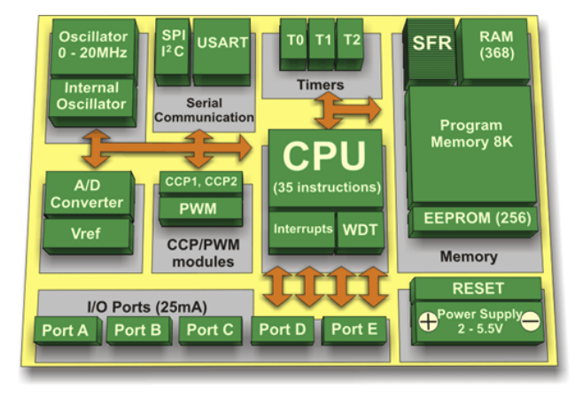
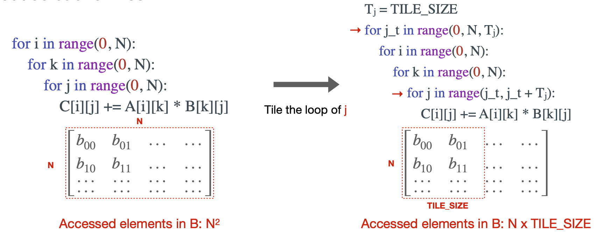
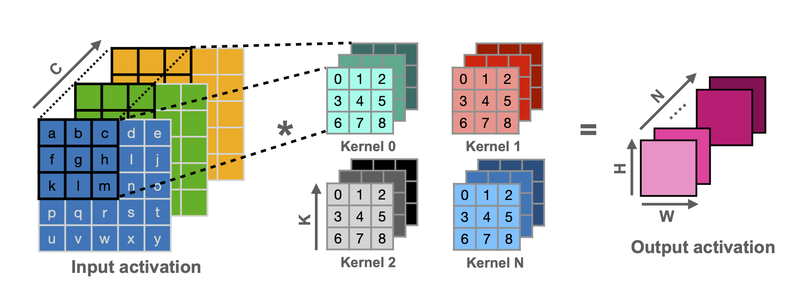
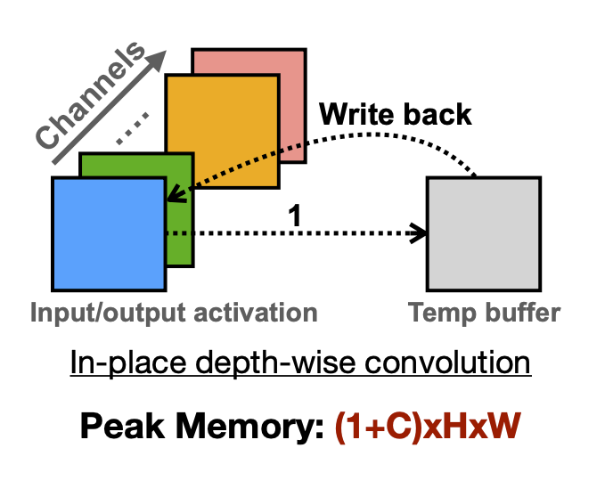
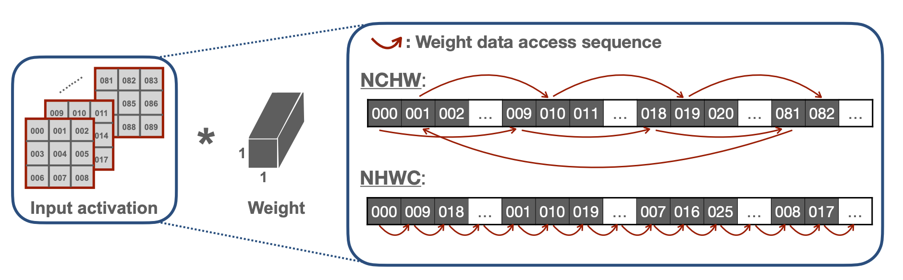
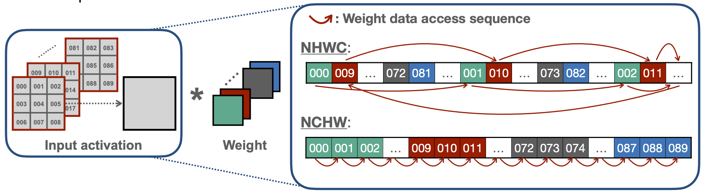
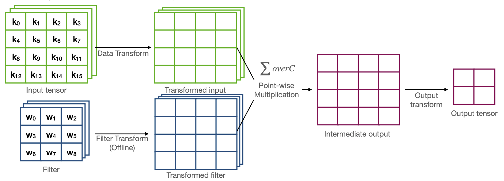

#  Lecture 17 TinyEngine - Efficient Training and Inference on Microcontrollers

## Note Information

| Title       | TinyEngine - Efficient Training and Inference on Microcontrollers                                                          |
|-------------|-----------------------------------------------------------------------------------------------------------------|
| Lecturer    | Song Han                                                                                                        |
| Date        | 11/08/2022                                                                                                      |
| Note Author | Weitung Chen (weitung)                                                                                       |
| Description | Learn to deploy tinyML inference on microcontrollers with TinyEngine   |

## Lecture Plan
1. Introduction to Microcontrollers
2. Critical factors to deploy neural network on microcontrollers
3. Critical optimization techniques used in TinyEngine

## Introduction to Microcontrollers
* Microcontrollers are ubiquitous in our daily lives. The number of microcontrollers is around 50 billion and is still growing rapidly. 
* Microcontrollers are used in many industries, such as vehicles, robots, medical, etc.
* STMicroelectronics, Texas Instruments, and Microchip Technology are some of the microcontroller vendors. 
* Microcontrollers are designed to control small features, and they have no Operating System. 
* Pros
	* Cost-effective
	* Low power
	* Small chip area
* Cons
	* Low computational capability
	* Small memory/storage space
	* Limited instruction set
* Basic structure of microcontrollers usually includes CPUs, volatile memory, nonvolatile memory, serial IOs, peripherals, and ADCs/DACs. A typical MCU structure is shown in the following figure:

* Comparing a STM32F7 MCU to MacBook Pro, MacBook Pro is 20x in CPU cores, 15x in Max Clock rate, 40x in L1 Cache Size, 210000x in Memory Capacity, and 8400000x in Storage Capacity. 
* L1 Cache on microcontrollers are usually very small. It is critical to effectively utilize the L1 cache and boost MCUs' performance. 

## Critical factors to deploy neural network on microcontrollers
* Challenge: The memory on MCU is too small to hold a neural network. 
* Primitive data types in neural network:
	* Synapses / Parameters / Weights will be stored in Flash
	* Neurons / Features / Activations will be stored in SRAM
* Primary data layouts in neural network (Convolution 4D data: N feature maps/kernels of C channels of H x W spatial domain):
	* NCHW: Used by default in Caffe
	* NHWC: Used by default in Tensorflow
	* CHWN

## Optimization techniques used in TinyEngine
* To enhance computing speed and reduce memory usage of the neural network, the following techniques are used:
	1. Loop unrolling
	2. Loop reordering
	3. Loop tiling
	4. SIMD (single instruction, multiple data) programming
	5. Image to Column (Im2col) convolution
	6. In-place depth-wise convolution
	7. NHWC for point-wise convolution, and NCHW for depth-wise convolution
	8. Winograd convolution

### Loop unrolling
* Reducing the branching overhead and optimizes a program's execution speed at the expense of its binary size.
* Overhead of the loop includes arithmetic operations of the pointers, end of loop test, and branch prediction. Loop unrolling replicates the loop body a number of times to unroll, or flatten, the loop. 

### Loop reordering
* Improve data locality by rearranging the order of loop traversal. 
* Reduce cache miss by changing the order of iteration variables

### Loop tiling
* Loop tiling is another technique that aims to reduce cache miss by partitioning loop's iteration space into smaller blocks
* If the data size is bigger than the cache size, it tiles the elements into smaller size. The illustration is as below:

* The tile size is determined based on cache size
* Multilevel tiling can also be done (L1, L2 cache)

### SIMD (single instruction, multiple data) programming
* Leverage the instruction set and perform operation on multiple data (vector) instead of a single data.
* Instruction set architecture includes Complex Instruction Set Computer (CISC), which has many specialized instructions (e.g. Intel x86), and Reduced Instruction set Computer (RISC), which only includes instructions that are commonly used in the program (e.g. Arm)
* Able to exploit data-level parallelism in loops
* Able to achieve speedup by quantization

### Image to Column (Im2col) convolution
* It's a technique that implements convolution with generalized matrix multiplication that calls for dot products
* However, it requires additional memory space. (The implicit generalized matrix multiplication can solve this problem)

### In-place Depth-wise Convolution
* Utilize the in-place updating policy to reduce the peak memory of depth-wise convolution
* For every activation calculations, it is done using the temporary buffer and then write back to the input activation layers

### NHWC for point-wise convolution, and NCHW for depth-wise convolution
* TinyEngine adopts the NHWC data layout for point-wise convolution
* NHWC often has better data locality as compared to NCHW since it has more sequential access during point-wise convolution

* TinyEngine accesses activation and conduct depth-wise convolution in NCHW data layout
* NCHW often has better data locality as compared to NHWC since it has more sequential access during in-place depth-wise convolution

### Winograd Convolution
* Winograd convolution only needs 2.25x fewer MACs than the normal direct convolution. It's flow is as follow:

