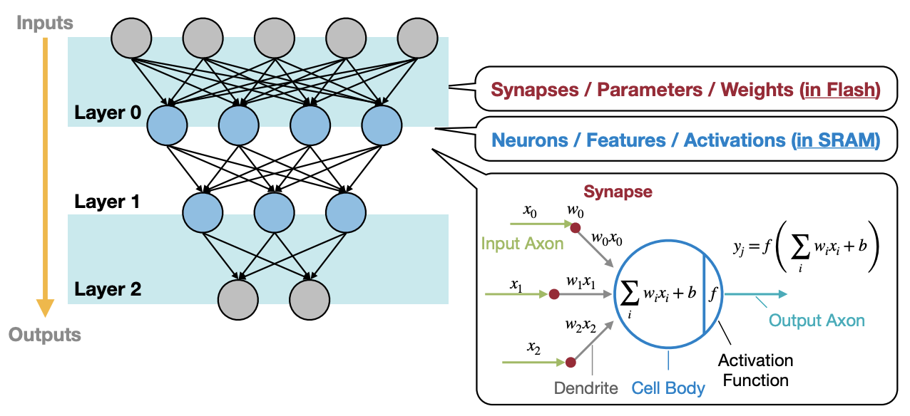
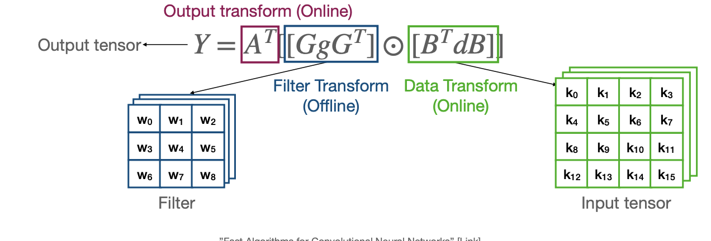

# Lecture 17: TinyEngine- Efficient Training and Inference on Microcontrollers

## Note Information

| Title       | TinyEngine- Efficient Training and Inference on Microcontrollers                                                  |
|-------------|-----------------------------------------------------------------------------------------------------------------|
| Lecturer    | Song Han                                                                                                        |
| Date        | 11/08/2022                                                                                                      |
| Note Author | Veronica Muriga (wmuriga)                                                                                       |
| Description | Deploying Neural Networks on MCUs with TinyEngine |

## Introduction to Microcontrollers
- Microcontrollers are simple mini computers which house small features of a larger component
- Microcontrollers fo not have an OS
- Advantages of microcontrollers:
    - Cheap
    - Low power
    - Small chip area
- Disadvantages:
    - Low computational capability
    - Small memory/storage space
    - Limited instruction set
- Structure of microcontrollers
    - CPU
    - RAM (volatile memory)
    - ROM/Flash memory (nonvolatile memory)
    - Serial input and output
    - Peripheral devices
    - ADCs
    - DACs
- Because of the size constraints on memory, how to effectively utilize the L1 cache is one of the most important design choices that can improve a MCU's performance

## Neural Networks on MCUs
- Memory is too small to hold DNNs
- MCUNet investigates how to implement tiny deep learning on IoT devices
- A recap on the primary data types in NN:
    - Synapses/parameters/weights in flash
    - Neurons/ features/ activations in SRAM

- Both activations and weights in convolutions operate on four-dimensional tensors: N feature maps/kernels of C channels of HxW dimensions
- These can be configured as NCHW, NHWC, or CHWN
- We utilize different channel data layouts under different circumstances
- TinyEngine is a memory-efficeint and high-performance NN library for MCUs
- To improve on speed and memory efficiency in TinyEngine:
    - Loop unrolling
        - Reduces branching overheads
        - Overheads in loop execution are caused by arithmetic operations for pointers, end of loop checking, and branch prediction
        - Loop unrolling involves replicating the loop body several times
        - This introduces a tradeoff between binary size and reduced overheads
    - Loop reordering
        - Plays around with data locality which improves performance
    - Loop tiling
        - Partitions a loop's iteration space into smaller blocks, such that memory access is reduced
        - If data is much larger than cache size, data in cache miss ratio will skyrocket
        - Partitioning the loop iteration spacec will fir the accessed elements in the loop into the cache size, which ensures that data stays in the cache until it is reused
        -The tile size can be determined according  to cache size
        - Fitting data which has been recently accessed in the cache means more cache data is reused, which reduces cache misses
        - Multilevel loop tiling can also be done for multi-level caches
    - Single Instruction, Multiple Data programming (SIMD)
        - This is where the same operation is performed on multiple data points at the same time
        - An ISA specifies both what the processor is capable of doing and how it gets done
        - SIMD performs operations on data vectors with a single instruction
        This applied data-level parallelism in loops and achieves speedups by quantization
    - Image to Column (Im2col) conversion
        - Implements convolution with Generalized Matrix Multiplication (GMM)
        - Rearranges input data to directly utilize matrix multiplication kernels
        - Im2col converts the image into a form such that GEMM will perform dot products
        - However, this uses up more memory- this can be solved with implicit GEMM
    - In-place depth-wise convolution
        - Some NNs have inverted residual blocks with depth wise convolutions 
        - These reduce memory usage and FLOPS, but increase peak memory
        - To reduce peak memory of deth wise convolution, perform in-place updating of channels, using a temporary buffer
        - This reuses the input buffer to write the output data, such that peak SRAM memory reduces
    - NHWC for point wise convolution, and NCHW for depth-wise convolution
        - TinyEngine uses NHWC for point-wise convolution, because it has better locality given its more sequential access
        - NCHW has more locality than NHWC for depth-wise convolution since it accesses data more sequentially in  that layout
        - This manipulates different data layouts that work better with different convolutions
    - Winograd convolution
        - Direct convolutions need 9xCx4 MACs for 4 outputs, but Winograd convolution needs only 16xC MACs for 4 outputs
        - This leads to a 2.25x MAC reduction
        
    

