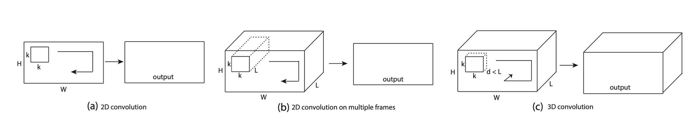
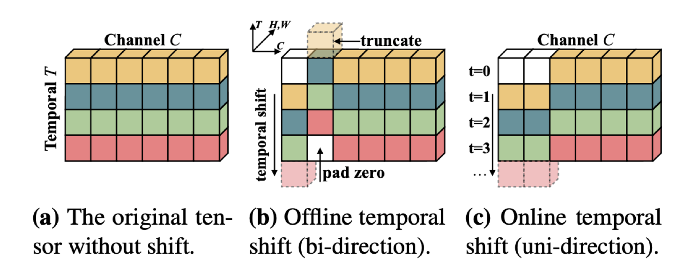

# Lecture 19: Efficient Video Understanding and Generative Models

## Note Information

| Title       | Efficient Video Understanding and Generative Models                                                                                            |
|-------------|-----------------------------------------------------------------------------------------------------------------|
| Lecturer    | Song Han                                                                                                        |
| Date        | 11/15/2022                                                                                                      |
| Note Author | Ria Sonecha (rsonecha)                                                                                       |
| Description | This lecture introduces techniques for efficient video understanding as well as efficient generative models.|

## Section 1: Efficient Video Understanding
- The amount of video content produced is growing explosively
- Efficient video processing is essential for both cloud and edge applications
- There are many applications of video understanding:
  - Action recognition
  - Scene understanding
  - Video search for ads
  - Video prediction for autonomous vehicles
  - and many more!
- The most important difference between image and video processing is that video encodes **temporal** information
### 2D CNNs for Visual Understanding
- Method 1: sample frames and process each frame just like you would process a single image and then aggregate the individual predictions/scores.
  - 
- Method 2: use two streams (spatial + temporal) and use dense optical flow (**slow** to compute) to fuse information from multiple frames.
  - 
- Method 3: Use 2D CNNs plus post-fusion modules like Long Short Term Memory (LSTM)
  - Low level information may be lost during the backbone inference
  - 
- Summary
  - Pros:
    - Compute-efficient. Reuse 2D CNNs from image recognition.
  - Cons:
    - Aggregating 2D CNNs cannot model temporal information. Low accuracy on video benchmarks.
    - Optical flow is very slow to compute (much slower than the deep network itself).
    - Late fusion cannot model low-level temporal relationships.
### 3D CNNs for Visual Understanding
- Method 1 (C3D): Convolve not only on the spatial dimensions but also on temporal dimensions to jointly model spatiotemporal information
  - 
- Method 2 (I3D): Use **inflation** to initialize 3D CNNs with pretrained 2D CNN weights by repeating the weights across the temporal dimension
  - 
- Summary
  - Pros:
    - Jointly modeling spatiotemporal information
    - Can model low-, middle-, high-level information
  - Cons:
    - Large cost (model size, computation) due to the extra temporal dimension
### Temporal Shift Module (TSM)
- Shift some of the channels along the temporal dimension to facilitate information exchange between neighboring frames
- Can be inserted into off-the-shelf 2D CNN to enable temporal modeling at the cost of zero FLOPs and zero parameters
- Can be bi-directional or uni-directional:
  - 
- **Offline** TSM models are used to process all frames in a single batch (can use bi-directional TSM)
  - Applications: action recognition, fall detection, video recommendation, etc.
  - 
- **Online** TSM models process a video frame-by-frame (streaming fashion)
  - Applications: autonomus driving, improving detection with temporal information, etc.
  - 
- TSM can be implemented with just a couple of lines of code
- TSM achieves high performance and high accuracy
  - It consumes 3× less computation than the ECO family, 6× less computation than the Non-local I3D family while achieving better performance on Something-Something dataset
  - 
- TSM is also lower latency and higher throughput compared to I3D
- Scaling down: TSM can be scaled down for low-latency deployment on low-power devices (raspberry pi, smartphones, etc.)
- Scaling up: TSM can also be scaled up to take advantage of super computers
- Faster training: low computation (FLOPs), low data movement
  - 
  - TSM performance does not degrade for batch sizes up to 12k
  - TSM model achieves 1.6x and 2.9x higher training throughput compared to previous I3D models
- Dissecting TSM
  - Spatiotemporal localization emerges from the training on classification tasks
  - Each channel learns different semantics
### Other Efficient Methods
- **Kernel Decomposition:** decompose 3D CNN kernels into a 2D spatial kernel and 1D temporal kernel
  - this is lighter and easier to train than the 3D counterpart
  - 
- **Multiscale Modeling:** use a two-branch design which separates spatial resolution from temporal resolution
  - Small spatial resolution + large temporal resolution
  - Large spatial resolution + small temporal resolution
  - 
- **Neural Architecture Search:** Neural architecture search for 3D CNNs by gradually expanding:
  - Temporal duration
  - Frame rate
  - Spatial resolution
  - Width
  - Bottleneck width
  - Depth
  - 
- **Skip Redundant Frames:** Reduce computation by skipping non-salient/uninformative segments
  - 
- **Utilize Spatial Redundancy Across Frames:**
  - In a video, neighboring frames might be highly similar (sometimes almost static, like surveillance)
  - Utilize the linearity of convolutions, and sparsity of the difference
  - Requires specialized hardware to exploit fine-grained sparsity
  - 
## Section 2: Efficient Generative Models
- Background on Generative Adversarial Networks (GANs):
  - Learn to *generate* by *adversarial* training
  - 
  - Example: learning to generate digits from MNIST
  - Unconditional GAN: random noise to output
  - Conditional GANs: D and G are conditioned on provided labels
    - class label
    - segmentation map
    - strokes
    - example: generative models for content creation, drawing, image editing, etc.
  - GANs are more expensive than recognition models
      - GAN Compression + Distillation
        - Automated model surgery: NAS for automated channel reduction
      - Anycost GAN: train the model to produce consistent results at different resolutions and channel depths
        - Problem 1: inconsistency between subnets -- resolved by incorporating distillation loss
          - 
        - Problem 2: high FID (Frechet Inception Distance) for some subnets -- resolved by using a G-coordinated discriminator
          - 
      - Spatially Sparse Inference: take advantage of spatial redundancy and update only the edited region and reuse the cached activations for unedited regions
        - 
        - Sparse Incremental Generative Engine (SIGE) is a specialized system to realize the theoretical savings/acceleration on different hardware settings
        - SIGE uses tiling based sparse convolutions. The process requires precomputing the original image stream, using a difference mask to identify edited regions, breaking the mask into small blocks to identify active indices, and scattering the output blocks into the original activation.
        - 
      - Differentiable Augmentation (Data-efficient GANs)
        - Big data is super expensive and GAN models deteriorate heavily with limited data
        - Differentiable augmentation involves augmenting the reals and fakes for both the discriminator and generator
        - Unlike other approaches, differentiable augmentation does not run into issues with unbalanced optimization or artifacts
        - 
